# CF-L5-0113 `运行期业务装配::运行期业务装配` 现状流程图

图类型：现状流程图
代码版本：`a48a70b2d678dea64dd8228adb4f26f0badd9506`
覆盖文件：`海中鱼巣/装配.运行期业务.ixx:57-119`；成员声明顺序：同文件 `:170-210`
唯一根函数：F0238
完整签名：`海中鱼巣::运行期业务装配::运行期业务装配(const 海中鱼巣::结构事务接线& 接线, 海中鱼巣::主信息仓库& 主信息, 海中鱼巣::节点仓库& 节点, 海中鱼巣::关系仓库& 关系, 海中鱼巣::索引仓库& 索引, std::uint64_t 关系仓库编号, std::uint64_t 稳定动作键)`
参数：`接线`、四仓库均为只读或可变借用；两个 `std::uint64_t` 按值；声明为 `稳定动作键` 提供调用点默认实参 `1`，默认实参不属于函数签名；本函数不取得仓库所有权
返回结果：成功时完成一个拥有 36 个业务值子对象和一个稳定动作键值的 `运行期业务装配`；任一子对象构造抛出时构造失败并传播原异常
调用方：F0072 `海中鱼巣::运行期上下文::运行期上下文(...)`
被调函数：36 个项目源码构造函数；其中 F0145 已有稳定函数身份，其余 35 个按完整签名和定义位置待聚合清单登记
调用图：`流程图/代码流程图/00_调用知识图谱.md`
逐行映射表：`流程图/代码流程图/L5/CF-L5-0113_运行期业务装配构造_逐行代码映射表.md`
入口前置：当前构造函数不自行判断接线、仓库编号或稳定动作键；各子对象构造合同分别处理自己的材料
结构读取与写入：只构造装配对象内部子对象；不直接写仓库机器结构
逻辑内返回：无显式分支或失败值
内部错误：子对象构造异常原样传播；当前函数不捕获、不改写
生命周期与资源释放：装配对象按值拥有全部子对象；各子对象内部可保存对传入仓库或先前子对象的引用；失败时只逆声明顺序析构已完成前缀
验证入口：冻结源码、声明顺序、节点和逐行映射机械核对；未运行构建或程序
依据：`规范/0600_代码函数流程图应用与维护规范.md`；冻结代码提交 `a48a70b2d678dea64dd8228adb4f26f0badd9506`
不得作为施工许可：是
不得宣称：构造完成不证明 `完整()` 为真，不证明接线或仓库可用，也不证明运行期业务已经执行

## 流程图

```mermaid
flowchart TD
 X01["X01【函数调用】编译器边界 复制结构事务接线(接线) -> 接线副本01"]
 X01 --> P01["P01【函数调用】F0145 特征值服务::特征值服务(主信息, 节点, 接线副本01)"]
 P01 --> X02["X02【函数调用】编译器边界 析构已移动接线副本01"]
 X02 --> X03["X03【函数调用】编译器边界 复制结构事务接线(接线) -> 接线副本02"]
 X03 --> P02["P02【函数调用】存在场景数据操作::存在场景数据操作(接线副本02, 主信息, 节点, 关系, 索引, 关系仓库编号)"]
 P02 --> X04["X04【函数调用】编译器边界 析构已移动接线副本02"]
 X04 --> X05["X05【函数调用】编译器边界 复制结构事务接线(接线) -> 接线副本03"]
 X05 --> P03["P03【函数调用】状态动态数据操作::状态动态数据操作(接线副本03, 主信息, 节点, 关系, 索引, 关系仓库编号)"]
 P03 --> X06["X06【函数调用】编译器边界 析构已移动接线副本03"]
 X06 --> X07["X07【函数调用】编译器边界 复制结构事务接线(接线) -> 接线副本04"]
 X07 --> P04["P04【函数调用】特征体系数据操作::特征体系数据操作(接线副本04, 主信息, 节点, 关系, 索引, 特征值_, 关系仓库编号)"]
 P04 --> X08["X08【函数调用】编译器边界 析构已移动接线副本04"]
 X08 --> X09["X09【函数调用】编译器边界 复制结构事务接线(接线) -> 接线副本05"]
 X09 --> P05["P05【函数调用】语素基础数据操作::语素基础数据操作(接线副本05, 主信息, 节点, 关系, 索引, 关系仓库编号)"]
 P05 --> X10["X10【函数调用】编译器边界 析构已移动接线副本05"]
 X10 --> X11["X11【函数调用】编译器边界 复制结构事务接线(接线) -> 接线副本06"]
 X11 --> P06["P06【函数调用】轻量因果数据操作::轻量因果数据操作(接线副本06, 主信息, 节点, 关系, 索引)"]
 P06 --> X12["X12【函数调用】编译器边界 析构已移动接线副本06"]
 X12 --> X13["X13【函数调用】编译器边界 复制结构事务接线(接线) -> 接线副本07"]
 X13 --> P07["P07【函数调用】概念图结构数据操作::概念图结构数据操作(接线副本07, 主信息, 节点, 关系, 索引, 关系仓库编号)"]
 P07 --> X14["X14【函数调用】编译器边界 析构已移动接线副本07"]
 X14 --> X15["X15【函数调用】编译器边界 复制结构事务接线(接线) -> 接线副本08"]
 X15 --> P08["P08【函数调用】需求任务方法数据操作::需求任务方法数据操作(接线副本08, 主信息, 节点, 关系, 索引, 关系仓库编号, 存在场景数据操作_, 状态动态数据操作_)"]
 P08 --> X16["X16【函数调用】编译器边界 析构已移动接线副本08"]
 X16 --> X17["X17【函数调用】编译器边界 复制结构事务接线(接线) -> 接线副本09"]
 X17 --> P09["P09【函数调用】系统角色数据操作::系统角色数据操作(接线副本09, 主信息, 节点, 关系, 索引, 关系仓库编号)"]
 P09 --> X18["X18【函数调用】编译器边界 析构已移动接线副本09"]
 X18 --> X19["X19【函数调用】编译器边界 复制结构事务接线(接线) -> 接线副本10"]
 X19 --> P10["P10【函数调用】概念活动数据操作::概念活动数据操作(接线副本10, 主信息, 节点, 关系, 索引, 关系仓库编号, 状态动态数据操作_)"]
 P10 --> X20["X20【函数调用】编译器边界 析构已移动接线副本10"]
 X20 --> P11["P11【函数调用】存在业务服务::存在业务服务(存在场景数据操作_)"]
 P11 --> P12["P12【函数调用】场景业务服务::场景业务服务(存在场景数据操作_)"]
 P12 --> P13["P13【函数调用】状态业务服务::状态业务服务(状态动态数据操作_)"]
 P13 --> P14["P14【函数调用】概念活动业务服务::概念活动业务服务(状态服务_, 概念活动数据操作_)"]
 P14 --> P15["P15【函数调用】动态业务服务::动态业务服务(状态服务_, 状态动态数据操作_)"]
 P15 --> P16["P16【函数调用】特征业务服务::特征业务服务(特征体系数据操作_)"]
 P16 --> P17["P17【函数调用】二次特征业务服务::二次特征业务服务(特征体系数据操作_)"]
 P17 --> P18["P18【函数调用】基础信息业务服务::基础信息业务服务(语素基础数据操作_)"]
 P18 --> P19["P19【函数调用】语素业务服务::语素业务服务(语素基础数据操作_)"]
 P19 --> P20["P20【函数调用】轻量因果业务服务::轻量因果业务服务(动态服务_, 轻量因果数据操作_)"]
 P20 --> P21["P21【函数调用】概念图结构业务服务::概念图结构业务服务(概念图结构数据操作_)"]
 P21 --> P22["P22【函数调用】需求业务服务::需求业务服务(需求任务方法数据操作_, 状态服务_)"]
 P22 --> P23["P23【函数调用】任务业务服务::任务业务服务(需求任务方法数据操作_, 需求服务_, 存在服务_, 状态服务_)"]
 P23 --> P24["P24【函数调用】方法业务服务::方法业务服务(需求任务方法数据操作_, 存在服务_, 状态服务_)"]
 P24 --> P25["P25【函数调用】方法召回业务服务::方法召回业务服务(需求服务_, 任务服务_, 方法服务_, 特征服务_, 状态服务_)"]
 P25 --> P26["P26【函数调用】存在场景组合器::存在场景组合器(存在场景数据操作_)"]
 P26 --> P27["P27【函数调用】状态动态组合器::状态动态组合器(状态服务_, 状态动态数据操作_)"]
 P27 --> P28["P28【函数调用】特征状态组合器::特征状态组合器(特征服务_, 特征体系数据操作_)"]
 P28 --> P29["P29【函数调用】语素概念入口组合器::语素概念入口组合器(语素服务_, 语素基础数据操作_)"]
 P29 --> P30["P30【函数调用】概念结构发布组合器::概念结构发布组合器(概念图结构服务_)"]
 P30 --> P31["P31【函数调用】需求任务方法组合器::需求任务方法组合器(需求服务_, 任务服务_, 方法召回服务_)"]
 P31 --> P32["P32【函数调用】任务执行组合器::任务执行组合器(任务服务_, 方法服务_, 状态动态组合器_, 稳定动作键)"]
 P32 --> P33["P33【函数调用】任务结果结算组合器::任务结果结算组合器(需求服务_, 任务服务_, 方法服务_, 状态服务_, 动态服务_)"]
 P33 --> P34["P34【函数调用】运行期只读查询组合器::运行期只读查询组合器(概念活动服务_, 语素服务_, 任务服务_, 方法服务_, 状态服务_, 动态服务_)"]
 P34 --> P35["P35【函数调用】系统角色初始化器::系统角色初始化器(十四个已构造服务或组合器引用)"]
 P35 --> P36["P36【函数调用】运行期业务操作组合器::运行期业务操作组合器(八个组合器与四个业务服务引用)"]
 P36 --> N37["N37【本函数内具体指令】复制稳定动作键到稳定动作键_"]
 N37 --> N38["N38【本函数内具体指令】执行空构造正文"]
 N38 --> N39["N39【本函数内具体指令】完成并发布运行期业务装配对象"]

 P01 -. "抛出" .-> E01
 P02 -. "抛出" .-> E01
 P03 -. "抛出" .-> E01
 P04 -. "抛出" .-> E01
 P05 -. "抛出" .-> E01
 P06 -. "抛出" .-> E01
 P07 -. "抛出" .-> E01
 P08 -. "抛出" .-> E01
 P09 -. "抛出" .-> E01
 P10 -. "抛出" .-> E01
 P11 -. "抛出" .-> E01
 P12 -. "抛出" .-> E01
 P13 -. "抛出" .-> E01
 P14 -. "抛出" .-> E01
 P15 -. "抛出" .-> E01
 P16 -. "抛出" .-> E01
 P17 -. "抛出" .-> E01
 P18 -. "抛出" .-> E01
 P19 -. "抛出" .-> E01
 P20 -. "抛出" .-> E01
 P21 -. "抛出" .-> E01
 P22 -. "抛出" .-> E01
 P23 -. "抛出" .-> E01
 P24 -. "抛出" .-> E01
 P25 -. "抛出" .-> E01
 P26 -. "抛出" .-> E01
 P27 -. "抛出" .-> E01
 P28 -. "抛出" .-> E01
 P29 -. "抛出" .-> E01
 P30 -. "抛出" .-> E01
 P31 -. "抛出" .-> E01
 P32 -. "抛出" .-> E01
 P33 -. "抛出" .-> E01
 P34 -. "抛出" .-> E01
 P35 -. "抛出" .-> E01
 P36 -. "抛出" .-> E01
 E01["E01【本函数内具体指令】销毁当前实参与已完成成员前缀，成员按声明顺序逆序析构"]
 E01 --> E02["E02【本函数内具体指令】传播原异常且不发布运行期业务装配对象"]
```

## 项目源码调用合同

| 节点 | 具名被调函数及定义 | 实参与形参绑定 | 结果绑定 | 异常时已完成成员前缀 |
| --- | --- | --- | --- | --- |
| P01 | F0145 `特征值服务::特征值服务(主信息仓库&, 节点仓库&, 结构事务接线)`；`领域/特征值服务.h:196` | `主信息`、`节点` 借用；接线副本01按值 | 原位构造 `特征值_` | 无 |
| P02 | `存在场景数据操作::存在场景数据操作(结构事务接线, 主信息仓库&, 节点仓库&, 关系仓库&, 索引仓库&, std::uint64_t)`；`领域/数据操作.存在场景.ixx:137` | 接线副本02、四仓库借用、关系仓库编号值 | 原位构造 `存在场景数据操作_` | P01 |
| P03 | `状态动态数据操作::状态动态数据操作(结构事务接线, 主信息仓库&, 节点仓库&, 关系仓库&, 索引仓库&, std::uint64_t)`；`领域/数据操作.状态动态.ixx:312` | 接线副本03、四仓库借用、关系仓库编号值 | 原位构造 `状态动态数据操作_` | P02 -> P01 |
| P04 | `特征体系数据操作::特征体系数据操作(结构事务接线, 主信息仓库&, 节点仓库&, 关系仓库&, 索引仓库&, 特征值服务&, std::uint64_t)`；`领域/数据操作.特征体系.ixx:458` | 接线副本04、四仓库、P01、编号 | 原位构造 `特征体系数据操作_` | P03 -> P01 |
| P05 | `语素基础数据操作::语素基础数据操作(结构事务接线, 主信息仓库&, 节点仓库&, 关系仓库&, 索引仓库&, std::uint64_t)`；`领域/数据操作.语素基础.ixx:206` | 接线副本05、四仓库、编号 | 原位构造 `语素基础数据操作_` | P04 -> P01 |
| P06 | `轻量因果数据操作::轻量因果数据操作(结构事务接线, 主信息仓库&, 节点仓库&, 关系仓库&, 索引仓库&)`；`领域/数据操作.轻量因果.ixx:95` | 接线副本06、四仓库借用 | 原位构造 `轻量因果数据操作_` | P05 -> P01 |
| P07 | `概念图结构数据操作::概念图结构数据操作(结构事务接线, 主信息仓库&, 节点仓库&, 关系仓库&, 索引仓库&, std::uint64_t)`；`领域/数据操作.概念图结构.ixx:245` | 接线副本07、四仓库、编号 | 原位构造 `概念图结构数据操作_` | P06 -> P01 |
| P08 | `需求任务方法数据操作::需求任务方法数据操作(结构事务接线, 主信息仓库&, 节点仓库&, 关系仓库&, 索引仓库&, std::uint64_t, 存在场景数据操作&, 状态动态数据操作&)`；`领域/数据操作.需求任务方法.ixx:863` | 接线副本08、四仓库、编号、P02、P03 | 原位构造 `需求任务方法数据操作_` | P07 -> P01 |
| P09 | `系统角色数据操作::系统角色数据操作(结构事务接线, 主信息仓库&, 节点仓库&, 关系仓库&, 索引仓库&, std::uint64_t)`；`领域/数据操作.系统角色.ixx:26` | 接线副本09、四仓库、编号 | 原位构造 `系统角色数据操作_` | P08 -> P01 |
| P10 | `概念活动数据操作::概念活动数据操作(结构事务接线, 主信息仓库&, 节点仓库&, 关系仓库&, 索引仓库&, std::uint64_t, 状态动态数据操作&)`；`领域/数据操作.概念活动.ixx:24` | 接线副本10、四仓库、编号、P03 | 原位构造 `概念活动数据操作_` | P09 -> P01 |
| P11 | `存在业务服务::存在业务服务(存在场景数据操作&)`；`领域/服务.存在.ixx:49` | P02引用 | 原位构造 `存在服务_` | P10 -> P01 |
| P12 | `场景业务服务::场景业务服务(存在场景数据操作&)`；`领域/服务.场景.ixx:25` | P02引用 | 原位构造 `场景服务_` | P11 -> P01 |
| P13 | `状态业务服务::状态业务服务(状态动态数据操作&)`；`领域/服务.状态.ixx:78` | P03引用 | 原位构造 `状态服务_` | P12 -> P01 |
| P14 | `概念活动业务服务::概念活动业务服务(状态业务服务&, 概念活动数据操作&)`；`领域/服务.概念活动.ixx:20` | P13、P10引用 | 原位构造 `概念活动服务_` | P13 -> P01 |
| P15 | `动态业务服务::动态业务服务(状态业务服务&, 状态动态数据操作&)`；`领域/服务.动态.ixx:30` | P13、P03引用 | 原位构造 `动态服务_` | P14 -> P01 |
| P16 | `特征业务服务::特征业务服务(特征体系数据操作&)`；`领域/服务.特征.ixx:109` | P04引用 | 原位构造 `特征服务_` | P15 -> P01 |
| P17 | `二次特征业务服务::二次特征业务服务(特征体系数据操作&)`；`领域/服务.二次特征.ixx:22` | P04引用 | 原位构造 `二次特征服务_` | P16 -> P01 |
| P18 | `基础信息业务服务::基础信息业务服务(语素基础数据操作&)`；`领域/服务.基础信息.ixx:20` | P05引用 | 原位构造 `基础信息服务_` | P17 -> P01 |
| P19 | `语素业务服务::语素业务服务(语素基础数据操作&)`；`领域/服务.语素.ixx:62` | P05引用 | 原位构造 `语素服务_` | P18 -> P01 |
| P20 | `轻量因果业务服务::轻量因果业务服务(动态业务服务&, 轻量因果数据操作&)`；`领域/服务.轻量因果.ixx:22` | P15、P06引用 | 原位构造 `轻量因果服务_` | P19 -> P01 |
| P21 | `概念图结构业务服务::概念图结构业务服务(概念图结构数据操作&)`；`领域/服务.概念图结构.ixx:80` | P07引用 | 原位构造 `概念图结构服务_` | P20 -> P01 |
| P22 | `需求业务服务::需求业务服务(需求任务方法数据操作&, 状态业务服务&)`；`领域/服务.需求.ixx:82` | P08、P13引用 | 原位构造 `需求服务_` | P21 -> P01 |
| P23 | `任务业务服务::任务业务服务(需求任务方法数据操作&, 需求业务服务&, 存在业务服务&, 状态业务服务&)`；`领域/服务.任务.ixx:61` | P08、P22、P11、P13引用 | 原位构造 `任务服务_` | P22 -> P01 |
| P24 | `方法业务服务::方法业务服务(需求任务方法数据操作&, 存在业务服务&, 状态业务服务&)`；`领域/服务.方法.ixx:72` | P08、P11、P13引用 | 原位构造 `方法服务_` | P23 -> P01 |
| P25 | `方法召回业务服务::方法召回业务服务(需求业务服务&, 任务业务服务&, 方法业务服务&, 特征业务服务&, 状态业务服务&)`；`领域/服务.方法召回.ixx:76` | P22、P23、P24、P16、P13引用 | 原位构造 `方法召回服务_` | P24 -> P01 |
| P26 | `存在场景组合器::存在场景组合器(存在场景数据操作&)`；`领域/组合.存在场景.ixx:21` | P02引用 | 原位构造 `存在场景组合器_` | P25 -> P01 |
| P27 | `状态动态组合器::状态动态组合器(状态业务服务&, 状态动态数据操作&)`；`领域/组合.状态动态.ixx:42` | P13、P03引用 | 原位构造 `状态动态组合器_` | P26 -> P01 |
| P28 | `特征状态组合器::特征状态组合器(特征业务服务&, 特征体系数据操作&)`；`领域/组合.特征状态.ixx:26` | P16、P04引用 | 原位构造 `特征状态组合器_` | P27 -> P01 |
| P29 | `语素概念入口组合器::语素概念入口组合器(语素业务服务&, 语素基础数据操作&)`；`领域/组合.语素概念入口.ixx:13` | P19、P05引用 | 原位构造 `语素概念入口组合器_` | P28 -> P01 |
| P30 | `概念结构发布组合器::概念结构发布组合器(概念图结构业务服务&)`；`领域/组合.概念结构发布.ixx:29` | P21引用 | 原位构造 `概念结构发布组合器_` | P29 -> P01 |
| P31 | `需求任务方法组合器::需求任务方法组合器(需求业务服务&, 任务业务服务&, 方法召回业务服务&)`；`领域/组合.需求任务方法.ixx:74` | P22、P23、P25引用 | 原位构造 `需求任务方法组合器_` | P30 -> P01 |
| P32 | `任务执行组合器::任务执行组合器(任务业务服务&, 方法业务服务&, 状态动态组合器&, std::uint64_t)`；`领域/组合.任务执行.ixx:56` | P23、P24、P27引用；稳定动作键值 | 原位构造 `任务执行组合器_` | P31 -> P01 |
| P33 | `任务结果结算组合器::任务结果结算组合器(需求业务服务&, 任务业务服务&, 方法业务服务&, 状态业务服务&, 动态业务服务&)`；`领域/组合.任务结果结算.ixx:112` | P22、P23、P24、P13、P15引用 | 原位构造 `任务结果结算组合器_` | P32 -> P01 |
| P34 | `运行期只读查询组合器::运行期只读查询组合器(概念活动业务服务&, 语素业务服务&, 任务业务服务&, 方法业务服务&, 状态业务服务&, 动态业务服务&)`；`领域/组合.运行期只读查询.ixx:95` | P14、P19、P23、P24、P13、P15引用 | 原位构造 `运行期只读查询组合器_` | P33 -> P01 |
| P35 | `系统角色初始化器::系统角色初始化器(系统角色数据操作&, 基础信息业务服务&, 场景业务服务&, 存在业务服务&, 状态业务服务&, 动态业务服务&, 特征业务服务&, 二次特征业务服务&, 轻量因果业务服务&, 概念图结构业务服务&, 需求业务服务&, 方法业务服务&, 存在场景组合器&, 特征状态组合器&)`；`领域/初始化.系统角色.ixx:40` | P09、P18、P12、P11、P13、P15、P16、P17、P20、P21、P22、P24、P26、P28引用 | 原位构造 `系统角色初始化器_` | P34 -> P01 |
| P36 | `运行期业务操作组合器::运行期业务操作组合器(存在场景组合器&, 状态动态组合器&, 特征状态组合器&, 语素概念入口组合器&, 概念结构发布组合器&, 需求任务方法组合器&, 任务执行组合器&, 任务结果结算组合器&, 需求业务服务&, 任务业务服务&, 方法业务服务&, 轻量因果业务服务&)`；`领域/组合.运行期业务操作.ixx:50` | P26-P33及P22-P24、P20相应引用 | 原位构造 `业务操作_` | P35 -> P01 |

## 外部与异常边界

- X01—X20 是 10 个独立 `结构事务接线` 按值实参的编译器生成复制/析构调用点；每个子构造函数把自己的副本移动到自身接线成员，不移动 F0238 借用的原接线。
- 同一构造调用中各实参求值顺序不作为业务依赖；所有实参只是已有左值引用或标量读取，没有相互冲突的副作用。
- P01—P36 的子对象初始化严格按 `运行期业务装配` 成员声明顺序执行，而不是由初始化列表排版以外的其它顺序决定。
- 任一 P 节点抛出时，当前调用实参先按语言规则清理，随后只析构 P01 到前一成功 P 节点组成的已完成前缀，顺序为从后向前；F0238 析构函数不运行。
- 项目源码调用边 36 条；外部/编译器边界调用点 20 个，另有一组异常展开边界；未解析调用零。
