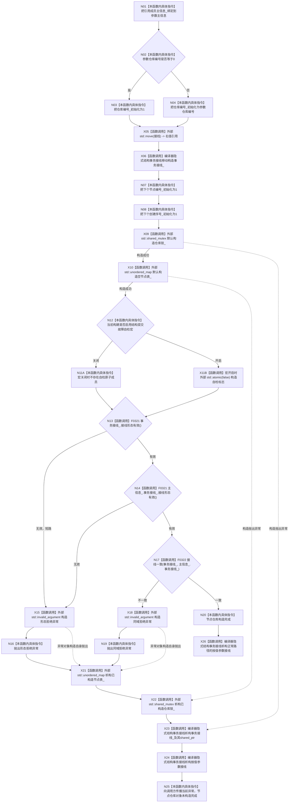

# CF-L5-0114 `节点仓库::节点仓库` 现状流程图

图类型：现状流程图
代码版本：`a48a70b2d678dea64dd8228adb4f26f0badd9506`
覆盖文件：`海中鱼巣/核心/节点仓库.cpp:43-51`
成员声明与初始化顺序证据：`海中鱼巣/核心/节点仓库.h:153-162`
唯一根函数：F0235
完整签名：`海中鱼巣::节点仓库::节点仓库(const 海中鱼巣::主信息仓库& 主信息, std::uint64_t 仓库编号, 海中鱼巣::结构事务接线 接线)`
参数：`主信息` 是只读借用引用且被引用对象必须覆盖节点仓库生命周期；`仓库编号` 按值传入；`接线` 按值传入并在成员初始化时移动
返回结果：无显式返回值；成功时构造节点仓库。任一接线形态无效或两仓库接线不一致时抛出 `std::invalid_argument`；成员构造或异常对象构造失败时传播当前标准库异常
调用图：`流程图/代码流程图/00_调用知识图谱.md`
逐行映射表：`流程图/代码流程图/L5/CF-L5-0114_节点仓库构造_逐行代码映射表.md`
输入契约 / 调用语境表：本图只冻结当前代码的参数、移动和引用生命周期事实；规范允许性由后续逐节点核规处理
非成功返回二分审查表：当前函数不返回失败值；拒绝和成员构造失败均以异常结束构造，规范归类由后续核规处理
偏差清单：不在本函数现状图内修改或裁决
依据提交 / 结构化消息：冻结代码提交 `a48a70b2d678dea64dd8228adb4f26f0badd9506`；正式工程治理规范 `规范/0600_代码函数流程图应用与维护规范.md`
验证输出：本切片只执行 Markdown、Mermaid、逐行覆盖和冻结代码对照；全包验证由顶层任务统一执行
不得作为施工许可：是
不得宣称：不得据此宣称引用生命周期由类型自动保证、所有调用方均传入有效接线、异常路径已运行验证或代码已经修改

## 函数合同与所有权

- `主信息_` 是 `const 主信息仓库&`。N01 只绑定引用，不复制或取得主信息仓库所有权；节点仓库析构时也不销毁被引用对象。
- `仓库编号_` 按 `仓库编号 == 0 ? 1 : 仓库编号` 初始化。零输入被当前代码归一化为 `1`。
- `事务接线_` 由按值参数 `接线` 移动构造。编译器隐式生成的 `结构事务接线` 移动构造复制标量和函数指针，并移动其 `std::shared_ptr<void> 运行期状态`；移动后参数的共享指针为空，成员取得该强引用。
- 未在显式初始化列表出现的成员仍按声明顺序初始化：两个序号为 `1`，仓库锁默认构造，节点表默认构造为空；启用 `HY_EGO_ENABLE_STRUCTURE_COMMIT_FAULT_SELF_TEST` 时，最后构造值为 `false` 的原子自检标志。
- 成员实际初始化顺序只由 `节点仓库.h:153-162` 的声明顺序决定，不由初始化列表书写顺序另行裁决。

## 流程图

## 项目源码调用合同

| 调用节点 | 被调函数 | 参数 / 输入绑定 | 结果 / 输出绑定 | 调用条件与类型 | 被调图 |
| --- | --- | --- | --- | --- | --- |
| N13 | F0321 `bool 海中鱼巣::结构事务接线::接线形态有效() const` | 隐式 `this=&事务接线_` | 第一形态条件 | 全部成员初始化成功后；直接 const 成员调用 | 待生成 |
| N14 | F0321 `bool 海中鱼巣::结构事务接线::接线形态有效() const` | 隐式 `this=&主信息_.事务接线_` | 第二形态条件 | N13 返回 `true`；`||` 短路后的直接 const 成员调用 | 待生成 |
| N17 | F0322 `bool 海中鱼巣::{匿名命名空间@节点仓库.cpp}::接线一致(const 海中鱼巣::结构事务接线& 左, const 海中鱼巣::结构事务接线& 右)` | `左=事务接线_`；`右=主信息_.事务接线_` | 一致条件 | N13、N14 均为 `true`；直接内部链接自由函数调用 | 待生成 |

## 外部与编译器边界调用

| 节点 | 外部 / 编译器函数边界 | 参数 / 输入绑定 | 结果 / 输出绑定 | 正常与异常影响 |
| --- | --- | --- | --- | --- |
| X05 | `std::move(结构事务接线&) noexcept` | 按值参数 `接线` | 右值引用 | 不转移资源，X06 才实际移动 |
| X06 | 编译器隐式 `结构事务接线::结构事务接线(结构事务接线&&)`，内部调用 `std::shared_ptr<void>` 移动构造 | X05 的右值引用 | 初始化 `事务接线_`；参数共享指针移空 | 当前成员类型组合为不抛出移动；标量和函数指针按值复制 |
| X09 | `std::shared_mutex::shared_mutex()` | 成员存储 | 已构造仓库锁 | 失败时传播标准库异常，并逆序清理 X06 之前已完成的非平凡成员 |
| X10 | `std::unordered_map<std::uint64_t, 节点记录>::unordered_map()` | 成员存储 | 空节点表 | 若外部构造抛出，则先析构 X09 再继续逆序清理 |
| X11B | `std::atomic<bool>::atomic(bool)` | `false` | 自检故障标志为 `false` | 仅宏开启构建存在；当前类型构造不抛出 |
| X15 | `std::invalid_argument::invalid_argument(const char*)` | 形态拒绝文字 | 待抛出异常对象 | 异常对象构造自身仍可能传播分配异常 |
| X18 | `std::invalid_argument::invalid_argument(const char*)` | 同域拒绝文字 | 待抛出异常对象 | 异常对象构造自身仍可能传播分配异常 |
| X21-X23 | 节点表、共享互斥量及编译器隐式接线析构边界 | 已完成成员 | 按成员声明逆序释放 | 只在构造失败且对应成员已完成时执行；引用和标量成员无析构调用 |
| X24/X26 | 编译器隐式 `结构事务接线::~结构事务接线()`，内部析构参数的 `shared_ptr` | 移动后的按值参数 `接线` | 参数生命周期结束 | 正常与异常退出均清理；移动后的共享指针为空 |

## 异常清理边界

| 失败位置 | 已完成的非平凡成员 | 清理顺序 | 结果 |
| --- | --- | --- | --- |
| X09 仓库锁构造 | `事务接线_` | X23 -> X24 | 传播当前异常；不形成节点仓库 |
| X10 节点表构造 | `仓库锁_`、`事务接线_` | X22 -> X23 -> X24 | 传播当前异常；不形成节点仓库 |
| X15/X18 或 N16/N19 | `节点表_`、`仓库锁_`、`事务接线_`；宏开启时原子成员为平凡清理 | X21 -> X22 -> X23 -> X24 | 传播 `invalid_argument` 或异常对象构造产生的当前异常 |
| 正常完成 | 全部成员 | 仅 X26 清理移动后的按值参数；对象成员继续存活 | 调用方取得已构造节点仓库 |

## 当前证据边界

- 项目源码调用边共三条调用点事实：F0321 两次、F0322 一次；唯一项目被调函数身份共两个。
- 未解析调用：0。`std::move`、标准库容器 / 同步 / 原子 / 异常类型以及编译器隐式特殊成员函数都只登记边界，不加入项目函数队列。
- `主信息_` 的引用生命周期没有运行期拥有者保护；本图只记录调用方必须保证被引用对象存活，不据此宣称所有调用点均已验证。
- 零仓库编号归一化、接线形态拒绝和同域拒绝均为当前实现事实；其规范符合性由后续逐节点核规处理。
