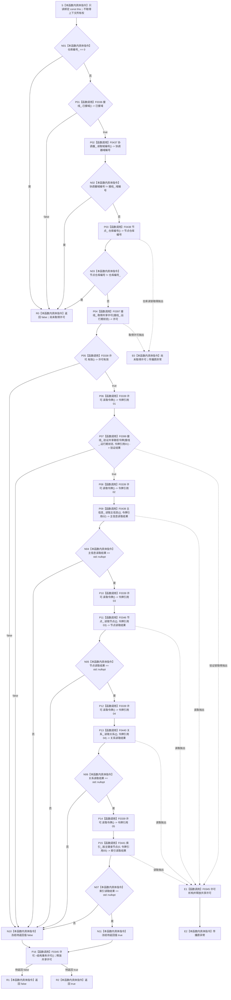

# CF-L5-0115 `运行期上下文::结构核心完整` 现状流程图

图类型：现状流程图
代码版本：`a48a70b2d678dea64dd8228adb4f26f0badd9506`
覆盖文件：`海中鱼巣/启动.运行期上下文.ixx:59-72`
唯一根函数：F0239
完整签名：`bool 海中鱼巣::运行期上下文::结构核心完整() const`
参数：无显式参数；隐式 `this` 为 `const 海中鱼巣::运行期上下文*` 非拥有借用，必须指向生命周期有效的对象
返回结果：全部身份、接线、共享许可和四类无效身份读取条件成立时返回 `true`；首个条件失败返回 `false`；许可取得、共享路径验证或仓库读取抛出时传播原异常
调用方：F0073、F0075、F0077、F0078；其它四个含调用点的自检函数当前从 `main` 不可达，不纳入调用闭包
被调函数：F0336、F0338、F0339、F0345、F0346、F0397、F0399、F0437—F0441
调用图：`流程图/代码流程图/00_调用知识图谱.md`
逐行映射表：`流程图/代码流程图/L5/CF-L5-0115_运行期上下文结构核心完整_逐行代码映射表.md`
入口前置：调用方提供已构造且生命周期有效的运行期上下文；本函数仍自行拒绝零仓库编号、未接域和身份不一致
结构读取与写入：读取上下文、接线和四仓库；共享许可取得/释放会短暂改变事务协调活动表和锁状态，但不写业务机器结构
逻辑内返回：无效候选上下文可以返回 `false`
内部错误：已正式成立的上下文出现域/仓库身份漂移、共享许可异常或无效身份竟可读时应追根因；当前裸 `bool` 不保留具体原因
生命周期与资源释放：局部 `结构事务许可` 拥有一次共享许可；返回表达式或异常求值完成前由 F0345 析构释放；令牌引用不逃逸
验证入口：冻结源码、项目调用边、短路顺序、RAII 释放和逐行映射机械核对；未运行构建或程序
依据：`规范/0050_项目通用机器逻辑与禁止性规则总纲_20260721.md`、`规范/4010_子规范_统一仓库稳定句柄与通用关系索引边界.md`、`规范/4040_子规范_不透明结构事务候选确认撤销与最后发布.md`、`规范/4050_子规范_入口拒绝逻辑内结果与内部逻辑错误.md`、`规范/0600_代码函数流程图应用与维护规范.md`
不得作为施工许可：是
不得宣称：返回 `true` 不证明仓库为空、非空记录完整、关系端点一致、索引正反向闭合、领域类型化记录完整或运行期业务装配已经成立

## 流程图

## 项目源码调用合同

| 节点 | 具名被调函数 | 实参与形参绑定 | 结果绑定 | 后继 |
| --- | --- | --- | --- | --- |
| P01 | F0336 `bool 结构事务接线::已接域() const` | `this=&接线_` | `bool 已接域` | false 返回 R0；true 进入 P02 |
| P02 | F0437 `std::uint64_t 结构事务协调器::读取域编号() const` | `this=&协调器_` | `协调器域编号` | N02 |
| P03 | F0438 `std::uint64_t 节点仓库::仓库编号() const` | `this=&节点_` | `节点仓库编号` | N03 |
| P04 | F0397 `结构事务许可 <lambda@协调.结构事务.ixx:152>::operator()(const std::shared_ptr<void>&) const` | `接线_.运行期状态 -> 状态` | 按值构造局部 `许可` | P05 或 E0 |
| P05 | F0338 `bool 结构事务许可::有效() const` | `this=&许可` | `bool 许可有效` | false 进入 N10；true 进入 P06 |
| P06 / P08 / P10 / P12 / P14 | F0339 `const 结构事务令牌& 结构事务许可::读取令牌() const` | `this=&许可` | 同一局部许可内五个短期 `const&` | 分别传给后继验证或读取 |
| P07 | F0399 `bool <lambda@协调.结构事务.ixx:154>::operator()(const std::shared_ptr<void>&, const 结构事务令牌&) const` | 运行期状态、令牌引用01 | `bool 验证结果` | false 进入 N10；true 进入 P08 |
| P09 | F0439 `主信息仓库::读取主信息(主信息句柄, const 结构事务令牌&) const` | 空句柄、令牌引用02 | `optional<主信息记录>` | N04 |
| P11 | F0346 `节点仓库::读取节点(节点句柄, const 结构事务令牌&) const` | 空句柄、令牌引用03 | `optional<节点记录>` | N05 |
| P13 | F0440 `关系仓库::读取关系(关系句柄, const 结构事务令牌&) const` | 空句柄、令牌引用04 | `optional<关系记录>` | N06 |
| P15 | F0441 `索引仓库::按主键查节点(std::uint64_t, const 结构事务令牌&) const` | `0`、令牌引用05 | `optional<节点句柄>` | N07 |
| P16 / E1 | F0345 `结构事务许可::~结构事务许可()` | `this=&许可` | 释放许可，无返回值 | 返回冻结值或传播原异常 |

## 输入契约与非成功语境

| 调用语境 | 上游保证 | `false` 口径 | 结构变化 | 处理 |
| --- | --- | --- | --- | --- |
| 无效候选上下文准入 | 不保证仓库编号、接线或装配完整 | 零编号或未接域属于逻辑内返回 | 无业务结构变化 | 保留拒绝 |
| F0073 / F0075 / F0077 / F0078 的正式候选或已发布上下文 | 构造顺序应建立协调器、接线和仓库同域关系 | 域/仓库身份漂移、许可不可用或无效身份可读属于追根因候选 | 许可活动表和锁在函数期内变化后释放 | 调用方不得把所有原因静默当作普通异参 |
| 仓库读取抛出 | 已取得共享许可 | 内部错误传播 | 先释放许可，不发布业务写入 | 追根因 |

## 外部与排除边界

- N04—N07 的四次 `std::optional == std::nullopt` 是标准库边界 X0178，不生成项目函数流程图。
- 空句柄 `{}` 是聚合值初始化；短路、成员读取和返回值冻结是语言内指令。
- `运行系统角色初始化自检`、`运行主装配事务自检`、`运行运行期上下文自检`、`运行运行期组合分层自检` 中虽存在 F0239 调用点，但这些函数当前没有从 `main` 可达的调用链，因此只作为具名排除证据。

本批已完成被调图双向引用：[F0336 结构事务接线已接域](../L6/CF-L6-0016_结构事务接线已接域_现状流程图.md)、[F0338 结构事务许可有效](../L6/CF-L6-0018_结构事务许可有效_现状流程图.md)、[F0339 结构事务许可读取令牌](../L6/CF-L6-0019_结构事务许可读取令牌_现状流程图.md)、[F0345 结构事务许可析构](../L6/CF-L6-0024_结构事务许可析构_现状流程图.md)、[F0346 节点仓库读取节点令牌重载](../L6/CF-L6-0025_节点仓库读取节点令牌重载_现状流程图.md)。
