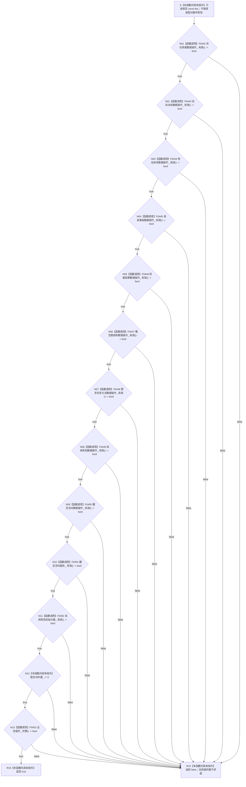

# CF-L5-0116 `运行期业务装配::完整` 现状流程图

图类型：现状流程图
代码版本：`a48a70b2d678dea64dd8228adb4f26f0badd9506`
覆盖文件：`海中鱼巣/装配.运行期业务.ixx:124-138`；成员类型与所有权证据：同文件 `:170-210`
唯一根函数：F0240
完整签名：`bool 海中鱼巣::运行期业务装配::完整() const noexcept`
参数：无显式参数；隐式 `this` 为 `const 海中鱼巣::运行期业务装配*` 非拥有借用，必须指向生命周期有效的对象
返回结果：九个数据操作、概念活动服务、系统角色初始化器、稳定动作键和业务操作组合器全部有效或完整时返回 `true`；首个失败条件按 `&&` 短路返回 `false`
调用方：当前已展开可达调用方为 F0073、F0075、F0077；其它源码调用点待其调用函数进入可达队列并展开时登记
被调函数：F0442—F0453
调用图：`流程图/代码流程图/00_调用知识图谱.md`
逐行映射表：`流程图/代码流程图/L5/CF-L5-0116_运行期业务装配完整_逐行代码映射表.md`
入口前置：生命周期有效的装配对象；空指针或悬空 `this` 属 C++ 未定义行为，不是逻辑返回
结构读取与写入：只读装配值成员及其内部接线/引用形态，不写节点、主信息、关系、索引或领域事实
逻辑内返回：任一组成探针为 `false` 或稳定动作键为零时返回 `false`
内部错误：本函数不返回结构化内部错误；在调用方已经保证装配完整的语境中再次返回 `false` 时，应由调用方按契约追根因
生命周期与资源释放：不取得所有权、不分配资源、不加锁；所有成员由装配对象按值拥有
异常：根函数和 12 个项目被调函数均声明 `noexcept`；若异常违反保证，语言运行期终止，不会转换成 `false`
验证入口：冻结源码、静态类型、12 条直接调用边、短路顺序和逐行映射机械核对；未运行构建或程序
依据：`规范/0050_项目通用机器逻辑与禁止性规则总纲_20260721.md`、`规范/4030_子规范_基础信息服务分层与领域写授权.md`、`规范/4050_子规范_入口拒绝逻辑内结果与内部逻辑错误.md`、`规范/8120_子规范_程序入口启动模式与运行宿主边界_20260726.md`、`规范/0600_代码函数流程图应用与维护规范.md`
不得作为施工许可：是
不得宣称：返回 `true` 只证明这些装配探针当前均为真，不证明任何业务请求已执行、机器事实已发布或生产闭环已完成

## 流程图

## 项目源码调用合同

| 节点 | 具名被调函数及定义 | 实参 / 所有权 | 结果与短路后继 |
| --- | --- | --- | --- |
| N01 | F0442 `bool 存在场景数据操作::有效() const noexcept`；`领域/数据操作.存在场景.ixx:153` | `this=&存在场景数据操作_`，只读借用 | false -> R14；true -> N02 |
| N02 | F0443 `bool 状态动态数据操作::有效() const noexcept`；`领域/数据操作.状态动态.ixx:324` | `this=&状态动态数据操作_` | false -> R14；true -> N03 |
| N03 | F0444 `bool 特征体系数据操作::有效() const noexcept`；`领域/数据操作.特征体系.ixx:471` | `this=&特征体系数据操作_` | false -> R14；true -> N04 |
| N04 | F0445 `bool 语素基础数据操作::有效() const noexcept`；`领域/数据操作.语素基础.ixx:217` | `this=&语素基础数据操作_` | false -> R14；true -> N05 |
| N05 | F0446 `bool 轻量因果数据操作::有效() const noexcept`；`领域/数据操作.轻量因果.ixx:104` | `this=&轻量因果数据操作_` | false -> R14；true -> N06 |
| N06 | F0447 `bool 概念图结构数据操作::有效() const noexcept`；`领域/数据操作.概念图结构.ixx:256` | `this=&概念图结构数据操作_` | false -> R14；true -> N07 |
| N07 | F0448 `bool 需求任务方法数据操作::有效() const noexcept`；`领域/数据操作.需求任务方法.ixx:877` | `this=&需求任务方法数据操作_` | false -> R14；true -> N08 |
| N08 | F0449 `bool 系统角色数据操作::有效() const noexcept`；`领域/数据操作.系统角色.ixx:38` | `this=&系统角色数据操作_` | false -> R14；true -> N09 |
| N09 | F0450 `bool 概念活动数据操作::有效() const noexcept`；`领域/数据操作.概念活动.ixx:37` | `this=&概念活动数据操作_` | false -> R14；true -> N10 |
| N10 | F0451 `bool 概念活动业务服务::有效() const noexcept`；`领域/服务.概念活动.ixx:26` | `this=&概念活动服务_` | false -> R14；true -> N11 |
| N11 | F0452 `bool 系统角色初始化器::有效() const noexcept`；`领域/初始化.系统角色.ixx:64` | `this=&系统角色初始化器_` | false -> R14；true -> N12 |
| N13 | F0453 `bool 运行期业务操作组合器::完整() const noexcept`；`领域/组合.运行期业务操作.ixx:77` | `this=&业务操作_` | false -> R14；true -> R15 |

## 输入契约与非成功语境

| 调用语境 | 上游保证 | `false` 语义 | 结构变化 | 处理 |
| --- | --- | --- | --- | --- |
| 候选装配准入 | 不保证每个值成员均有效 | 首个探针失败或零稳定动作键为逻辑内返回 | 无 | 调用方拒绝候选 |
| 已经由正式发布读回确认的装配 | 上游保证同一代次、同一对象完整 | 再次变为 `false` 属调用方契约漂移或对象生命周期错误候选 | 无 | 调用方追根因 |
| `noexcept` 被违反 | 项目被调函数承诺不抛出 | 不是 `false` 分支 | 进程终止边界 | 不伪装为普通拒绝 |

## 外部与排除边界

- `&&` 的左到右短路、标量读取和 `稳定动作键_ != 0` 是语言内指令，不登记外部调用。
- `运行期业务装配::读取业务操作`、`读取只读查询`、`初始化系统角色`、`复核系统角色`、`初始化概念活动`、`复核概念活动`、F0253 及一个自检函数也调用 F0240；它们的出边只在各自进入当前可达队列并展开时登记，不反向猜测为本批新增可达入口。
