# CF-L5-0117 `系统角色清单::匹配参数` 现状流程图

图类型：现状流程图
代码版本：`a48a70b2d678dea64dd8228adb4f26f0badd9506`
覆盖文件：`海中鱼巣/领域/系统角色清单.数据.h:234-262`
唯一根函数：F0241
完整签名：`bool 海中鱼巣::系统角色清单::匹配参数(const 海中鱼巣::系统角色初始化参数& 参数) const noexcept`
参数：`参数` 为 `const&` 只读借用至返回，不保存引用、不取得所有权；隐式 `this` 为生命周期有效的 `const 系统角色清单*`
返回结果：清单完整、参数有效，且清单版本、21 个稳定主键、4 个安全/服务数值和动态根材料逐项精确相等时返回 `true`；首个失败点按 `&&` 短路返回 `false`
调用方：当前主入口可达调用方为 F0073；两个自检函数中的源码调用点当前不可达，不纳入调用闭包
被调函数：F0245 `系统角色清单::完整()`、F0228 `系统角色初始化参数::有效()`
调用图：`流程图/代码流程图/00_调用知识图谱.md`
逐行映射表：`流程图/代码流程图/L5/CF-L5-0117_系统角色清单匹配参数_逐行代码映射表.md`
入口前置：清单与参数对象生命周期有效；参数值域由 F0228 裁决，清单内部结构由 F0245 裁决
结构读取与写入：只读两个值对象；不写仓库、关系、索引或领域事实
逻辑内返回：两个各自有效但版本、身份或值不同的对象返回 `false`
内部错误：F0073 已先调用 F0228，且缓存清单应来自成功发布；该语境中 F0245 或第二次 F0228 返回 `false` 属上游/缓存契约漂移候选，不应与正常异参完全等同
生命周期与资源释放：不分配资源、不加锁、不保留引用；返回后借用结束
异常：根函数、F0245 和 F0228 均为 `noexcept`
验证入口：冻结源码、29 个短路判断节点、两条项目调用边、27 个字段覆盖和逐行映射机械核对；未运行构建或程序
依据：`规范/0050_项目通用机器逻辑与禁止性规则总纲_20260721.md`、`规范/4010_子规范_统一仓库稳定句柄与通用关系索引边界.md`、`规范/4050_子规范_入口拒绝逻辑内结果与内部逻辑错误.md`、`规范/6120_子规范_自我存在服务与生存基本因果闭环_20260720.md`、`规范/0600_代码函数流程图应用与维护规范.md`
不得作为施工许可：是
不得宣称：`true` 只证明两个值式材料逐项相同，不独立证明相关节点、关系、需求或状态仍是当前权威事实

## 流程图

```mermaid
flowchart TD
    S["S【本函数内具体指令】只读绑定 const this 与 const& 参数；不取得所有权"]
    C01{"C01【函数调用】F0245 this->完整() -> 清单完整"}
    C02{"C02【函数调用】F0228 参数.有效() -> 参数有效"}
    B03{"B03【本函数内具体指令】参数.清单版本 == 版本"}
    B04{"B04【本函数内具体指令】参数.世界根主键 == 主体.世界根.稳定主键"}
    B05{"B05【本函数内具体指令】参数.自我场景主键 == 主体.自我场景.稳定主键"}
    B06{"B06【本函数内具体指令】参数.自我存在主键 == 主体.自我存在.稳定主键"}
    B07{"B07【本函数内具体指令】参数.安全特征定义主键 == 主体.安全根需求.特征定义.稳定主键"}
    B08{"B08【本函数内具体指令】参数.安全实例槽位主键 == 主体.安全根需求.实例槽位.稳定主键"}
    B09{"B09【本函数内具体指令】参数.安全当前特征值主键 == 主体.安全根需求.当前特征值.稳定主键"}
    B10{"B10【本函数内具体指令】参数.安全目标状态主键 == 主体.安全根需求.目标状态.稳定主键"}
    B11{"B11【本函数内具体指令】参数.安全根需求主键 == 主体.安全根需求.根需求.稳定主键"}
    B12{"B12【本函数内具体指令】参数.服务特征定义主键 == 主体.服务根需求.特征定义.稳定主键"}
    B13{"B13【本函数内具体指令】参数.服务实例槽位主键 == 主体.服务根需求.实例槽位.稳定主键"}
    B14{"B14【本函数内具体指令】参数.服务当前特征值主键 == 主体.服务根需求.当前特征值.稳定主键"}
    B15{"B15【本函数内具体指令】参数.服务目标状态主键 == 主体.服务根需求.目标状态.稳定主键"}
    B16{"B16【本函数内具体指令】参数.服务根需求主键 == 主体.服务根需求.根需求.稳定主键"}
    B17{"B17【本函数内具体指令】参数.概念存在根主键 == 主体.概念存在根.稳定主键"}
    B18{"B18【本函数内具体指令】参数.概念动态根主键 == 主体.概念动态根.稳定主键"}
    B19{"B19【本函数内具体指令】参数.概念关系根主键 == 主体.概念关系根.稳定主键"}
    B20{"B20【本函数内具体指令】参数.概念因果根主键 == 主体.概念因果根.稳定主键"}
    B21{"B21【本函数内具体指令】参数.方法登记根主键 == 主体.方法登记根.稳定主键"}
    B22{"B22【本函数内具体指令】参数.方法登记角色状态主键 == 主体.方法登记角色状态.稳定主键"}
    B23{"B23【本函数内具体指令】参数.方法活跃状态主键 == 主体.方法活跃状态.稳定主键"}
    B24{"B24【本函数内具体指令】参数.方法失效状态主键 == 主体.方法失效状态.稳定主键"}
    B25{"B25【本函数内具体指令】参数.安全当前值 == 主体.安全根需求.当前值"}
    B26{"B26【本函数内具体指令】参数.安全目标值 == 主体.安全根需求.目标值"}
    B27{"B27【本函数内具体指令】参数.服务当前值 == 主体.服务根需求.当前值"}
    B28{"B28【本函数内具体指令】参数.服务目标值 == 主体.服务根需求.目标值"}
    B29{"B29【本函数内具体指令】参数.动态根材料 == 主体.动态根材料"}
    RF["RF【本函数内具体指令】首个失败点返回 false；不写结构"]
    RT["RT【本函数内具体指令】全部成立返回 true；不写结构"]

    S --> C01
    C01 -- "false" --> RF
    C01 -- "true" --> C02
    C02 -- "false" --> RF
    C02 -- "true" --> B03
    B03 -- "不等" --> RF
    B03 -- "相等" --> B04
    B04 -- "不等" --> RF
    B04 -- "相等" --> B05
    B05 -- "不等" --> RF
    B05 -- "相等" --> B06
    B06 -- "不等" --> RF
    B06 -- "相等" --> B07
    B07 -- "不等" --> RF
    B07 -- "相等" --> B08
    B08 -- "不等" --> RF
    B08 -- "相等" --> B09
    B09 -- "不等" --> RF
    B09 -- "相等" --> B10
    B10 -- "不等" --> RF
    B10 -- "相等" --> B11
    B11 -- "不等" --> RF
    B11 -- "相等" --> B12
    B12 -- "不等" --> RF
    B12 -- "相等" --> B13
    B13 -- "不等" --> RF
    B13 -- "相等" --> B14
    B14 -- "不等" --> RF
    B14 -- "相等" --> B15
    B15 -- "不等" --> RF
    B15 -- "相等" --> B16
    B16 -- "不等" --> RF
    B16 -- "相等" --> B17
    B17 -- "不等" --> RF
    B17 -- "相等" --> B18
    B18 -- "不等" --> RF
    B18 -- "相等" --> B19
    B19 -- "不等" --> RF
    B19 -- "相等" --> B20
    B20 -- "不等" --> RF
    B20 -- "相等" --> B21
    B21 -- "不等" --> RF
    B21 -- "相等" --> B22
    B22 -- "不等" --> RF
    B22 -- "相等" --> B23
    B23 -- "不等" --> RF
    B23 -- "相等" --> B24
    B24 -- "不等" --> RF
    B24 -- "相等" --> B25
    B25 -- "不等" --> RF
    B25 -- "相等" --> B26
    B26 -- "不等" --> RF
    B26 -- "相等" --> B27
    B27 -- "不等" --> RF
    B27 -- "相等" --> B28
    B28 -- "不等" --> RF
    B28 -- "相等" --> B29
    B29 -- "不等" --> RF
    B29 -- "相等" --> RT
```

## 字段覆盖合同

| 节点组 | 材料 | 数量 | 类型与所有权 | 结果 |
| --- | --- | ---: | --- | --- |
| C01 | 当前清单 | 1 个清单对象 | `const this` 只读借用 | F0245 汇总清单内部结构完整性 |
| C02 | 候选初始化参数 | 1 个参数对象 | `const&` 只读借用 | F0228 汇总版本、主键唯一性和安全/服务值域 |
| B03 | 清单版本 | 1 | `std::uint32_t` 标量读取 | 精确相等才继续 |
| B04—B24 | 世界根、自我场景、自我存在、安全/服务根材料、概念四根和方法四状态稳定主键 | 21 | `std::uint64_t` 标量读取 | 每项精确相等才继续 |
| B25—B28 | 安全/服务当前值与目标值 | 4 | `std::int64_t` 标量读取 | 每项精确相等才继续 |
| B29 | 动态根材料 | 1 | `std::int64_t` 标量读取 | 精确相等返回 true |

## 输入契约与非成功语境

| 调用语境 | 失败位置 | 口径 | 结构变化 | 处理 |
| --- | --- | --- | --- | --- |
| 通用值式比较 | C01 / C02 | 任一对象本身不完整或无效，返回 `false` | 无 | 逻辑内返回 |
| 通用值式比较 | B03—B29 | 两个各自有效对象内容不同，返回 `false` | 无 | 逻辑内返回，供幂等冲突裁决 |
| F0073 已先验证参数且缓存来自成功初始化 | C01 / C02 | 上游保证后仍失败，属于缓存或调用契约漂移候选 | 无 | 调用方追根因，不与普通异参混账 |
| F0073 同一语境 | B03—B29 | 有效但不同的参数与已缓存清单不匹配 | 无 | 结构化映射为幂等冲突 |

## 外部与排除边界

- 27 个字段比较和 `&&` 短路均为内建整数操作，不登记项目或外部函数边。
- F0245 的下层 `系统角色身份材料::完整()` 当前仍要求旧主信息句柄有效；这与 `0050`、`4010` 的节点直接身份合同存在已登记偏差。本图只记录 F0241 的调用事实，不把 F0245 尚未展开的完整性合同判为符合。
- `系统角色清单::operator== = default` 未被本函数调用。
- `运行生产运行期首发自检` 和 `运行系统角色初始化自检` 中虽存在 F0241 调用点，但两个函数当前均没有从 `main` 可达的调用链，因此只作为具名排除证据。
- `动态根材料` 当前由 F0228 上游合同承载值域；F0241 只比较，不自行补造额外拒绝。
