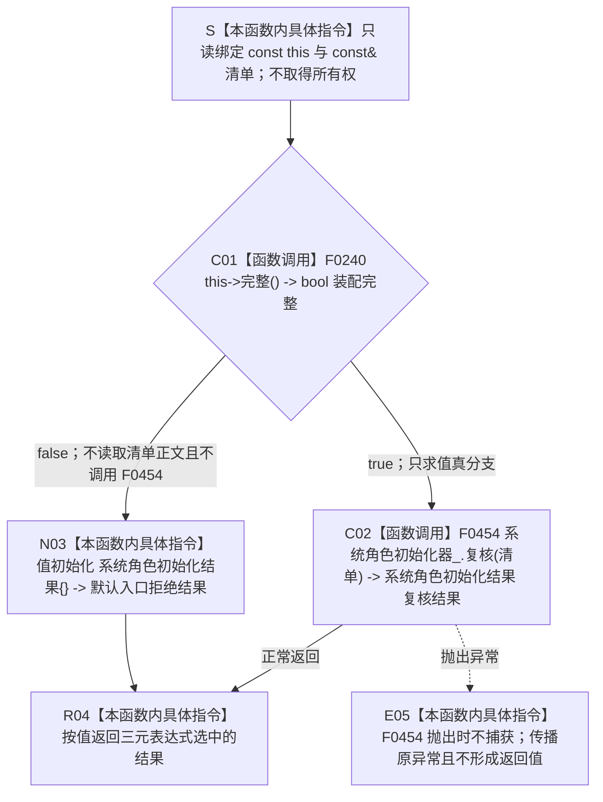

# CF-L5-0118 `运行期业务装配::复核系统角色` 现状流程图

图类型：现状流程图
代码版本：`a48a70b2d678dea64dd8228adb4f26f0badd9506`
覆盖文件：`海中鱼巣/装配.运行期业务.ixx:152-154`
唯一根函数：F0242
完整签名：`海中鱼巣::系统角色初始化结果 海中鱼巣::运行期业务装配::复核系统角色(const 海中鱼巣::系统角色清单& 清单) const`
参数：隐式 `this` 为生命周期有效的 `const 运行期业务装配*`；`清单` 为调用期间有效的 `const&` 只读借用；均不转移所有权、不保存引用，悬空引用属于 C++ 未定义行为而非逻辑内结果
返回结果：装配完整时按值原样返回 F0454 的复核结果；装配不完整时返回 `系统角色初始化结果{}`，其状态为 `入口拒绝`、清单为默认空值、`成功()==false`、`改变了结构()==false`
调用方：当前主入口可达调用方为 F0073、F0075、F0077；`运行期上下文::系统角色完整()` 中另有源码调用点，但其调用链当前不可达
被调函数：F0240 `运行期业务装配::完整()`、F0454 `系统角色初始化器::复核(...)`
调用图：`流程图/代码流程图/00_调用知识图谱.md`
逐行映射表：`流程图/代码流程图/L5/CF-L5-0118_运行期业务装配复核系统角色_逐行代码映射表.md`
入口前置：`this` 与 `清单` 生命周期有效；根函数不直接检查清单字段，装配完整性由 F0240、清单完整性和权威读回由 F0454 裁决
结构读取与写入：根函数只读装配探针并转发清单；不直接写节点、主信息、关系、索引或领域事实；F0454 是只读复核入口
逻辑内返回：一般候选装配不完整时返回默认入口拒绝；一般调用方传入不完整清单时由 F0454 形成结构化拒绝
内部错误：当前三个可达调用方均已先证明同一装配和清单完整，重复门禁再失败属于契约漂移候选；F0454 的内部不一致和异常不得降级为普通入口拒绝
生命周期与资源释放：不加锁、不分配资源、不保留引用；正常返回或异常传播后借用结束
异常：F0240 为 `noexcept`；F0454 和根函数均未声明 `noexcept`，F0454 抛出的异常不被捕获并原样传播
验证入口：冻结源码、三元短路两支、2 条项目调用边、调用方语境和逐行映射机械核对；未运行构建或程序
依据：`规范/0050_项目通用机器逻辑与禁止性规则总纲_20260721.md`、`规范/4010_子规范_统一仓库稳定句柄与通用关系索引边界.md`、`规范/4050_子规范_入口拒绝逻辑内结果与内部逻辑错误.md`、`规范/7130_子规范_自我内部世界成员特征与事实读取投影.md`、`规范/0600_代码函数流程图应用与维护规范.md`
不得作为施工许可：是
不得宣称：值式复核结果只表达本次调用材料；在 F0454 展开并完成权威读回核规前，不得宣称系统角色结构符合现行节点直接身份合同

## 流程图

## 节点合同

| 节点 | 类型 | 参数 / 输入绑定 | 结果 / 输出绑定 | 事实读写 | 后继条件 | 验证 |
| --- | --- | --- | --- | --- | --- | --- |
| S | 本函数内具体指令 | `this`、`清单` | 两个只读借用 | 无 | 绑定完成进入 C01 | 对照 152 行 |
| C01 | 函数调用 | `this=&当前运行期业务装配` | `装配完整` | 只读装配成员探针 | true 到 C02；false 到 N03 | F0240 双向引用、三元条件 |
| C02 | 函数调用 | `this=&系统角色初始化器_`；`清单 -> 清单` | `复核结果` | 根函数不直接写；F0454 读取正式结构 | 正常返回到 R04；异常到 E05 | F0454 待展开 |
| N03 | 本函数内具体指令 | `装配完整=false` | 默认入口拒绝结果 | 无 | 进入 R04 | DTO 默认字段核对 |
| R04 | 本函数内具体指令 | C02 或 N03 选中的值 | 按值返回 `系统角色初始化结果` | 无新增写入 | 函数返回 | 两个正常分支 |
| E05 | 本函数内具体指令 | F0454 抛出的异常 | 原异常传播 | 不形成返回值 | 异常离开函数 | 根函数无 catch |

## 输入契约与非成功语境

| 调用语境 | 失败位置 | 口径 | 结构变化 | 处理 |
| --- | --- | --- | --- | --- |
| 一般候选装配 | C01 | 装配本就不完整 | 无 | 写前逻辑内入口拒绝 |
| F0073 / F0075 / F0077 当前可达路径 | C01 | 调用方已先证明同一装配完整，二次检查变为 false | 无 | 追根因；当前默认结果存在分类偏差 |
| 一般清单材料 | C02 | 清单本就不完整或正式结构不接受 | 无 | 保留 F0454 结构化结果 |
| 已保证完整的清单 | C02 / E05 | 权威读回不一致或异常 | 无直接写入 | 内部错误或异常传播，不得伪装成功 |

## 全部项目内直接调用点

| 调用方 | 位置 | 当前可达性 | 调用前合同 |
| --- | --- | --- | --- |
| F0073 `运行期上下文::初始化系统角色(...)` | `海中鱼巣/启动.运行期上下文.ixx:103` | 从生产运行期入口可达 | F0240 已返回 true；缓存存在且 F0241 参数匹配 |
| F0075 `运行期上下文::初始化概念活动(...)` | `海中鱼巣/启动.运行期上下文.ixx:133` | 从生产运行期入口可达 | F0240 已返回 true；清单存在且 F0245 返回 true |
| F0077 `运行期上下文::完整()` | `海中鱼巣/启动.运行期上下文.ixx:78` | 从生产运行期发布检查可达 | 同一短路链已验证结构核心、F0240、清单存在且完整 |
| 尚未登记 `运行期上下文::系统角色完整() const` | `海中鱼巣/启动.运行期上下文.ixx:126` | 当前从 `main` 不可达 | 清单存在且 F0245 返回 true；仅旧自检调用此函数 |

## 外部与排除边界

- 三元运算符先求值 F0240，之后只求值 F0454 调用或默认聚合值初始化其中一支。
- `系统角色初始化结果{}` 是本函数内聚合值初始化，不是项目显式函数，不登记函数或外部边。
- 当前无标准库、系统、第三方、虚调用、间接调用、递归或新增未解析调用。
- `运行期上下文::系统角色完整()` 的源码调用点当前仅由未接入 `main` 的旧自检函数间接使用，不增加当前可达调用边。
- F0454 的真实读回范围、旧主信息依赖和结果原因合同在其独立流程图中展开；本图不提前判定符合。
