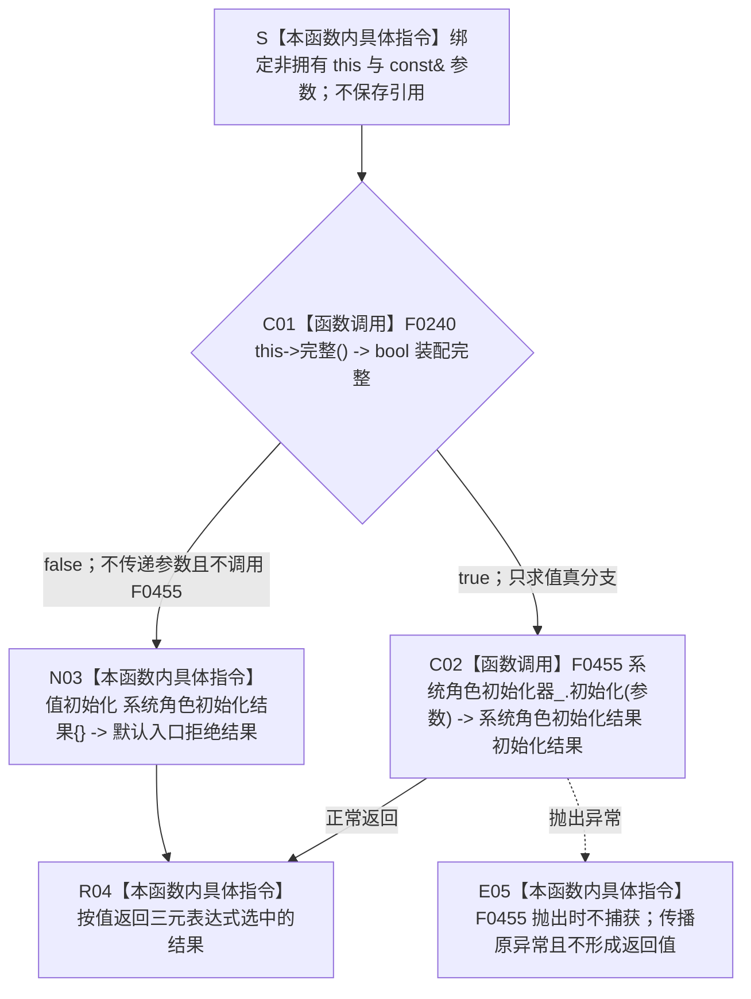

# CF-L5-0119 `运行期业务装配::初始化系统角色` 现状流程图

图类型：现状流程图
代码版本：`a48a70b2d678dea64dd8228adb4f26f0badd9506`
覆盖文件：`海中鱼巣/装配.运行期业务.ixx:148-150`
唯一根函数：F0243
完整签名：`海中鱼巣::系统角色初始化结果 海中鱼巣::运行期业务装配::初始化系统角色(const 海中鱼巣::系统角色初始化参数& 参数)`
参数：隐式 `this` 为生命周期有效的非拥有 `运行期业务装配*`；`参数` 为调用期间有效的 `const&` 只读借用；均不保存引用、不转移所有权，悬空引用属于 C++ 未定义行为
返回结果：装配完整时按值原样返回 F0455 的初始化结果；装配不完整时返回 `系统角色初始化结果{}`，其状态为 `入口拒绝`、清单为默认空值
调用方：当前主入口可达直接调用方只有 F0073 `运行期上下文::初始化系统角色(...)`
被调函数：F0240 `运行期业务装配::完整()`、F0455 `系统角色初始化器::初始化(...)`
调用图：`流程图/代码流程图/00_调用知识图谱.md`
逐行映射表：`流程图/代码流程图/L5/CF-L5-0119_运行期业务装配初始化系统角色_逐行代码映射表.md`
入口前置：`this` 与参数生命周期有效；根函数不直接校验参数，参数值域和全部写入合同由 F0455 下层裁决
结构读取与写入：根函数只读装配完整性；真分支可由 F0455 写入并读回节点、主信息、关系、索引及领域结构，根函数自身不直接取得仓库、许可或令牌
逻辑内返回：一般候选装配不完整时返回默认入口拒绝；F0455 的入口拒绝、幂等冲突、许可拒绝和版本漂移原样传播
内部错误：F0073 已先证明同一装配完整，再次失败属于契约漂移候选；F0455 返回内部不一致或抛出异常时不得降级
生命周期与资源释放：根函数不加锁、不保留引用；F0455 的资源和事务生命周期由其独立图核规
异常：F0240 为 `noexcept`；F0455 和根函数均未声明 `noexcept`，F0455 抛出的异常不被捕获并原样传播
验证入口：冻结源码、三元短路两支、2 条项目调用边、唯一调用方语境和逐行映射机械核对；未运行构建或程序
依据：`规范/0050_项目通用机器逻辑与禁止性规则总纲_20260721.md`、`规范/4010_子规范_统一仓库稳定句柄与通用关系索引边界.md`、`规范/4050_子规范_入口拒绝逻辑内结果与内部逻辑错误.md`、`规范/7130_子规范_自我内部世界成员特征与事实读取投影.md`、`规范/0600_代码函数流程图应用与维护规范.md`
不得作为施工许可：是
不得宣称：强类型返回和当前调用链不证明系统角色写入已经符合节点直接身份、单事务、完整读回或原子发布合同

## 流程图

## 节点合同

| 节点 | 类型 | 参数 / 输入绑定 | 结果 / 输出绑定 | 事实读写 | 后继条件 | 验证 |
| --- | --- | --- | --- | --- | --- | --- |
| S | 本函数内具体指令 | `this`、`参数` | 非拥有借用 | 无 | 绑定完成进入 C01 | 对照 148 行 |
| C01 | 函数调用 | `this=&当前运行期业务装配` | `装配完整` | 只读装配成员探针 | true 到 C02；false 到 N03 | F0240 双向引用 |
| C02 | 函数调用 | `this=&系统角色初始化器_`；`参数 -> 参数` | `初始化结果` | 根函数不直接写；F0455 当前可改变多类机器结构 | 正常返回到 R04；异常到 E05 | F0455 待展开 |
| N03 | 本函数内具体指令 | `装配完整=false` | 默认入口拒绝结果 | 无 | 进入 R04 | DTO 默认字段核对 |
| R04 | 本函数内具体指令 | C02 或 N03 选中的值 | 按值返回 `系统角色初始化结果` | 无新增变化 | 函数返回 | 两个正常分支 |
| E05 | 本函数内具体指令 | F0455 抛出的异常 | 原异常传播 | 不形成返回值 | 异常离开函数 | 根函数无 catch |

## 输入契约与非成功语境

| 调用语境 | 失败位置 | 口径 | 结构变化 | 处理 |
| --- | --- | --- | --- | --- |
| 一般候选装配 | C01 | 装配本就不完整 | 无 | 写前逻辑内入口拒绝 |
| F0073 当前可达路径 | C01 | 行 96 已先证明同一装配完整，再次为 false | 无 | 追根因；当前默认结果存在分类偏差 |
| F0455 写前门禁 | C02 | 参数无效、幂等冲突、许可拒绝或版本漂移 | 依 F0455 实际阶段 | 原样传播结构化结果 |
| F0455 前置成立后 | C02 / E05 | 内部不一致或异常 | 可能已有下层变化 | 追根因；不得伪装普通失败或成功 |

## 全部项目内直接调用点

| 调用方 | 位置 | 当前可达性 | 调用前合同 |
| --- | --- | --- | --- |
| F0073 `运行期上下文::初始化系统角色(...)` | `海中鱼巣/启动.运行期上下文.ixx:108` | 从生产运行期入口可达 | 首次缓存为空；行 96 已验证结构核心、F0240 和参数有效；第一把系统角色锁已释放 |

## 外部与排除边界

- 三元运算符先且只调用一次 F0240，之后只求值 F0455 调用或默认聚合值初始化其中一支。
- `系统角色初始化结果{}` 是本函数内聚合值初始化，不是项目显式函数，不登记函数或外部边。
- 当前无标准库、系统、第三方、虚调用、间接调用、递归或新增未解析调用。
- 其它源码中的 `上下文.初始化系统角色(...)` 调用 F0073，不是 F0243 的直接调用方。
- F0455 当前使用 21 个裸稳定键、旧主信息结构和多阶段写入；这些偏差归 F0455 独立图和系统角色初始化迁移合同，本薄包装不补造修复。
