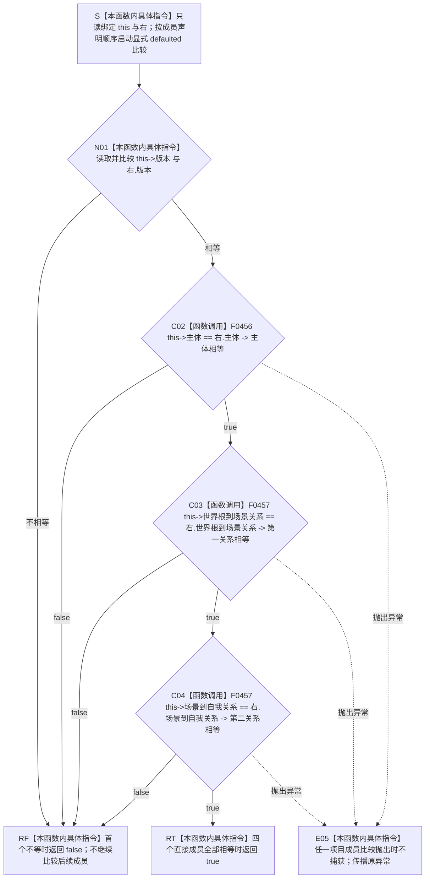

# CF-L5-0120 `系统角色清单::operator==` 现状流程图

图类型：现状流程图
代码版本：`a48a70b2d678dea64dd8228adb4f26f0badd9506`
覆盖文件：`海中鱼巣/领域/系统角色清单.数据.h:215-219,264`
唯一根函数：F0244
完整签名：`bool 海中鱼巣::系统角色清单::operator==(const 海中鱼巣::系统角色清单& 右) const`
参数：隐式 `this` 与 `右` 都是调用期间有效的只读借用，不转移所有权；允许同一对象自比较；悬空引用属于 C++ 未定义行为而非逻辑内结果
返回结果：按成员声明顺序比较 `版本`、`主体`、`世界根到场景关系`、`场景到自我关系`；首个不等时返回 `false`，全部相等时返回 `true`
调用方：当前主入口可达调用方为 F0073 和尚待登记的 `系统角色数据操作::复核系统角色(...)` 对应现存源码路径；一个当前不可达自检函数另有 3 个调用点
被调函数：F0456 `系统角色主体材料::operator==(...)`、F0457 `系统角色关系材料::operator==(...)`（后者调用 2 次）
调用图：`流程图/代码流程图/00_调用知识图谱.md`
逐行映射表：`流程图/代码流程图/L5/CF-L5-0120_系统角色清单等值比较_逐行代码映射表.md`
入口前置：两个对象生命周期有效；本函数不调用 `完整()`，任何可构造值都可比较
结构读取与写入：只读两个值对象的全部直接成员；不写仓库、关系、索引或领域事实
逻辑内返回：`false` 只表示两个值对象的首个对应成员不相等，不是入口拒绝、版本漂移或内部错误；具体业务映射由调用方决定
内部错误：本函数无结构化内部错误分支；成员比较抛出时异常原样传播
生命周期与资源释放：不加锁、不分配资源、不保留引用；返回或异常传播后借用结束
异常：声明未写 `noexcept`，静态合同为 potentially-throwing；当前成员比较没有显式抛出语句，但不得把签名改写为 `noexcept`
验证入口：冻结源码、显式 defaulted 定义的四成员短路顺序、3 条项目调用边、5 个源码调用点和逐行映射机械核对；未运行构建或程序
依据：`规范/0050_项目通用机器逻辑与禁止性规则总纲_20260721.md`、`规范/4010_子规范_统一仓库稳定句柄与通用关系索引边界.md`、`规范/4050_子规范_入口拒绝逻辑内结果与内部逻辑错误.md`、`规范/7130_子规范_自我内部世界成员特征与事实读取投影.md`、`规范/0600_代码函数流程图应用与维护规范.md`
不得作为施工许可：是
不得宣称：值式相等不证明任一对象完整、权威或仍是当前结构事实；递归比较纳入旧主信息句柄，不能据此宣称符合节点直接身份合同

## 流程图

## 节点合同

| 节点 | 类型 | 参数 / 输入绑定 | 结果 / 输出绑定 | 事实读写 | 后继条件 | 验证 |
| --- | --- | --- | --- | --- | --- | --- |
| S | 本函数内具体指令 | `this`、`右` | 两个只读借用 | 无 | 进入 N01 | 264 行显式 defaulted 定义 |
| N01 | 本函数内具体指令 | `this->版本`、`右.版本` | 版本相等 | 只读两个 `std::uint32_t` | false 到 RF；true 到 C02 | 成员声明顺序第一项 |
| C02 | 函数调用 | `this=&this->主体`；`右=&右.主体` | `主体相等` | 只读聚合材料 | false 到 RF；true 到 C03；异常到 E05 | F0456 待展开 |
| C03 | 函数调用 | `this=&this->世界根到场景关系`；`右=&右.世界根到场景关系` | `第一关系相等` | 只读关系材料 | false 到 RF；true 到 C04；异常到 E05 | F0457 待展开 |
| C04 | 函数调用 | `this=&this->场景到自我关系`；`右=&右.场景到自我关系` | `第二关系相等` | 只读关系材料 | false 到 RF；true 到 RT；异常到 E05 | F0457 第二调用点 |
| RF / RT | 本函数内具体指令 | 首个不等或全部相等 | `false` / `true` | 无 | 函数返回 | defaulted 等值语义 |
| E05 | 本函数内具体指令 | 成员比较异常 | 原异常传播 | 不形成布尔结果 | 异常离开函数 | 根函数无 catch |

## 输入契约与非成功语境

| 调用语境 | 失败位置 | 口径 | 结构变化 | 处理 |
| --- | --- | --- | --- | --- |
| 通用值对象比较 | N01 / C02 / C03 / C04 | 对应成员不相等 | 无 | 返回 false |
| F0073 并发缓存比较 | 任一比较节点 | 第二次加锁后已有缓存与刚完成结果不同 | 无 | 调用方映射为 `内部不一致` |
| 系统角色数据操作复核 | 任一比较节点 | 权威读回结果与传入清单不同 | 无 | 调用方映射为 `版本漂移` |
| 任一调用方 | C02 / C03 / C04 | 成员比较抛出 | 无 | 异常原样传播 |

## 全部项目内直接调用点

| 调用方 | 位置 | 当前可达性 | 比较结果用途 |
| --- | --- | --- | --- |
| F0073 `运行期上下文::初始化系统角色(...)` | `海中鱼巣/启动.运行期上下文.ixx:111` | 从生产运行期入口可达 | 第二次加锁后已有缓存时，false 映射为 `内部不一致` |
| 尚未登记 `系统角色数据操作::复核系统角色(...) const` | `海中鱼巣/领域/数据操作.系统角色.ixx:185` | 经 F0454 / F0455 的生产复核路径可达 | 当前权威读回清单与传入清单不等时映射为 `版本漂移` |
| 当前不可达 `运行系统角色初始化自检(bool)` | `海中鱼巣/自检.系统角色初始化.ixx:378` | 函数只有定义，未接入当前 `main` 自检注册链 | 核对重复初始化清单 |
| 同一不可达自检函数 | `海中鱼巣/自检.系统角色初始化.ixx:425` | 同上 | 核对两个并发结果清单 |
| 同一不可达自检函数 | `海中鱼巣/自检.系统角色初始化.ixx:427` | 同上 | 核对缓存清单与并发结果清单 |

## 外部与排除边界

- `std::uint32_t` 的 `==` 是内建运算指令；defaulted 展开机制本身不是另一个函数，均不登记外部边。
- F0456 和 F0457 是项目源码中的显式 defaulted 定义，不能作为编译器隐式函数排除；它们进入 L6 待展开队列。
- F0456 后续会递归调用 `系统根需求角色材料::operator==`、`系统角色身份材料::operator==` 和 F0457；本图只登记直接调用边，不把下层过程内联。
- 当前递归比较仍包含 `系统角色身份材料::主信息` 和 `主信息句柄` 等值，这与 `0050`、`4010` 的节点直接身份和通用主信息退役合同存在实现偏差。
- `运行系统角色初始化自检(...)` 中 3 个调用点所属函数当前没有从 `main` 可达的调用链，只记录排除证据。
