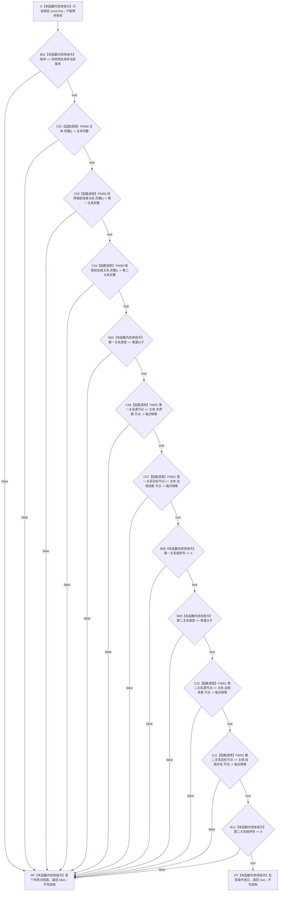

# CF-L5-0121 `系统角色清单::完整` 现状流程图

图类型：现状流程图
代码版本：`a48a70b2d678dea64dd8228adb4f26f0badd9506`
覆盖文件：`海中鱼巣/领域/系统角色清单.数据.h:215-232`
唯一根函数：F0245
完整签名：`bool 海中鱼巣::系统角色清单::完整() const noexcept`
参数：无显式参数；隐式 `this` 是调用期间有效的 `const 系统角色清单*` 只读借用，不取得或保存所有权；悬空 `this` 属 C++ 未定义行为，不形成逻辑内 `false`
返回结果：按源码顺序验证版本、主体、两条关系及其类型、端点和顺序号；首个条件不成立时短路返回 `false`，全部成立时返回 `true`
调用方：当前图谱已登记 F0074、F0075、F0077、F0241；F0454 及其余生产调用方在各自函数展开时补齐反向边；五个当前不可达自检调用方只作排除证据
被调函数：F0458 `系统角色主体材料::完整()`、F0459 `系统角色关系材料::完整()`（调用 2 次）、F0051 `operator==(节点句柄,节点句柄)`（调用 4 次）
调用图：`流程图/代码流程图/00_调用知识图谱.md`
逐行映射表：`流程图/代码流程图/L5/CF-L5-0121_系统角色清单完整_逐行代码映射表.md`
入口前置：对象生命周期有效；本函数允许默认值、零值和坏句柄材料进入，并通过下层谓词或本地比较返回 `false`
结构读取与写入：只读值式清单、主体和关系材料；不读取运行期仓库当前状态，不写节点、关系、索引或领域事实
逻辑内返回：一般候选材料不满足局部谓词时返回 `false`；已成功发布且上游保证完整的材料再次失败时由调用方追根因
内部错误：无结构化内部错误结果；F0051 若异常越过调用将因根函数 `noexcept` 触发终止，不能形成布尔返回
生命周期与资源释放：不加锁、不分配资源、不保留引用；返回后 `this` 借用结束
异常：根函数、F0458、F0459 均声明 `noexcept`；F0051 未显式声明 `noexcept`，冻结实现只有整数比较
验证入口：冻结源码、12 个短路条件、7 条项目调用边、19 个源码调用点和逐行映射机械核对；未运行构建或程序
依据：`规范/0050_项目通用机器逻辑与禁止性规则总纲_20260721.md`、`规范/4010_子规范_统一仓库稳定句柄与通用关系索引边界.md`、`规范/4050_子规范_入口拒绝逻辑内结果与内部逻辑错误.md`、`规范/7130_子规范_自我内部世界成员特征与事实读取投影.md`、`规范/0600_代码函数流程图应用与维护规范.md`
不得作为施工许可：是
不得宣称：返回 `true` 只证明当前值式清单满足旧 v1 局部谓词，不证明仓库记录仍当前、权威自我结构完整或节点直接身份迁移已经完成

## 流程图

## 节点合同

| 节点 | 类型 | 参数 / 输入绑定 | 结果 / 输出绑定 | 事实读写 | 后继条件 | 验证 |
| --- | --- | --- | --- | --- | --- | --- |
| S | 本函数内具体指令 | `this` | 当前清单只读借用 | 无 | 进入 B01 | 221 行签名 |
| B01 | 本函数内具体指令 | `版本`、`系统角色清单当前版本` | 版本是否相等 | 只读标量 | false 到 RF；true 到 C02 | 222 行 |
| C02 | 函数调用 | `this=&主体` | `主体完整` | 只读主体材料 | false 到 RF；true 到 C03 | F0458 待展开 |
| C03 / C04 | 函数调用 | `this=&世界根到场景关系` / `this=&场景到自我关系` | 两项关系完整性 | 只读关系材料 | false 到 RF；true 继续 | F0459 两个调用点 |
| B05 / B08 / B09 / B12 | 本函数内具体指令 | 两条关系的类型、顺序号 | 对应条件是否成立 | 只读关系材料 | false 到 RF；true 继续或到 RT | 224、227、228、231 行 |
| C06 / C07 / C10 / C11 | 函数调用 | 两个 `const 节点句柄&` | 对应端点是否相等 | 只读节点句柄 | false 到 RF；true 继续 | F0051 四个调用点 |
| RF / RT | 本函数内具体指令 | 首个失败或全部成功 | `false` / `true` | 无 | 函数返回 | `&&` 左到右短路 |

## 输入契约与非成功语境

| 调用语境 | 失败位置 | 口径 | 结构变化 | 处理 |
| --- | --- | --- | --- | --- |
| 通用候选材料 | 任一验证节点 | 值式清单不满足局部谓词 | 无 | 逻辑内返回 `false` |
| F0075 初始化概念活动 | 任一验证节点 | 已缓存系统角色材料失去局部完整性 | 无 | 调用方应追根因，不能把所有失败压成入口拒绝 |
| F0241 匹配参数 | C02 及其下层 | 清单主体仍依赖旧主信息完整性条件 | 无 | 登记迁移偏差，不在本图补造目标合同 |
| 权威复核路径 | 任一验证节点 | 值式材料与当前仓库事实可能漂移 | 无 | 必须由正式服务读回裁决，不能仅消费本布尔值 |

## 全部源码直接调用点

- 当前图谱已登记：F0074 `系统角色初始化结果::成功()`、F0075 `运行期上下文::初始化概念活动(...)`、F0077 `运行期上下文::完整()`、F0241 `系统角色清单::匹配参数(...)`。
- 已登记待展开调用方：F0454 `系统角色初始化器::复核(...)`。
- 当前生产链中尚待调用方展开：`运行期上下文::系统角色完整()`、`运行期上下文::概念活动完整()`、`系统角色数据操作::复核系统角色(...)`、`系统角色数据操作::读取当前清单(...)`、概念活动数据操作的初始化/重建、概念活动业务服务的初始化/复核，共 8 个调用点。
- 当前 `main` 无调用链的排除项：运行期兼容请求、服务写入兼容边界、系统角色初始化、运行期上下文、概念命名治理五个旧自检函数，共 6 个调用点。
- 冻结源码合计 19 个直接调用点；聚合调用图只立即闭合已经展开调用方产生的边，其余随调用方展开补齐，避免抢占首次发现顺序。

## 外部与偏差边界

- 标量、枚举和顺序号比较属于本函数内具体指令，不生成外部函数身份。
- F0458 和 F0459 是项目源码中具名 `完整()` 函数，分别进入 L6 待展开队列。
- F0458 下层继续要求旧 `主信息句柄` 有效；这与 `0050`、`4010` 的节点直接身份和通用主信息退役合同存在实现偏差。
- 本函数只验证两条值式关系材料，不能替代 `7130` 要求的正式身份、关系和读取投影读回。
