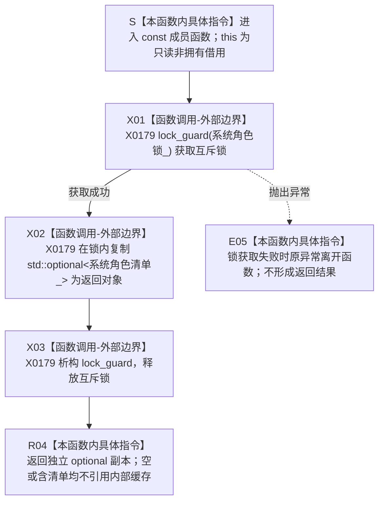

# CF-L5-0122 `运行期上下文::读取系统角色材料` 现状流程图

图类型：现状流程图
代码版本：`a48a70b2d678dea64dd8228adb4f26f0badd9506`
覆盖文件：`海中鱼巣/启动.运行期上下文.ixx:118-121,186-189`
唯一根函数：F0246
完整签名：`std::optional<海中鱼巣::系统角色清单> 海中鱼巣::运行期上下文::读取系统角色材料() const`
参数：无显式参数；隐式 `this` 是调用期间有效的只读非拥有借用；过期对象属于 C++ 未定义行为，不形成空 optional
返回结果：返回调用方拥有的 `std::optional<系统角色清单>` 独立副本；缓存为空则副本为空，缓存存在则在锁内复制完整值对象
调用方：当前图谱已登记 F0075、F0077；冻结源码合计 12 个唯一调用者、17 个调用点，其余随调用方展开闭合反向边
被调函数：无项目源码函数；X0179 记录 `std::lock_guard<std::mutex>` 获取/释放和 `std::optional<系统角色清单>` 值式复制边界
调用图：`流程图/代码流程图/00_调用知识图谱.md`
逐行映射表：`流程图/代码流程图/L5/CF-L5-0122_运行期上下文读取系统角色材料_逐行代码映射表.md`
入口前置：上下文生命周期有效；函数不要求缓存存在，也不调用 F0245 验证清单完整
结构读取与写入：只读受 `系统角色锁_` 保护的 `系统角色清单_` 缓存；不写缓存或运行期机器结构
逻辑内返回：初始化前候选语境允许返回空 optional；已发布上下文或上游保证存在时，空值由调用方追根因
内部错误：锁获取失败抛出 `std::system_error` 并原样传播；不返回半成品，不改变缓存
生命周期与资源释放：锁内完成 optional 值式复制；返回对象形成后 RAII 解锁，副本不引用上下文内部内存
异常：函数未声明 `noexcept`；锁获取异常原样传播；冻结清单复制只含标量和聚合值
验证入口：冻结源码、锁/复制/解锁顺序、17 个源码调用点和逐行映射机械核对；未运行构建或程序
依据：`规范/0050_项目通用机器逻辑与禁止性规则总纲_20260721.md`、`规范/7130_子规范_自我内部世界成员特征与事实读取投影.md`、`规范/0600_代码函数流程图应用与维护规范.md`
不得作为施工许可：是
不得宣称：返回副本是非权威缓存材料，不证明系统角色、完整自我或仓库当前事实成立，也不构成跨缓存或跨仓库原子快照

## 流程图

## 节点合同

| 节点 | 类型 | 参数 / 输入绑定 | 结果 / 输出绑定 | 事实读写 | 后继条件 | 验证 |
| --- | --- | --- | --- | --- | --- | --- |
| S | 本函数内具体指令 | `this` | 上下文只读借用 | 无 | 进入 X01 | 118 行签名 |
| X01 | 函数调用-外部边界 | `系统角色锁_` | 持锁的 `锁` | 只改变同步状态，不改机器事实 | 成功到 X02；异常到 E05 | X0179 |
| X02 | 函数调用-外部边界 | `系统角色清单_` | 独立 optional 返回对象 | 只读缓存材料 | 复制完成到 X03 | X0179 |
| X03 | 函数调用-外部边界 | `锁` | 互斥锁已释放 | 只改变同步状态 | 到 R04 | RAII 析构 |
| R04 | 本函数内具体指令 | 已完成的 optional 对象 | 按值返回给调用方 | 无 | 函数返回 | 120 行 |
| E05 | 本函数内具体指令 | 锁获取异常 | 原异常传播 | 无返回、无缓存变化 | 异常离开函数 | 根函数无 catch |

## 输入契约与非成功语境

| 调用语境 | 返回为空的含义 | 结构变化 | 处理 |
| --- | --- | --- | --- |
| 初始化前候选上下文 | 系统角色尚未缓存 | 无 | 逻辑内空材料 |
| F0075 初始化概念活动 | 三项准入已通过但系统角色缓存为空 | 无 | 调用方入口拒绝；是否为内部漂移需按上游合同分账 |
| F0077 已发布完整性复核 | 完整上下文缺少系统角色缓存 | 无 | 追根因候选 |
| 自检只读快照 | 读取时刻的缓存副本 | 无 | 只能作为自检材料，不取得机器事实权威 |

## 全部源码直接调用点

- 当前图谱已登记：F0075 `运行期上下文::初始化概念活动(...)`、F0077 `运行期上下文::完整()`。
- 当前生产源码待调用方展开：`运行期上下文::系统角色完整()`、`运行期上下文::概念活动完整()`。
- 自检与诊断源码：主装配事务快照/验收、运行期兼容请求、生产运行期首发、服务写入兼容边界、运行期上下文、系统角色初始化、概念命名治理，共 8 个具名调用者、13 个调用点。
- 冻结源码合计 12 个唯一调用者、17 个调用点；未展开调用方不在本批抢占函数身份或调用边。

## 外部与偏差边界

- X0179 合并登记锁获取、optional 复制和 RAII 解锁三个标准库边界调用；标准库函数不生成项目流程图。
- 返回值是值式缓存材料。`0050` 要求缓存命中不得独立裁决机器事实，`7130` 要求正式自我身份和关系由正式服务读回。
- 被复制 DTO 仍递归暴露旧 `主信息句柄`；该偏差归系统角色清单节点直接切换，不由本读取函数重解释。
