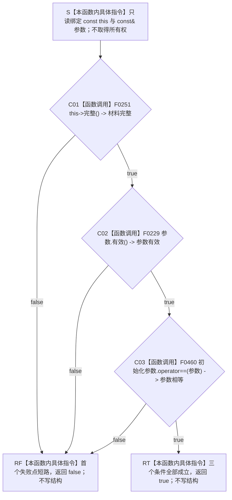

# CF-L5-0123 `概念活动材料::匹配参数` 现状流程图

图类型：现状流程图
代码版本：`a48a70b2d678dea64dd8228adb4f26f0badd9506`
覆盖文件：`海中鱼巣/领域/概念活动状态.数据.h:35-53,152-184`
唯一根函数：F0247
完整签名：`bool 海中鱼巣::概念活动材料::匹配参数(const 海中鱼巣::概念活动初始化参数& 参数) const noexcept`
参数：隐式 `this` 与 `参数` 均为调用期间有效的只读借用，不转移所有权、不保存引用；悬空引用属于 C++ 未定义行为
返回结果：依次要求当前材料完整、候选参数有效、缓存初始化参数与候选参数值式相等；首个失败短路返回 `false`，三项成立返回 `true`
调用方：当前图谱已登记 F0075；概念活动业务服务的生产调用点随其调用方展开闭边；当前不可达生产运行期首发自检调用点只作排除证据
被调函数：F0251 `概念活动材料::完整()`、F0229 `概念活动初始化参数::有效()`、F0460 `概念活动初始化参数::operator==(...)`
调用图：`流程图/代码流程图/00_调用知识图谱.md`
逐行映射表：`流程图/代码流程图/L5/CF-L5-0123_概念活动材料匹配参数_逐行代码映射表.md`
入口前置：两个对象生命周期有效；函数允许无效候选材料进入并返回 `false`
结构读取与写入：只读值式活动材料、初始化参数和投影；不写仓库、关系、索引或领域事实
逻辑内返回：一般值比较语境下 `false` 表示至少一项条件不成立；已验证参数和成功缓存语境中只有 F0460 不等才是异义参数冲突
内部错误：F0251 或 F0229 在已成立前置语境中失败属于内部一致性/契约漂移候选；当前裸 bool 无法保留原因
生命周期与资源释放：不加锁、不分配资源、不保留引用；资源生命周期只覆盖调用
异常：根函数声明 `noexcept`；当前三个下层均无显式抛出路径，若异常越过调用将终止程序而非形成结果
验证入口：冻结源码、3 个项目调用、3 个源码直接调用点、F0227 旧外部边界纠偏和逐行映射机械核对；未运行构建或程序
依据：`规范/0050_项目通用机器逻辑与禁止性规则总纲_20260721.md`、`规范/4010_子规范_统一仓库稳定句柄与通用关系索引边界.md`、`规范/4050_子规范_入口拒绝逻辑内结果与内部逻辑错误.md`、`规范/7140_子规范_概念四根三态实例存在阶段与启动重建边界.md`、`规范/0600_代码函数流程图应用与维护规范.md`
不得作为施工许可：是
不得宣称：返回 `true` 只表示当前值对象匹配，不独立承担概念身份、生命周期、幂等事实或权威结构完整性

## 流程图

## 节点合同

| 节点 | 类型 | 参数 / 输入绑定 | 结果 / 输出绑定 | 事实读写 | 后继条件 | 验证 |
| --- | --- | --- | --- | --- | --- | --- |
| S | 本函数内具体指令 | `this`、`参数` | 两个只读借用 | 无 | 进入 C01 | 182 行 |
| C01 | 函数调用 | `this=&当前概念活动材料` | `材料完整` | 只读活动投影 | false 到 RF；true 到 C02 | F0251 待展开 |
| C02 | 函数调用 | `this=&参数` | `参数有效` | 只读候选参数 | false 到 RF；true 到 C03 | F0229 已完成 |
| C03 | 函数调用 | `this=&初始化参数`；`右=&参数` | `参数相等` | 只读两个值对象 | false 到 RF；true 到 RT | F0460 待展开 |
| RF / RT | 本函数内具体指令 | 首个失败或全部成功 | `false` / `true` | 无 | 函数返回 | `&&` 左到右短路 |

## 输入契约与非成功语境

| 调用语境 | 失败节点 | 口径 | 结构变化 | 处理 |
| --- | --- | --- | --- | --- |
| 通用值式比较 | C01 / C02 / C03 | 材料不完整、参数无效或参数不等 | 无 | 逻辑内 `false` |
| F0075 缓存幂等路径 | C01 | 成功缓存材料不再完整 | 无 | 内部一致性问题，不应映射为幂等冲突 |
| F0075 缓存幂等路径 | C02 | 调用前已验证参数有效，但再次验证失败 | 无 | 前置漂移，应追根因 |
| F0075 或概念活动业务服务 | C03 | 两个有效参数值式不等 | 无 | 才是异义参数/幂等冲突 |

## 全部项目内直接调用点

| 调用方 | 位置 | 当前可达性 | 结果用途 |
| --- | --- | --- | --- |
| F0075 `运行期上下文::初始化概念活动(...)` | `海中鱼巣/启动.运行期上下文.ixx:137` | 当前生产运行期入口可达 | false 被映射为 `幂等冲突` |
| 待其调用方展开的 `概念活动业务服务::初始化(...)` | `海中鱼巣/领域/服务.概念活动.ixx:35` | 经 F0249 生产路径可达 | false 同样被映射为 `幂等冲突` |
| 当前不可达 `运行生产运行期首发自检()` | `海中鱼巣/自检.生产运行期首发.ixx:92` | 未接入当前 `main` 自检注册链 | 验收固定配置与缓存参数匹配 |

## 外部与偏差边界

- F0460 在源码 52 行以显式 `= default` 定义，是项目函数而非编译器隐式黑箱；F0227 旧图的 X0171 子项同步纠正为 F0460 项目调用边。
- F0251 下层仍通过状态角色材料要求旧 `主信息句柄` 有效，与节点直接身份和通用主信息退役合同存在实现偏差。
- 两个生产调用方都把 C01、C02、C03 的全部 `false` 压为幂等冲突，未区分内部一致性、前置漂移和真实异义参数。
