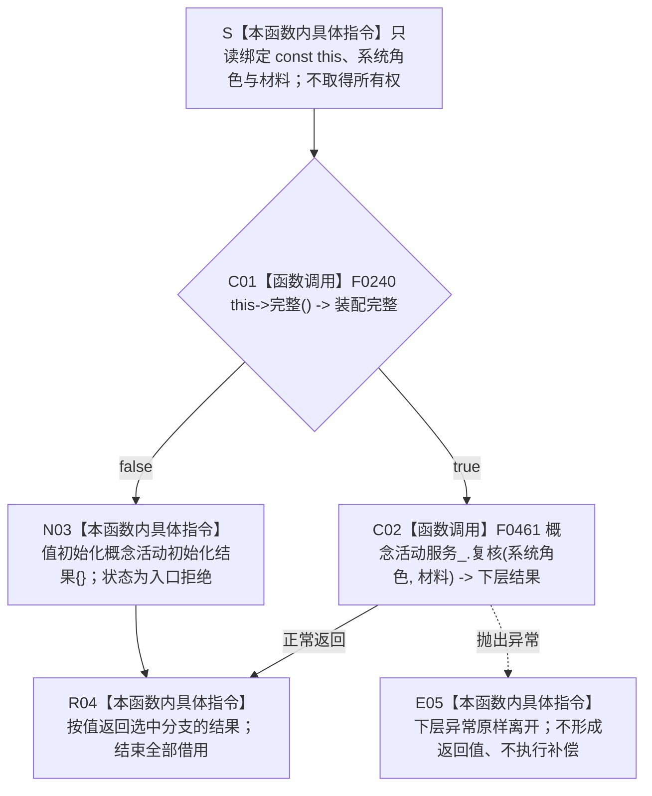

# CF-L5-0124 `运行期业务装配::复核概念活动` 现状流程图

图类型：现状流程图
代码版本：`a48a70b2d678dea64dd8228adb4f26f0badd9506`
覆盖文件：`海中鱼巣/装配.运行期业务.ixx:163-168`
唯一根函数：F0248
完整签名：`海中鱼巣::概念活动初始化结果 海中鱼巣::运行期业务装配::复核概念活动(const 海中鱼巣::系统角色清单& 系统角色, const 海中鱼巣::概念活动材料& 材料) const`
参数：隐式 `this`、`系统角色` 和 `材料` 均为调用期间有效的只读非拥有借用；函数不保存引用、不转移所有权；悬空借用属于 C++ 未定义行为
返回结果：装配完整时原样按值返回 F0461 的 `概念活动初始化结果`；装配不完整时返回调用方拥有的默认结果，状态为 `入口拒绝`、材料为空且不完整
调用方：当前图谱已登记 F0075、F0077；当前不可达的 `运行期上下文::概念活动完整() const` 调用点只作排除证据
被调函数：F0240 `运行期业务装配::完整()`、F0461 `概念活动业务服务::复核(...) const`
调用图：`流程图/代码流程图/00_调用知识图谱.md`
逐行映射表：`流程图/代码流程图/L5/CF-L5-0124_运行期业务装配复核概念活动_逐行代码映射表.md`
入口前置：装配对象和两个参数对象生命周期有效；根函数自身不预先要求装配完整，而是以 F0240 结果选择唯一三元分支
结构读取与写入：根函数只读装配完整性并转发两个值式材料；不直接读写节点、关系、索引或领域记录；F0461 内部会读取并重建活动投影
逻辑内返回：一般候选装配不完整时默认 `入口拒绝` 且零结构写入
内部错误：当前两个可达调用方已经先证明同一装配完整；重复门禁随后失败时应追根因，但代码仍折叠为默认入口拒绝
生命周期与资源释放：根函数不加锁、不分配资源；所有借用在返回或异常离开时结束；下层返回对象归调用方所有
异常：函数未声明 `noexcept`、不捕获异常；F0461 或返回值形成期间的异常原样离开，不形成结果
验证入口：冻结源码、2 个项目调用、2 个当前可达调用方、1 个不可达调用点和逐行映射机械核对；未运行构建或程序
依据：`规范/0050_项目通用机器逻辑与禁止性规则总纲_20260721.md`、`规范/4050_子规范_入口拒绝逻辑内结果与内部逻辑错误.md`、`规范/7140_子规范_概念身份生命周期退役删除与活动投影分账.md`、`规范/0600_代码函数流程图应用与维护规范.md`
不得作为施工许可：是
不得宣称：返回成功只透传下层本次复核结果，不证明活动投影取得权威、完整概念结构已迁移或缓存可以替代权威读回

## 流程图

## 节点合同

| 节点 | 类型 | 参数 / 输入绑定 | 结果 / 输出绑定 | 事实读写 | 后继条件 | 验证 |
| --- | --- | --- | --- | --- | --- | --- |
| S | 本函数内具体指令 | `this`、`系统角色`、`材料` | 三个只读借用 | 无 | 进入 C01 | 163—165 行 |
| C01 | 函数调用 | `this=&当前装配` | `装配完整` | 只读装配依赖探针 | true 到 C02；false 到 N03 | F0240 已完成 |
| C02 | 函数调用 | `this=&概念活动服务_`；`系统角色`、`材料` 原样传递 | `下层结果` | 下层只读权威结构并更新返回投影；根函数不写 | 正常到 R04；异常到 E05 | F0461 待展开 |
| N03 | 本函数内具体指令 | 无 | 默认 `概念活动初始化结果` | 无 | 到 R04 | 167 行聚合值初始化 |
| R04 | 本函数内具体指令 | 下层结果或默认结果 | 调用方拥有的值对象 | 无 | 函数返回 | 三元运算符只求值一支 |
| E05 | 本函数内具体指令 | 下层异常 | 无返回结果 | 根函数零写入 | 异常离开 | 根函数无 catch |

## 输入契约与非成功语境

| 调用语境 | 非成功位置 | 口径 | 结构变化 | 处理 |
| --- | --- | --- | --- | --- |
| 一般候选装配 | C01 为 false | 装配前置不成立 | 根函数无写入 | 默认入口拒绝 |
| F0075 初始化期缓存复核 | C01 为 false | 调用方已先证明同一装配完整，前置发生漂移 | 根函数无写入 | 内部错误候选，不应降格为普通拒绝 |
| F0077 已发布上下文完整性复核 | C01 为 false | 已发布上下文的装配完整性失效 | 根函数无写入 | 追根因 |
| C02 下层返回非成功 | 由 F0461 的强类型结果裁决 | 根函数不重解释原因 | 以 F0461 实际结果为准 | 原样透传 |

## 全部源码直接调用点

- 当前可达并已登记：F0075 `运行期上下文::初始化概念活动(...)`，`启动.运行期上下文.ixx:140`；调用时持有上下文活动锁并已核对装配、参数和系统角色。
- 当前可达并已登记：F0077 `运行期上下文::完整()`，`启动.运行期上下文.ixx:80`；同一短路链已核对装配、系统角色和活动材料。
- 当前不可达排除项：`运行期上下文::概念活动完整() const`，`启动.运行期上下文.ixx:164`；未进入当前 `main` 根模式，不建立当前可达调用边。

## 外部与偏差边界

- `概念活动初始化结果{}` 是本函数内聚合值初始化，不登记项目函数或外部调用边。
- F0075、F0077 已先证明同一 F0240 成立；重复检查失败仍返回无具名原因的 `入口拒绝`，与 4050 的前置成立后内部异常分型存在实现偏差。
- F0461 继续使用私有活动材料缓存参与复核。7140 规定活动材料是可清空、可缺失、可确定重建的非权威投影；缓存缺失或矛盾的精确分型归 F0461 独立展开。
- F0075 持有上下文活动锁时进入 F0461 的服务活动锁；当前只证明这一方向，尚不能据此宣称存在或不存在反向取锁和死锁。
