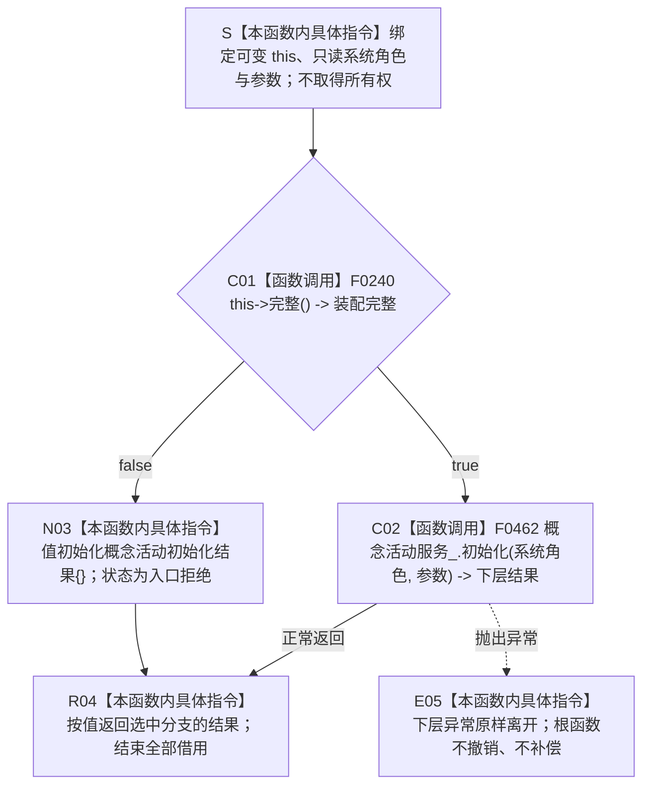

# CF-L5-0125 `运行期业务装配::初始化概念活动` 现状流程图

图类型：现状流程图
代码版本：`a48a70b2d678dea64dd8228adb4f26f0badd9506`
覆盖文件：`海中鱼巣/装配.运行期业务.ixx:156-161`
唯一根函数：F0249
完整签名：`海中鱼巣::概念活动初始化结果 海中鱼巣::运行期业务装配::初始化概念活动(const 海中鱼巣::系统角色清单& 系统角色, const 海中鱼巣::概念活动初始化参数& 参数)`
参数：隐式 `this` 是调用期间有效的可变非拥有借用；`系统角色` 和 `参数` 是调用期间有效的只读非拥有借用；函数不保存引用、不转移所有权
返回结果：装配完整时原样按值返回 F0462 的 `概念活动初始化结果`；装配不完整时返回默认入口拒绝结果；返回值归调用方所有
调用方：当前可达且已登记的唯一直接调用方是 F0075 `运行期上下文::初始化概念活动(...)`
被调函数：F0240 `运行期业务装配::完整()`、F0462 `概念活动业务服务::初始化(...)`
调用图：`流程图/代码流程图/00_调用知识图谱.md`
逐行映射表：`流程图/代码流程图/L5/CF-L5-0125_运行期业务装配初始化概念活动_逐行代码映射表.md`
入口前置：装配对象和两个参数对象生命周期有效；根函数以 F0240 结果决定是否进入下层业务服务
结构读取与写入：根函数只读装配完整性并转发材料；F0462 可以执行概念活动初始化写入，根函数本身不持有事务令牌、不补偿下层变化
逻辑内返回：一般候选装配不完整时返回默认入口拒绝且不调用 F0462
内部错误：当前唯一可达调用方已经先证明同一装配完整；重复门禁随后失败时当前实现仍降格为默认入口拒绝
生命周期与资源释放：根函数不直接加锁或分配；所有借用在返回或异常离开时结束；下层结果按值交给调用方
异常：函数未声明 `noexcept`、不捕获异常；F0462 异常原样传播，根函数无撤销或补偿
验证入口：冻结源码、2 个项目调用、唯一当前可达调用方和逐行映射机械核对；未运行构建或程序
依据：`规范/0050_项目通用机器逻辑与禁止性规则总纲_20260721.md`、`规范/4010_子规范_统一仓库稳定句柄与通用关系索引边界.md`、`规范/4050_子规范_入口拒绝逻辑内结果与内部逻辑错误.md`、`规范/7140_子规范_概念身份生命周期退役删除与活动投影分账.md`、`规范/0600_代码函数流程图应用与维护规范.md`
不得作为施工许可：是
不得宣称：进入 F0462 或返回成功不证明节点直接身份迁移、统一事务发布、活动投影退役或完整概念活动生产能力已经完成

## 流程图

## 节点合同

| 节点 | 类型 | 参数 / 输入绑定 | 结果 / 输出绑定 | 事实读写 | 后继条件 | 验证 |
| --- | --- | --- | --- | --- | --- | --- |
| S | 本函数内具体指令 | `this`、`系统角色`、`参数` | 三个调用期借用 | 无 | 进入 C01 | 156—158 行 |
| C01 | 函数调用 | `this=&当前装配` | `装配完整` | 只读装配依赖探针 | true 到 C02；false 到 N03 | F0240 已完成 |
| C02 | 函数调用 | `this=&概念活动服务_`；系统角色与参数原样传递 | `下层结果` | 下层可写概念活动结构；根函数不直接写 | 正常到 R04；异常到 E05 | F0462 待展开 |
| N03 | 本函数内具体指令 | 无 | 默认入口拒绝结果 | 无 | 到 R04 | 160 行聚合值初始化 |
| R04 | 本函数内具体指令 | 下层结果或默认结果 | 调用方拥有的值对象 | 无 | 函数返回 | 三元运算符只求值一支 |
| E05 | 本函数内具体指令 | 下层异常 | 无返回结果 | 根函数不补偿 | 异常离开 | 根函数无 catch |

## 输入契约与非成功语境

| 调用语境 | 非成功位置 | 口径 | 结构变化 | 处理 |
| --- | --- | --- | --- | --- |
| 一般候选装配 | C01 为 false | 装配前置不成立 | 根函数零写入 | 默认入口拒绝 |
| F0075 正式初始化路径 | C01 为 false | 调用方已先证明同一装配完整，前置发生漂移 | 根函数零写入 | 内部错误候选 |
| C02 下层入口拒绝 / 逻辑内结果 | F0462 强类型状态 | 由下层合同区分 | 以 F0462 实际提交边界为准 | 原样透传 |
| C02 下层内部不一致或异常 | F0462 内部阶段 | 根函数不重解释、不补偿 | 以 F0462 事务边界为准 | 传播结果或异常 |

## 全部源码直接调用点

- F0075 `运行期上下文::初始化概念活动(...)` 在 `启动.运行期上下文.ixx:145` 调用本函数。
- 调用前 F0075 已在 130 行确认同一 `业务装配_.完整()`，在 131—133 行确认系统角色缓存存在、完整且复核成功，并在 144 行释放首次活动缓存锁。
- 冻结源码没有其它项目内直接调用点。

## 外部与偏差边界

- `概念活动初始化结果{}` 是聚合值初始化，不登记项目函数或外部调用边。
- F0075 已先证明 F0240 成立；重复门禁失败仍返回无具名原因的入口拒绝，与 4050 的内部错误分型存在实现偏差。
- F0462 下层继续消费含旧 `主信息句柄` 的活动 DTO，并以私有 optional 活动材料参与幂等。该偏差归 F0462 与概念活动节点直接迁移，不在本薄包装图中补造目标。
- F0462 可能产生结构变化；本根函数不持有事务、撤销或发布令牌，不能单独证明下层事务完整。
