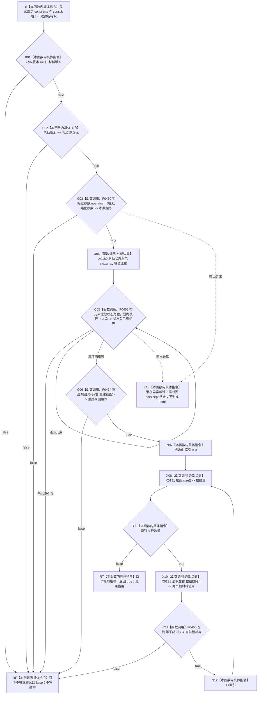

# CF-L5-0126 `概念活动材料::等于` 现状流程图

图类型：现状流程图
代码版本：`a48a70b2d678dea64dd8228adb4f26f0badd9506`
覆盖文件：`海中鱼巣/领域/概念活动状态.数据.h:152-194`
唯一根函数：F0250
完整签名：`bool 海中鱼巣::概念活动材料::等于(const 海中鱼巣::概念活动材料& 右) const noexcept`
参数：隐式 `this` 与 `右` 均为调用期间有效的只读非拥有借用；不复制、不保留、不转移所有权；悬空引用属于 C++ 未定义行为
返回结果：按确定顺序比较材料版本、活动版本、初始化参数、状态角色组、重建视图和四个根材料；首个不等返回 `false`，全部相等返回 `true`
调用方：当前图谱已登记 F0075；F0461 及三个当前不可达自检调用点随其调用方展开或作为排除证据记录
被调函数：F0460 `概念活动初始化参数::operator==(...)`、F0463 `概念活动状态角色材料::operator==(...)`、F0464 `概念活动重建视图::等于(...)`、F0465 `概念活动根材料::等于(...)`
调用图：`流程图/代码流程图/00_调用知识图谱.md`
逐行映射表：`流程图/代码流程图/L5/CF-L5-0126_概念活动材料等值比较_逐行代码映射表.md`
入口前置：两个对象生命周期有效；函数不要求任一材料先通过 `完整()`，相同的无效材料也可能比较为相等
结构读取与写入：只读两个值式活动投影；不加锁、不读取运行期仓库、不写节点、关系、索引或领域记录
逻辑内返回：一般值式比较语境下，首个不等返回 `false`
内部错误：F0075 已在成功初始化后的并发发布语境使用本结果；不等时调用方返回 `内部不一致`
生命周期与资源释放：仅使用栈上循环索引和两个只读借用；返回后借用结束
异常：根函数声明 `noexcept`；F0460、F0463 或标准库数组比较若有异常越过调用，将终止程序而不形成布尔返回
验证入口：冻结源码、4 个项目被调身份、2 个外部边界、1 个当前可达调用点、3 个不可达自检调用点和逐行映射机械核对；未运行构建或程序
依据：`规范/0050_项目通用机器逻辑与禁止性规则总纲_20260721.md`、`规范/4010_子规范_统一仓库稳定句柄与通用关系索引边界.md`、`规范/4050_子规范_入口拒绝逻辑内结果与内部逻辑错误.md`、`规范/7140_子规范_概念身份生命周期退役删除与活动投影分账.md`、`规范/0600_代码函数流程图应用与维护规范.md`
不得作为施工许可：是
不得宣称：返回 `true` 只表示本地值式比较成立，不证明材料完整、活动投影权威、仓库当前结构一致或概念身份生命周期成立

## 流程图

## 节点合同

| 节点 | 类型 | 参数 / 输入绑定 | 结果 / 输出绑定 | 事实读写 | 后继条件 | 验证 |
| --- | --- | --- | --- | --- | --- | --- |
| S | 本函数内具体指令 | `this`、`右` | 两个只读借用 | 无 | 进入 B01 | 186 行 |
| B01 / B02 | 本函数内具体指令 | 左右材料版本、活动版本 | 对应标量是否相等 | 只读值式投影 | false 到 RF；true 继续 | 187 行左到右短路 |
| C03 | 函数调用 | `this=&初始化参数`；`右=&右.初始化参数` | `参数相等` | 只读参数值 | false 到 RF；true 到 X04；异常到 E13 | F0460 待展开 |
| X04 | 函数调用-外部边界 | 两个 `std::array<概念活动状态角色材料,3>` | 启动逐元素比较 | 只读数组容器 | 进入 C05 | X0180 |
| C05 | 函数调用 | 当前左右状态角色元素 | 当前元素相等；聚合为状态角色组相等 | 只读状态角色材料 | 某项 false 到 RF；还有元素回 C05；全部 true 到 C06 | F0463 待展开 |
| C06 | 函数调用 | `this=&重建视图`；`右=&右.重建视图` | `重建视图相等` | 只读重建投影 | false 到 RF；true 到 N07 | F0464 待展开 |
| N07 / B09 / N12 | 本函数内具体指令 | 循环索引与根数量 | 初始化、继续判断、递增 | 无机器事实写入 | 循环或退出 | 190 行 |
| X08 / X10 | 函数调用-外部边界 | 根组及索引 | 根数量、当前左右元素借用 | 只读数组容器 | 到 B09 / C11 | X0181 |
| C11 | 函数调用 | `this=&根组[索引]`；`右=&右.根组[索引]` | `当前根相等` | 只读根材料 | false 到 RF；true 到 N12 | F0465 待展开 |
| RF / RT | 本函数内具体指令 | 首个不等或循环完成 | `false` / `true` | 无 | 函数返回 | 187—193 行 |
| E13 | 本函数内具体指令 | 潜在下层异常 | 无返回结果 | 无 | `std::terminate` | 根函数 `noexcept` |

## 输入契约与非成功语境

| 调用语境 | 非成功位置 | 口径 | 结构变化 | 处理 |
| --- | --- | --- | --- | --- |
| 通用值式比较 | 任一比较节点 | 两个材料按本函数合同不等 | 无 | 逻辑内 `false` |
| 两个同样无效的材料 | 所有比较均相等 | 仍可能返回 `true` | 无 | 不得扩大为完整性或权威证明 |
| F0075 成功初始化后并发发布 | 任一比较节点 | 已成功返回结果与并发缓存不一致 | 无 | 调用方返回 `内部不一致` |
| F0461 服务复核 | F0461 前置和缓存比较 | 预期材料完整但私有缓存可能无效或不等 | 无 | 精确分型归 F0461，不能由本裸 bool 裁决 |

## 全部源码直接调用点

- 当前可达并已登记：F0075 `运行期上下文::初始化概念活动(...)`，`启动.运行期上下文.ixx:148`；下层初始化结果已成功，第二次加锁后缓存存在。
- 经 F0248 新登记但尚待展开的调用方：F0461 `概念活动业务服务::复核(...) const`，`领域/服务.概念活动.ixx:72`；反向边随 F0461 展开建立。
- 当前不可达排除项：`运行概念活动所有权自检()` 在 `领域/自检.概念活动所有权.ixx:200,211,267` 的三个调用点；模块未被当前入口导入或调用，不建立当前可达边。

## 外部与偏差边界

- X0180 只承载 `std::array<概念活动状态角色材料,3>` 容器比较；元素比较的源码显式 defaulted F0463 仍是项目函数，并建立可达回调边。
- X0181 承载 `std::array<概念活动根材料,4>::size()` 与两侧 `operator[] const`；循环、索引判断和递增属于本函数内具体指令。
- F0465 不是普通逐字段比较：它还要求左右概念签名分别满足规范根签名；两个相同但非法的签名仍可比较为 `false`。
- F0463 会递归比较旧 `主信息句柄`，F0465 的根身份比较也继续传播旧主信息字段；与 0050、4010 的节点直接身份和主信息退役合同存在实现偏差。
- 本函数不调用任一材料的 `完整()`；值式相等与 7140 的非权威活动投影边界一致，但不能独立承担结构完整性或当前性。
