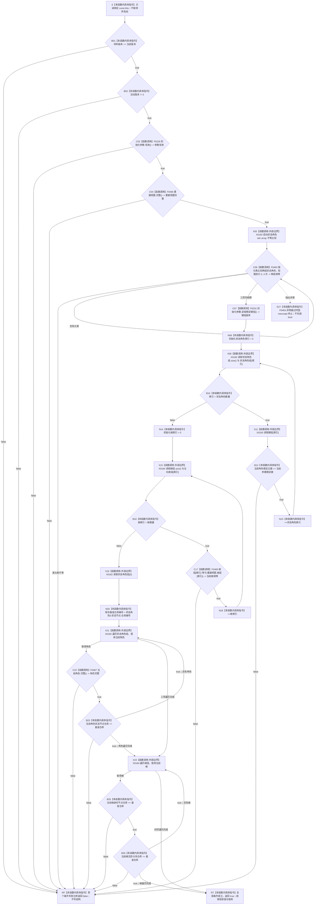

# CF-L5-0127 `概念活动材料::完整` 现状流程图

图类型：现状流程图
代码版本：`a48a70b2d678dea64dd8228adb4f26f0badd9506`
覆盖文件：`海中鱼巣/领域/概念活动状态.数据.h:152-180`
唯一根函数：F0251
完整签名：`bool 海中鱼巣::概念活动材料::完整() const noexcept`
参数：无显式参数；隐式 `this` 是调用期间有效的只读非拥有借用；不保存引用、不转移所有权；悬空对象属于 C++ 未定义行为
返回结果：按固定顺序验证材料版本、活动版本、初始化参数、重建视图、重复状态角色投影、三项稳定键、四个根投影及同仓库约束；首个失败返回 `false`，全部成立返回 `true`
调用方：当前图谱已登记 F0076、F0077、F0247；冻结源码当前可达闭包另有 F0461 和待 F0462 展开的概念活动数据操作调用点，随调用方展开闭合反向边
被调函数：F0229 `概念活动初始化参数::有效()`、F0466 `概念活动重建视图::完整()`、F0463 `概念活动状态角色材料::operator==(...)`、F0231 `概念活动初始化参数::读取稳定键组()`、F0465 `概念活动根材料::等于(...)`、F0467 `概念活动状态角色材料::完整()`
调用图：`流程图/代码流程图/00_调用知识图谱.md`
逐行映射表：`流程图/代码流程图/L5/CF-L5-0127_概念活动材料完整_逐行代码映射表.md`
入口前置：材料对象生命周期有效；函数不取得运行期锁，不证明材料仍对应当前仓库代次
结构读取与写入：只读一个值式概念活动投影及其嵌套数组；不读取仓库、不写节点、关系、索引或领域记录
逻辑内返回：一般候选材料语境中，任一局部谓词不成立返回 `false`
内部错误：候选写入前置已成立、数据操作已经提交或初始化结果已声明成功后再返回 `false`，由调用方按内部不一致追根因
生命周期与资源释放：局部拥有稳定键数组副本、两个循环索引和基准仓库编号；范围遍历元素均为只读借用，返回时结束
异常：根函数声明 `noexcept`；F0463 未显式声明 `noexcept`，若其比较异常越过调用则终止程序，不形成 `false`
验证入口：冻结源码、6 个项目被调身份、3 个外部边界、6 个当前可达源码调用点和逐行映射机械核对；未运行构建或程序
依据：`规范/0050_项目通用机器逻辑与禁止性规则总纲_20260721.md`、`规范/4010_子规范_统一仓库稳定句柄与通用关系索引边界.md`、`规范/4050_子规范_入口拒绝逻辑内结果与内部逻辑错误.md`、`规范/4060_子规范_非权威缓存统计失效与确定重建.md`、`规范/7140_子规范_概念身份生命周期退役删除与活动投影分账.md`、`规范/0600_代码函数流程图应用与维护规范.md`
不得作为施工许可：是
不得宣称：返回 `true` 只证明旧值式 DTO 的局部谓词成立，不证明活动投影权威、概念身份与生命周期当前、运行期上下文完整或生产闭环成立

## 流程图

## 节点合同

| 节点 | 类型 | 参数 / 输入绑定 | 结果 / 输出绑定 | 事实读写 | 后继条件 | 验证 |
| --- | --- | --- | --- | --- | --- | --- |
| S / B01 / B02 | 本函数内具体指令 | `this`、材料版本、活动版本 | 只读借用与两个布尔判断 | 只读非权威投影 | false 到 RF；true 继续 | 160—162 行 |
| C03 | 函数调用 | `this=&初始化参数` | `参数有效` | 只读初始化参数 | false 到 RF；true 到 C04 | F0229 |
| C04 | 函数调用 | `this=&重建视图` | `重建视图完整` | 只读重建投影 | false 到 RF；true 到 X05 | F0466 待展开 |
| X05 / C06 | 函数调用-外部边界 / 函数调用 | 两个状态角色数组；逐元素绑定左右角色 | 数组相等 | 只读状态角色投影 | 不等到 RF；相等到 C07；异常到 E27 | X0182、F0463 |
| C07 | 函数调用 | `this=&初始化参数` | 三项稳定键数组副本 | 只读参数 | 到 N08 | F0231 |
| N08 / X09 / B10 / X11 / B12 / N13 | 本函数内具体指令 / 函数调用-外部边界 | 状态角色组、键组、循环索引 | 每项稳定键是否一致 | 只读数组和局部索引 | 失败到 RF；循环完成到 N14 | 165—167 行、X0182/X0183 |
| N14 / X15 / B16 / C17 / N18 | 本函数内具体指令 / 函数调用 | 根组、重建视图根组、循环索引 | 每个根投影是否相等 | 只读根投影 | 失败到 RF；循环完成到 X19 | 168—170 行、F0465/X0184 |
| X19 / N20 | 函数调用-外部边界 / 本函数内具体指令 | 状态角色0 | 基准仓库编号 | 只读投影字段 | 到 X21 | 171 行 |
| X21 / C22 / B23 | 函数调用-外部边界 / 函数调用 / 本函数内具体指令 | 当前角色、基准仓库 | 角色完整且同仓库 | 只读状态角色投影 | 失败到 RF；继续或到 X24 | 172—174 行、F0467/X0182 |
| X24 / B25 / B26 | 函数调用-外部边界 / 本函数内具体指令 | 当前根、基准仓库 | 根节点和活跃关系均同仓库 | 只读根投影 | 失败到 RF；继续或到 RT | 175—178 行、X0184 |
| RF / RT | 本函数内具体指令 | 首个失败或全部循环完成 | `false` / `true` | 无 | 函数返回 | 161—179 行 |
| E27 | 本函数内具体指令 | F0463 潜在异常 | 无返回结果 | 无 | `std::terminate` | 根函数 `noexcept` |

## 输入契约与非成功语境

| 调用语境 | 返回 `false` 的口径 | 结构变化 | 处理 |
| --- | --- | --- | --- |
| 一般外部或候选材料 | 局部材料谓词不成立 | 无 | 逻辑内 `false` |
| F0076 已提交 / 幂等读回结果 | 成功状态携带的材料不完整 | 无 | 内部不一致候选；F0076 当前压成 `false` |
| F0077 候选发布前完整性检查 | 候选材料尚不完整 | 无 | 候选拒绝；已发布上下文中同样结果应追根因 |
| F0247 参数匹配 | 材料自身失败、候选参数失败或两个参数不等混入同一裸 `false` | 无 | 调用方不得全部映射为幂等冲突 |
| F0461 服务复核 | 预期材料不完整或私有缓存矛盾 | 无 | 需由 F0461 精确分型 |
| 数据操作候选组装 / 提交后读回 | 前置和写入结果已成立但候选材料不完整 | 可能已有事务候选或已提交事实 | 4050 内部逻辑错误，不是普通入口拒绝 |

## 全部源码直接调用点

- 当前图谱已登记：F0076 `概念活动初始化结果::成功()`，`领域/概念活动状态.数据.h:213`；F0077 `运行期上下文::完整()`，`启动.运行期上下文.ixx:79`；F0247 `概念活动材料::匹配参数(...)`，`领域/概念活动状态.数据.h:183`。
- 当前可达、调用方待展开：F0461 `概念活动业务服务::复核(...) const`，`领域/服务.概念活动.ixx:71`；`概念活动数据操作::初始化全新活动(...) const`，`领域/数据操作.概念活动.ixx:119,125`。
- 以上共 5 个唯一调用方、6 个源码调用点。旧概念活动所有权自检中的其它调用当前不可达，只作排除证据，不建立当前调用边。

## 外部与偏差边界

- X0182 统一记录状态角色数组的不等比较、`size/operator[]` 和范围遍历；比较时逐元素调用项目显式 defaulted F0463。
- X0183 只记录稳定键数组的 `operator[] const`；X0184 记录根数组的 `size/operator[]` 和范围遍历。
- F0463 与 F0467 继续读取旧 `主信息句柄`；与 0050、4010 的节点直接身份和主信息退役合同存在实现偏差。
- 7140 明确活动快照、重建视图和活动版本是可清空、可确定重建的非权威投影。本函数只验证本地副本内部重复字段和仓库编号一致，未读节点、关系、领域类型化记录或生命周期当前关系。
- 当前材料只承载材料版本和活动投影代次，未完整承载 4060 要求的权威来源版本、规则版本和失效身份；`true` 不能证明缓存当前有效。
- `noexcept` 根函数调用未显式 `noexcept` 的 F0463，静态异常合同未闭合。
