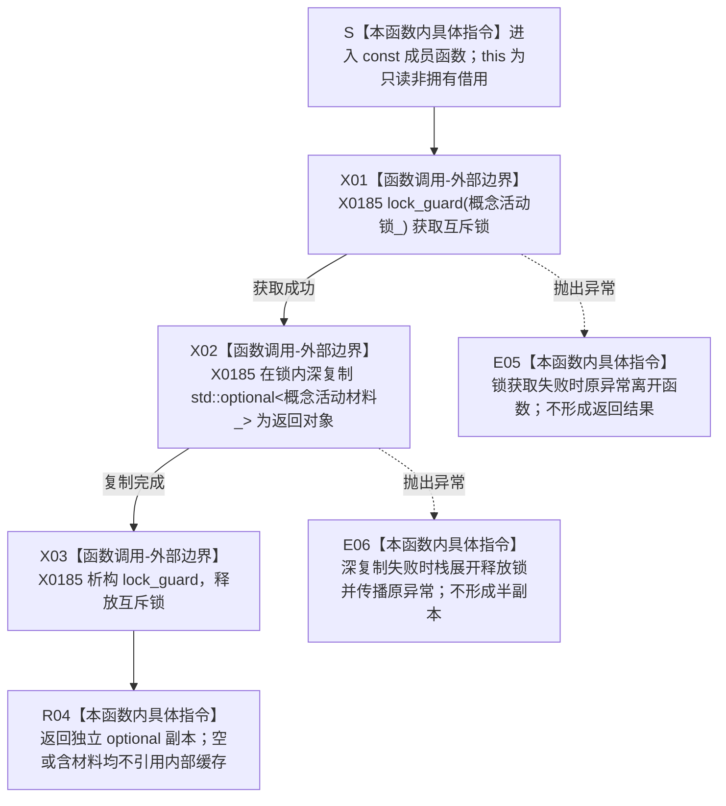

# CF-L5-0128 `运行期上下文::读取概念活动材料` 现状流程图

图类型：现状流程图
代码版本：`a48a70b2d678dea64dd8228adb4f26f0badd9506`
覆盖文件：`海中鱼巣/启动.运行期上下文.ixx:155-158,188-189`
唯一根函数：F0252
完整签名：`std::optional<海中鱼巣::概念活动材料> 海中鱼巣::运行期上下文::读取概念活动材料() const`
参数：无显式参数；隐式 `this` 是调用期间有效的只读非拥有借用；过期对象属于 C++ 未定义行为，不形成空 optional
返回结果：返回调用方拥有的 `std::optional<概念活动材料>` 独立深副本；缓存为空则副本为空，缓存存在则在锁内复制完整值对象
调用方：当前根模式递归可达并已登记的唯一项目调用方是 F0077；冻结源码另有 13 个当前不可达调用点，只作排除证据
被调函数：无项目源码函数；X0185 记录 `std::lock_guard<std::mutex>` 获取/释放和 `std::optional<概念活动材料>` 值式深复制边界
调用图：`流程图/代码流程图/00_调用知识图谱.md`
逐行映射表：`流程图/代码流程图/L5/CF-L5-0128_运行期上下文读取概念活动材料_逐行代码映射表.md`
入口前置：上下文生命周期有效；函数不要求缓存存在，不调用 F0251 验证材料完整，也不取得概念活动业务服务锁
结构读取与写入：只读受 `概念活动锁_` 保护的 `概念活动材料_` 缓存；不写缓存或运行期机器结构
逻辑内返回：未初始化候选语境允许返回空 optional；已发布上下文中空值由调用方追根因
内部错误：锁获取失败抛出 `std::system_error`；活动材料深复制可能因分配失败抛出；两类异常均原样传播，不返回半副本
生命周期与资源释放：锁内完成 optional 深复制；正常返回对象形成或复制异常展开时 RAII 解锁；成功副本不引用上下文内部存储
异常：函数未声明 `noexcept`；锁和深复制异常均可传播
验证入口：冻结源码、锁/深复制/解锁顺序、14 个源码调用点、当前可达性和逐行映射机械核对；未运行构建或程序
依据：`规范/0050_项目通用机器逻辑与禁止性规则总纲_20260721.md`、`规范/4050_子规范_入口拒绝逻辑内结果与内部逻辑错误.md`、`规范/4060_子规范_非权威缓存统计失效与确定重建.md`、`规范/7140_子规范_概念身份生命周期退役删除与活动投影分账.md`、`规范/0600_代码函数流程图应用与维护规范.md`
不得作为施工许可：是
不得宣称：返回副本是单一非权威缓存快照，不证明概念身份、关系、生命周期或仓库当前事实成立，也不构成跨缓存、跨服务或跨仓库同代次快照

## 流程图

## 节点合同

| 节点 | 类型 | 参数 / 输入绑定 | 结果 / 输出绑定 | 事实读写 | 后继条件 | 验证 |
| --- | --- | --- | --- | --- | --- | --- |
| S | 本函数内具体指令 | `this` | 上下文只读借用 | 无 | 进入 X01 | 155 行签名 |
| X01 | 函数调用-外部边界 | `概念活动锁_` | 持锁的 `锁` | 只改变同步状态，不改机器事实 | 成功到 X02；异常到 E05 | X0185 |
| X02 | 函数调用-外部边界 | `概念活动材料_` | 独立 optional 深副本 | 只读缓存材料 | 成功到 X03；异常到 E06 | X0185 |
| X03 | 函数调用-外部边界 | `锁` | 互斥锁已释放 | 只改变同步状态 | 到 R04 | RAII 析构 |
| R04 | 本函数内具体指令 | 已完成的 optional 对象 | 按值返回给调用方 | 无 | 函数返回 | 157 行 |
| E05 | 本函数内具体指令 | 锁获取异常 | 原异常传播 | 无返回、无缓存变化 | 异常离开函数 | 根函数无 catch |
| E06 | 本函数内具体指令 | 深复制异常 | 原异常传播 | 无返回、缓存不变、锁已释放 | 异常离开函数 | 活动材料递归含动态 vector |

## 输入契约与非成功语境

| 调用语境 | 返回为空的含义 | 结构变化 | 处理 |
| --- | --- | --- | --- |
| 初始化前候选上下文 | 概念活动尚未缓存 | 无 | 逻辑内空材料 |
| F0077 候选发布准入 | 候选缺少概念活动材料 | 无 | `完整()` 返回 false，宿主拒绝发布 |
| 已发布上下文 | 已发布上下文丢失活动缓存 | 无 | 内部漂移候选，不应继续当作普通未初始化 |
| 自检只读快照 | 读取时刻的单缓存副本 | 无 | 只能作为自检材料，不取得机器事实权威 |

## 全部源码直接调用点

- 当前可达并已登记：F0077 `运行期上下文::完整() const`，`启动.运行期上下文.ixx:76`；返回值绑定为 `活动`，随后检查存在、完整并执行服务复核。
- 当前不可达生产成员：`运行期上下文::概念活动完整()`，`启动.运行期上下文.ixx:162`。
- 当前不可达自检：`运行概念命名治理自检(...)` 1 次、`运行主装配事务自检()` 2 次、`运行生产运行期首发自检()` 1 次、`运行系统角色初始化自检(bool)` 1 次、`运行运行期上下文自检()` 1 次、`运行运行期兼容请求自检()` 1 次、`运行概念活动所有权自检()` 5 次。
- 冻结源码合计 14 个调用点；当前不可达函数不建立项目调用边。

## 外部与偏差边界

- X0185 分账互斥锁获取、optional 深复制和 RAII 解锁；标准库函数不生成项目流程图。
- `概念活动材料` 递归包含 `std::vector<概念约束材料>`，因此有值副本的深复制可因分配失败抛出；异常展开仍释放锁。
- 返回值只是 7140 所列活动投影的单缓存副本。函数没有事务代次，也不与概念活动服务锁、节点、关系或领域记录形成原子快照。
- DTO 仍递归包含旧 `主信息句柄`，与 0050、4010 的节点直接身份合同存在实现偏差。
- F0077 把可清空活动投影的存在作为运行期上下文完整性和租约有效性的前置，与 7140 的“可清空、可确定重建、不裁决权威事实”边界冲突；偏差归上下文完整性与活动投影合同，不由本读取函数重解释。
- 空 optional 同时承载合法未初始化和已发布内部缺失，函数自身没有强类型结果分型。
