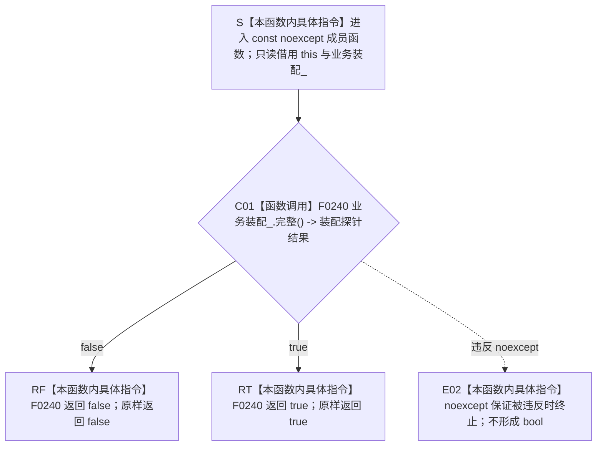

# CF-L5-0129 `运行期上下文::服务装配完整` 现状流程图

图类型：现状流程图
代码版本：`a48a70b2d678dea64dd8228adb4f26f0badd9506`
覆盖文件：`海中鱼巣/启动.运行期上下文.ixx:83-85,184`
唯一根函数：F0253
完整签名：`bool 海中鱼巣::运行期上下文::服务装配完整() const noexcept`
参数：无显式参数；隐式 `this` 是调用期间有效的只读非拥有借用；不保存引用、不转移所有权
返回结果：原样返回 F0240 `运行期业务装配::完整() const noexcept` 的布尔结果
调用方：当前根模式递归可达并已登记的唯一调用方是 F0078；冻结源码另有 6 个当前不可达自检调用点
被调函数：F0240 `运行期业务装配::完整() const noexcept`
调用图：`流程图/代码流程图/00_调用知识图谱.md`
逐行映射表：`流程图/代码流程图/L5/CF-L5-0129_运行期上下文服务装配完整_逐行代码映射表.md`
入口前置：上下文生命周期有效；函数不要求结构核心、系统角色或概念活动已经完整
结构读取与写入：只读成员 `业务装配_` 并委托其探针；本函数不加锁、不写任何机器结构
逻辑内返回：当前唯一可达语境是未发布候选准入；F0240 返回 false 时 F0078 在写入前映射为 `缺少领域服务装配`
内部错误：已发布上下文若后续出现同样 false 应追根因；本函数当前唯一可达调用点不处于该语境
生命周期与资源释放：仅借用上下文和成员装配，返回后借用结束
异常：根函数和 F0240 均声明 `noexcept`；没有正常异常返回路径，违反保证时直接终止
验证入口：冻结源码、1 个项目调用边、1 个当前可达调用点、6 个不可达自检调用点和逐行映射机械核对；未运行构建或程序
依据：`规范/0050_项目通用机器逻辑与禁止性规则总纲_20260721.md`、`规范/4050_子规范_入口拒绝逻辑内结果与内部逻辑错误.md`、`规范/0600_代码函数流程图应用与维护规范.md`
不得作为施工许可：是
不得宣称：返回 `true` 只转述 F0240 当前十二项装配探针成立，不证明结构核心、系统角色、概念活动、机器事实发布或完整生产闭环成立

## 流程图

## 节点合同

| 节点 | 类型 | 参数 / 输入绑定 | 结果 / 输出绑定 | 事实读写 | 后继条件 | 验证 |
| --- | --- | --- | --- | --- | --- | --- |
| S | 本函数内具体指令 | `this`、成员 `业务装配_` | 两个只读借用 | 无 | 到 C01 | 83、184 行 |
| C01 | 函数调用 | `this=&业务装配_` | `装配探针结果` | 只读下层接线探针 | false 到 RF；true 到 RT | F0240 |
| RF / RT | 本函数内具体指令 | `装配探针结果` | 原样 `false` / `true` | 无 | 函数返回 | 84 行 |
| E02 | 本函数内具体指令 | 下层违反无异常保证 | 无返回结果 | 无 | `std::terminate` | 两层均 `noexcept` |

## 输入契约与非成功语境

| 调用语境 | F0240 返回 `false` 的含义 | 结构变化 | 处理 |
| --- | --- | --- | --- |
| F0078 未发布候选准入 | 候选缺少当前装配探针之一 | 无 | 写前逻辑内拒绝，映射为 `缺少领域服务装配` |
| 已发布上下文假设语境 | 原先完整的装配探针发生漂移 | 无 | 内部逻辑错误候选；本函数不分型 |
| 当前不可达自检 | 只读探针不成立 | 无 | 仅作验收材料，不取得机器事实权威 |

## 全部源码直接调用点

- 当前可达并已登记：F0078 `运行期上下文宿主::尝试首次发布全新上下文(...)`，`启动.运行期上下文.ixx:216`；前置为候选非空且 F0239 `结构核心完整()` 已返回 true。
- 当前不可达自检：`运行主装配事务自检()` 2 次、`运行系统角色初始化自检(bool)` 1 次、`运行运行期上下文自检()` 1 次、`运行运行期兼容请求自检()` 1 次、`运行运行期组合分层自检(bool)` 1 次。
- 冻结源码合计 7 个调用点；当前不可达自检不建立项目调用边。

## 外部与偏差边界

- 本函数没有标准库、系统、间接、虚调用或递归边；唯一行为是薄转发 F0240。
- F0240 依次检查九个数据操作、概念活动服务、系统角色初始化器、稳定动作键和业务操作组合器；这些下层探针 F0442—F0453 仍待逐函数展开。
- `true` 的证明范围因此属于证据不足，但本薄转发函数没有新增独立实现偏差。
- 当前唯一可达调用方在发布写入前将 false 映射为具名状态，符合 4050 的写前逻辑内拒绝；本函数自身仍是裸 bool，不能区分候选拒绝与已发布漂移。
