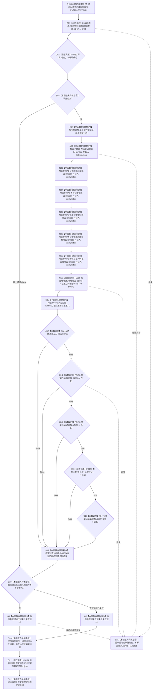

# CF-L5-0130 `运行概念图四根创建自检` 现状流程图

图类型：现状流程图
代码版本：`a48a70b2d678dea64dd8228adb4f26f0badd9506`
覆盖文件：`海中鱼巣/自检.入口初始化.ixx:73-100`
唯一根函数：F0254
完整签名：`海中鱼巣::自检单元结果 海中鱼巣::运行概念图四根创建自检(const 海中鱼巣::入口初始化自检运行配置& 配置)`
参数：`配置` 是调用期间有效的只读非拥有借用；函数不保存其引用；`配置.强制失败编号` 是测试故障注入材料，`配置.观察回调` 由 F0468 消费
返回结果：独立值式 `自检单元结果`；编号固定 `ENTRY-ONLY-S01`，名称固定“概念图四根创建”，验收项固定 1，失败项为 0 或 1
调用方：F0080 `登记入口初始化自检单元(...)::<lambda@486>::operator()() const`
直接被调函数：F0468、F0469、F0015、F0016、F0476；隔离环境销毁显式可达 F0131 `自我线程::~自我线程()`
同步回调函数：F0015 按端口顺序调用 F0470—F0475；这些回调不是 F0254 的直接调用
调用图：`流程图/代码流程图/00_调用知识图谱.md`
逐行映射表：`流程图/代码流程图/L5/CF-L5-0130_运行概念图四根创建自检_逐行代码映射表.md`
入口前置：仅在完整自检模式的 S01 登记回调被运行器执行时可达；其它当前根模式不可达
结构读取与写入：在局部独占 `普通应用上下文` 中执行系统初始化并只读四个根节点类型；不把该隔离上下文发布为全局运行期结构
逻辑内返回：环境或系统初始化失败、任一根读取/类型验收失败、强制失败命中均折叠为一项自检失败
内部错误：F0016 已返回成功后根节点缺失或类型错误是内部不一致证据，但当前结果只保留总通过位
生命周期与资源释放：环境按值独占 `unique_ptr`；六个端口闭包和类型匹配闭包只捕获局部上下文引用；端口先于环境销毁
异常：根函数无 `noexcept` 且无 `catch`；异常不形成 `自检单元结果`，局部对象按 RAII 展开并由上层自检运行器异常边界收口
验证入口：冻结源码、8 个显式根调用点、1 个项目成员隐式析构调用、13 条回调/下层调用边、5 组外部边界和逐行映射机械核对；未运行构建或程序
依据：`规范/0050_项目通用机器逻辑与禁止性规则总纲_20260721.md`、`规范/4010_子规范_统一仓库稳定句柄与通用关系索引边界.md`、`规范/4050_子规范_入口拒绝逻辑内结果与内部逻辑错误.md`、`规范/7140_子规范_概念身份生命周期退役删除与活动投影分账.md`、`规范/8120_子规范_程序入口启动模式与运行宿主边界_20260726.md`
不得作为施工许可：是
不得宣称：本函数通过只证明旧初始化结果与四个节点类型检查成立，不证明四根正式稳定身份、生命周期、权威关系或完整生产闭环成立

## 流程图

## 节点合同

| 节点 | 类型 | 参数 / 输入绑定 | 结果 / 输出绑定 | 事实读写 | 后继条件 | 验证 |
| --- | --- | --- | --- | --- | --- | --- |
| S | 本函数内具体指令 | `配置` | `编号` | 无 | 到 C01 | 73—74 行 |
| C01 / C02 / B03 | 函数调用 / 本函数内具体指令 | `配置,编号`；`this=&环境` | 独占环境；环境成功位 | F0468 形成隔离测试上下文 | 成功到 X04；失败到 B19 | F0468/F0469 |
| X04 | 本函数内具体指令 | `环境.上下文` | 非拥有 `上下文&` | 只绑定局部结构 | 到 N05 | X0187 |
| N05—N10 | 本函数内具体指令 | 六组上下文成员与参数 | F0470—F0475 闭包及端口 | 不执行回调、不写结构 | 依次到 C11 | X0188 |
| C11 | 函数调用 | `端口`、两项配置材料 | `系统初始化结果` | 经六个回调写入隔离上下文 | 到 N12 | F0015；E0986—E0997 |
| N12 | 本函数内具体指令 | `上下文&` | F0476 闭包 | 无 | 到 C13 | 88—91 行 |
| C13—C17 / N18 | 函数调用 / 本函数内具体指令 | 初始化结果、四个根材料和预期类型 | `通过` | F0476 只读节点仓 | 首个 false 短路 | E0981—E0985、E0998 |
| B19 | 本函数内具体指令 | `通过`、可选失败编号、固定编号 | 最终通过位 | 无 | 到 RT 或 RF | X0190 |
| RT / RF / D20 / D22 | 本函数内具体指令 | 固定编号、名称、通过位 | 独立自检结果；局部资源释放 | 不发布隔离上下文 | 经 C21 后函数返回 | 97—100 行 |
| C21 | 函数调用 | `this=&环境.上下文->自我线程实例` | 无返回值 | 停止并收口隔离自我线程 | 正常到 D22；异常展开也可达 | F0131、E0999 |
| E21 | 本函数内具体指令 | 异常对象 | 无正常结果 | 已形成局部结构随环境销毁 | 向 F0080 上层传播 | 根函数异常合同 |

## 输入契约与非成功语境

| 语境 | 非成功条件 | 结构变化 | 分类与后继 |
| --- | --- | --- | --- |
| 环境构造 | F0468/F0469 不成功 | 不进入本项初始化 | 自检失败 |
| 系统初始化 | F0015 返回非成功 | 隔离上下文可能有完整或已收口的局部变化 | 自检失败；具体状态被根函数压缩 |
| 四根类型读回 | F0016 已成功，但 F0476 任一读取无值或类型不符 | 只读 | 内部不一致证据；报告本项失败 |
| 强制失败 | 配置编号命中 S01 | 隔离结构可以已经完整形成 | 测试故障注入；报告本项失败 |
| 异常 | 分配或下层调用抛出 | 不发布全局结构；RAII 销毁局部环境 | 无 `自检单元结果`；交给运行器异常边界 |

## 外部与偏差边界

- X0186—X0190 分账固定字符串视图、独占上下文生命周期、六个 `std::function` 端口、局部闭包和结果/故障注入字符串边界。
- F0470—F0475 与 F0476 是独立待展开函数；本图只记录闭包构造、F0015 的同步回调边和直接调用，不展开其内部流程。
- 节点类型 3/10/13/11 与 7140 四根类型一致；但本函数未核对固定系统角色稳定主键、完整句柄、概念签名、关系 12 永久活跃或所属对象权威结构。
- F0016 的旧成功谓词仍把名称入口材料纳入成功条件；名称与登记投影均不能单独证明 7140 的根身份。
- 环境确为局部独占，但本函数未读取初始计数、未验证析构后 live-count 或跨项引用清零，隔离收口证据仍不完整。
