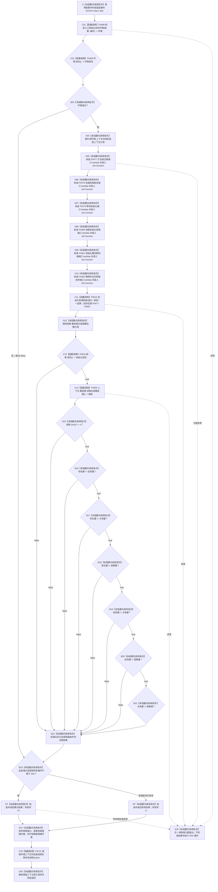

# CF-L5-0131 `运行概念图四根唯一自检` 现状流程图

图类型：现状流程图
代码版本：`a48a70b2d678dea64dd8228adb4f26f0badd9506`
覆盖文件：`海中鱼巣/自检.入口初始化.ixx:102-128`
唯一根函数：F0255
完整签名：`海中鱼巣::自检单元结果 海中鱼巣::运行概念图四根唯一自检(const 海中鱼巣::入口初始化自检运行配置& 配置)`
参数：`配置` 是调用期间有效的只读非拥有借用；不保存引用
返回结果：独立值式 `自检单元结果`；编号固定 `ENTRY-ONLY-S02`，名称固定“概念图四根唯一”，验收项固定 1，失败项为 0 或 1
调用方：F0081 `登记入口初始化自检单元(...)::<lambda@488>::operator()() const`
直接被调函数：F0468、F0469、F0015、F0016、F0355；隔离环境销毁显式可达 F0131 `自我线程::~自我线程()`
同步回调函数：F0015 按端口顺序调用 F0477—F0482；这些回调不是 F0255 的直接调用
调用图：`流程图/代码流程图/00_调用知识图谱.md`
逐行映射表：`流程图/代码流程图/L5/CF-L5-0131_运行概念图四根唯一自检_逐行代码映射表.md`
入口前置：仅完整自检模式 S02 可达；正常生产路径不可达
结构读取与写入：在局部隔离上下文执行系统初始化；随后读取旧四根登记投影并比较四个裸稳定非名称键
逻辑内返回：环境/初始化失败、登记数量非 4、任一键重复或故障注入命中均折叠为一项自检失败
内部错误：初始化已成功但登记数量或键唯一性不符是内部不一致证据，当前结果不保留具名原因
生命周期与资源释放：环境独占上下文；端口闭包引用只在同步初始化期间有效；函数退出销毁隔离上下文
异常：无 `noexcept`、无 `catch`；异常不形成自检结果并按 RAII 展开
验证入口：冻结源码、5 个显式根调用点、1 个项目成员隐式析构调用、12 条回调/下层调用边、5 组外部边界与逐行映射机械核对；未运行构建或程序
依据：`规范/0050_项目通用机器逻辑与禁止性规则总纲_20260721.md`、`规范/4010_子规范_统一仓库稳定句柄与通用关系索引边界.md`、`规范/4050_子规范_入口拒绝逻辑内结果与内部逻辑错误.md`、`规范/7140_子规范_概念身份生命周期退役删除与活动投影分账.md`、`规范/8120_子规范_程序入口启动模式与运行宿主边界_20260726.md`
不得作为施工许可：是
不得宣称：登记数量为 4 且四个裸键两两不同不等于四个正式概念根身份唯一

## 流程图

## 节点合同

| 节点 | 类型 | 参数 / 输入绑定 | 结果 / 输出绑定 | 事实读写 | 后继条件 | 验证 |
| --- | --- | --- | --- | --- | --- | --- |
| S | 本函数内具体指令 | `配置` | 固定编号 | 无 | 到 C01 | 102—103 行 |
| C01 / C02 / B03 | 函数调用 / 本函数内具体指令 | `配置,编号`；环境 | 环境与成功位 | F0468 形成隔离上下文 | 成功到 X04；失败到 B23 | F0468/F0469 |
| X04 / N05—N10 | 本函数内具体指令 | 独占上下文 | 上下文借用、F0477—F0482 端口 | 只构造回调 | 到 C11 | X0192/X0193 |
| C11 | 函数调用 | 端口和请求 | 初始化结果 | 写入隔离上下文 | 到 N12 | F0015 |
| N12 / C13 | 本函数内具体指令 / 函数调用 | 初始化结果 | 概念图借用、成功位 | 无 | true 到 C14；false 到 N22 | F0016 |
| C14 / B15 | 函数调用 / 本函数内具体指令 | `this=&上下文.概念图` | 根登记组及数量判断 | 只读非权威登记投影 | 数量 4 到 B16 | F0355、X0194 |
| B16—B21 / N22 | 本函数内具体指令 | 四个裸 `uint64_t` 键 | 通过位 | 无 | 首个相等短路 | 119—124 行 |
| B23 / RT / RF / D24 / D26 | 本函数内具体指令 | 通过位与故障注入 | 一项值式结果；释放资源 | 不发布隔离上下文 | 经 C25 后返回 | X0195 |
| C25 | 函数调用 | `this=&环境.上下文->自我线程实例` | 无返回值 | 停止并收口隔离自我线程 | 正常到 D26；异常展开也可达 | F0131、E1017 |
| E25 | 本函数内具体指令 | 异常 | 无正常结果 | 局部结构随环境销毁 | 向上层传播 | 根异常合同 |

## 输入契约与非成功语境

| 语境 | 非成功条件 | 结构变化 | 分类与后继 |
| --- | --- | --- | --- |
| 环境/初始化 | 环境或 F0015 不成功 | 只存在隔离测试结构 | 自检失败 |
| 根登记读取 | F0016 成功后登记数量不是 4 | 只读 | 内部不一致证据；自检失败 |
| 裸键比较 | 任一 `稳定非名称键` 相等 | 只读 | 当前实现的一致性失败；不等于正式稳定主键验收 |
| 强制失败 | 配置编号命中 S02 | 隔离结构可以已完整形成 | 测试故障注入 |
| 异常 | 下层或分配抛出 | 不发布全局结构 | 无结果；RAII 展开 |

## 外部与偏差边界

- X0191—X0195 分账固定/结果字符串、独占上下文、六个 `std::function`、向量数量读取和可选故障编号比较。
- F0477—F0482 是独立待展开端口函数；F0015 的六条回调边必须带“端口绑定来自 F0255”语境。
- 本函数只证明旧四根登记投影数量与四个裸键两两不同；7140 明确规定登记投影不能单独证明根身份。
- 正式唯一性还需要固定系统角色稳定主键的命名域和值、完整句柄、节点类型、本域对象结构、永久活跃关系及权威读回；当前均未覆盖。
