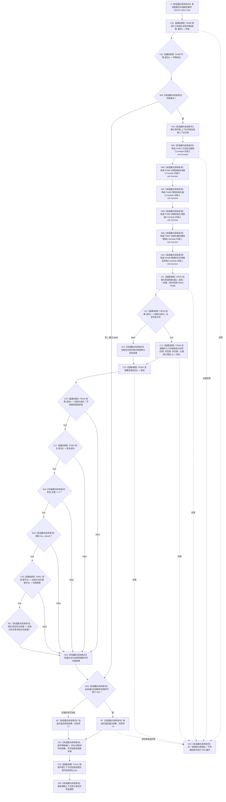

# CF-L5-0132 `运行概念图非名称身份自检` 现状流程图

图类型：现状流程图
代码版本：`a48a70b2d678dea64dd8228adb4f26f0badd9506`
覆盖文件：`海中鱼巣/自检.入口初始化.ixx:130-157`
唯一根函数：F0256
完整签名：`海中鱼巣::自检单元结果 海中鱼巣::运行概念图非名称身份自检(const 海中鱼巣::入口初始化自检运行配置& 配置)`
参数：`配置` 是调用期间有效的只读非拥有借用；不保存引用
返回结果：独立值式 `自检单元结果`；编号固定 `ENTRY-ONLY-S03`，名称固定“概念图非名称身份”，验收项固定 1，失败项为 0 或 1
调用方：F0082 `登记入口初始化自检单元(...)::<lambda@490>::operator()() const`
直接被调函数：F0468、F0469、F0015、F0016（两个调用点）、F0364、F0352、F0363、F0051；隔离环境销毁显式可达 F0131 `自我线程::~自我线程()`
同步回调函数：F0015 按端口顺序调用 F0483—F0488；这些回调不是 F0256 的直接调用
调用图：`流程图/代码流程图/00_调用知识图谱.md`
逐行映射表：`流程图/代码流程图/L5/CF-L5-0132_运行概念图非名称身份自检_逐行代码映射表.md`
入口前置：仅完整自检模式 S03 可达；正常生产路径不可达
结构读取与写入：在隔离上下文初始化系统；成功时尝试用名称“实体”创建指向存在根的语素概念入口，再读回存在根登记
逻辑内返回：环境/初始化/别名创建/读回/等值验收失败或故障注入命中均折叠为一项自检失败
内部错误：系统初始化或别名创建已经成功后，读回根身份不一致属于内部不一致证据；当前结果只保留总通过位
生命周期与资源释放：环境独占上下文；端口闭包同步借用；别名结果与读回材料按值局部持有，函数退出销毁隔离结构
异常：无 `noexcept`、无 `catch`；异常不形成自检结果并按 RAII 展开
验证入口：冻结源码、9 个显式根调用点、1 个项目成员隐式析构调用、12 条回调/下层调用边、5 组外部边界和逐行映射机械核对；未运行构建或程序
依据：`规范/0050_项目通用机器逻辑与禁止性规则总纲_20260721.md`、`规范/4010_子规范_统一仓库稳定句柄与通用关系索引边界.md`、`规范/4050_子规范_入口拒绝逻辑内结果与内部逻辑错误.md`、`规范/7140_子规范_概念身份生命周期退役删除与活动投影分账.md`、`规范/8120_子规范_程序入口启动模式与运行宿主边界_20260726.md`
不得作为施工许可：是
不得宣称：别名创建不改变旧根登记只证明当前旧接口的局部行为，不证明根身份已完全与名称解耦或符合现行权威结构

## 流程图

## 节点合同

| 节点 | 类型 | 参数 / 输入绑定 | 结果 / 输出绑定 | 事实读写 | 后继条件 | 验证 |
| --- | --- | --- | --- | --- | --- | --- |
| S | 本函数内具体指令 | `配置` | 固定编号 | 无 | 到 C01 | 130—131 行 |
| C01 / C02 / B03 | 函数调用 / 本函数内具体指令 | `配置,编号`；环境 | 环境与成功位 | F0468 形成隔离上下文 | 成功到 X04；失败到 B23 | F0468/F0469 |
| X04 / N05—N10 | 本函数内具体指令 | 独占上下文 | 上下文借用、F0483—F0488 端口 | 只构造回调 | 到 C11 | X0197/X0198 |
| C11 | 函数调用 | 端口和请求 | 初始化结果 | 写入隔离上下文 | 到 C12 | F0015 |
| C12—N14 | 函数调用 / 本函数内具体指令 | 初始化结果和存在根材料 | 别名创建结果或默认结果 | 成功分支由 F0364 写语素入口材料 | 合流到 C15 | F0016/F0364 |
| C15 | 函数调用 | `概念根类别::存在` | 存在根登记候选 | 只读非权威登记 | 到 C16 | F0352 |
| C16—B21 / N22 | 函数调用 / 本函数内具体指令 | 初始化、别名、读回材料 | 最终通过位 | 只读局部结果与登记 | 首个 false 短路 | F0016/F0363/F0051、X0199 |
| B23 / RT / RF / D24 / D26 | 本函数内具体指令 | 通过位与故障注入 | 一项值式结果；释放资源 | 不发布隔离上下文 | 经 C25 后返回 | X0200 |
| C25 | 函数调用 | `this=&环境.上下文->自我线程实例` | 无返回值 | 停止并收口隔离自我线程 | 正常到 D26；异常展开也可达 | F0131、E1039 |
| E25 | 本函数内具体指令 | 异常 | 无正常结果 | 局部结构随环境销毁 | 向上层传播 | 根异常合同 |

## 输入契约与非成功语境

| 语境 | 非成功条件 | 结构变化 | 分类与后继 |
| --- | --- | --- | --- |
| 环境/初始化 | 环境或 F0015 不成功 | 只存在隔离测试结构 | 自检失败 |
| 别名条件 | 初始化失败 | 不调用 F0364，形成默认结果 | 自检失败 |
| 别名创建 | F0364 返回非成功或主键非 0 | 隔离语素/关系结构由下层合同裁决 | 自检失败；具体原因被压缩 |
| 根读回 | 读回为空、句柄或裸键与初始化结果不同 | 只读 | 初始化成功后的内部不一致证据 |
| 强制失败 | 配置编号命中 S03 | 隔离结构可以已完整形成 | 测试故障注入 |
| 异常 | 下层或分配抛出 | 不发布全局结构 | 无结果；RAII 展开 |

## 外部与偏差边界

- X0196—X0200 分账固定/宽字符串与结果字符串、独占上下文、六个 `std::function`、optional 读回访问和可选故障编号比较。
- F0483—F0488 是独立待展开端口函数；F0015 的回调边必须保留 F0256 端口绑定语境。
- 本函数把“别名成功且返回主键为 0、根登记读回不变”当作非名称身份证据，但 7140 的正式根身份由固定系统角色稳定主键、完整句柄和本类对象结构共同成立。
- 读回仍来自非权威根登记投影；裸 `稳定非名称键` 不是 4010 的完整稳定主键，且未核对命名域、节点类型、生命周期关系和权威结构。
- 名称入口写入不得成为根身份，当前检查方向与该边界部分一致；但验证材料不足以证明名称完全不参与下层成功谓词或身份准入。
