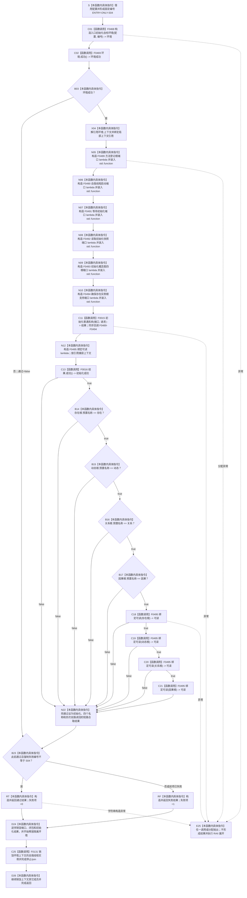

# CF-L5-0133 `运行概念图根名绑定自检` 现状流程图

图类型：现状流程图
代码版本：`a48a70b2d678dea64dd8228adb4f26f0badd9506`
覆盖文件：`海中鱼巣/自检.入口初始化.ixx:159-190`
唯一根函数：F0257
完整签名：`海中鱼巣::自检单元结果 海中鱼巣::运行概念图根名绑定自检(const 海中鱼巣::入口初始化自检运行配置& 配置)`
参数：`配置` 是调用期间有效的只读非拥有借用；函数不保存其引用
返回结果：独立值式 `自检单元结果`；编号固定 `ENTRY-ONLY-S04`，名称固定“概念图根名绑定”，验收项固定 1，失败项为 0 或 1
调用方：F0083 `登记入口初始化自检单元(...)::<lambda@492>::operator()() const`
直接被调函数：F0468、F0469、F0015、F0016、F0495（四个调用点）；隔离环境销毁显式可达 F0131 `自我线程::~自我线程()`
同步回调函数：F0015 按端口顺序调用 F0489—F0494；这些回调不是 F0257 的直接调用
下层读取函数：F0495 同步调用 F0496 `读取入口绑定目标组` 和 F0497 `读取入口概念追溯组`
调用图：`流程图/代码流程图/00_调用知识图谱.md`
逐行映射表：`流程图/代码流程图/L5/CF-L5-0133_运行概念图根名绑定自检_逐行代码映射表.md`
入口前置：仅完整自检模式 S04 可达；其它当前根模式不可达
结构读取与写入：在局部隔离上下文执行系统初始化；随后比较四个预置名称并只读各名称语素入口的对应信息组和概念追溯组
逻辑内返回：环境或初始化失败、名称不符、任一绑定或追溯缺失、强制失败命中均折叠为一项自检失败
内部错误：F0016 已成功但任一根名称材料或双路关系读回不符属于内部不一致证据；当前结果只保留总通过位
生命周期与资源释放：环境独占上下文；六个端口闭包和绑定读取闭包同步借用局部上下文；退出时销毁隔离上下文
异常：根函数无 `noexcept` 且无 `catch`；异常不形成 `自检单元结果`，局部对象按 RAII 展开并由上层自检运行器异常边界收口
验证入口：冻结源码、8 个显式根调用点、1 个项目成员隐式析构调用、16 条回调/下层调用边、6 组外部边界和逐行映射机械核对；未运行构建或程序
依据：`规范/0050_项目通用机器逻辑与禁止性规则总纲_20260721.md`、`规范/4050_子规范_入口拒绝逻辑内结果与内部逻辑错误.md`、`规范/7140_子规范_概念身份生命周期退役删除与活动投影分账.md`、`规范/7200_子规范_基础信息语素信息关系整合_20260720.md`、`规范/8120_子规范_程序入口启动模式与运行宿主边界_20260726.md`
不得作为施工许可：是
不得宣称：四个旧预置名称及其双路关系可读只证明当前名称投影链的局部行为，不证明名称承担根身份，也不证明四根正式权威结构完整

## 流程图

## 节点合同

| 节点 | 类型 | 参数 / 输入绑定 | 结果 / 输出绑定 | 事实读写 | 后继条件 | 验证 |
| --- | --- | --- | --- | --- | --- | --- |
| S | 本函数内具体指令 | `配置` | 固定编号 | 无 | 到 C01 | 159—160 行 |
| C01 / C02 / B03 | 函数调用 / 本函数内具体指令 | `配置,编号`；环境 | 环境与成功位 | F0468 形成隔离上下文 | 成功到 X04；失败到 B23 | F0468/F0469 |
| X04 / N05—N10 | 本函数内具体指令 | 独占上下文 | 上下文借用、F0489—F0494 端口 | 只构造回调 | 到 C11 | X0202/X0203 |
| C11 | 函数调用 | 端口和请求 | 初始化结果 | 写入隔离上下文 | 到 N12 | F0015 |
| N12 | 本函数内具体指令 | `上下文&` | F0495 闭包 | 无 | 到 C13 | 174—179 行 |
| C13 / B14—B17 | 函数调用 / 本函数内具体指令 | 初始化结果和四个预置名称 | 前半验收位 | 只读结果 DTO | 首个 false 短路 | F0016、X0205 |
| C18—C21 / N22 | 函数调用 / 本函数内具体指令 | 四个根初始化项 | 四项双路可读位和总通过位 | F0495 只读语素对应与追溯关系；两次 `std::find` 逐元素回调 F0051 | 首个 false 短路 | F0495—F0497、F0051 |
| B23 / RT / RF / D24 / D26 | 本函数内具体指令 | 通过位与故障注入 | 一项值式结果；释放资源 | 不发布隔离上下文 | 经 C25 后返回 | X0206 |
| C25 | 函数调用 | `this=&环境.上下文->自我线程实例` | 无返回值 | 停止并收口隔离自我线程 | 正常到 D26；异常展开也可达 | F0131 |
| E25 | 本函数内具体指令 | 异常 | 无正常结果 | 局部结构随环境销毁 | 向上层传播 | 根异常合同 |

## 输入契约与非成功语境

| 语境 | 非成功条件 | 结构变化 | 分类与后继 |
| --- | --- | --- | --- |
| 环境/初始化 | 环境或 F0015 不成功 | 只存在隔离测试结构 | 自检失败 |
| 名称材料 | F0016 成功但任一预置名称不符 | 只读 | 内部不一致证据；自检失败 |
| 双路关系读回 | 对应信息组或概念追溯组不含根节点 | 只读 | 初始化成功后的内部不一致证据 |
| 强制失败 | 配置编号命中 S04 | 隔离结构可以已完整形成 | 测试故障注入 |
| 异常 | 下层或分配抛出 | 不发布全局结构 | 无结果；RAII 展开 |

## 外部与偏差边界

- X0201—X0206 分账固定编号、独占上下文、六个 `std::function`、局部绑定闭包与两组向量/`std::find`、宽字符串比较和结果字符串生命周期。
- F0489—F0494、F0495、F0496、F0497 是独立待展开函数；F0015 的回调边必须带“端口绑定来自 F0257”语境。
- 本函数验证名称语素入口的对应信息与概念追溯均可找到根节点，方向符合 7200 的双路读回边界。
- 7140 明确根名称和登记投影不能单独证明根身份；本函数未核对固定系统角色稳定主键、完整句柄、本类结构、概念签名和永久活跃生命周期。
- F0016 的旧成功谓词已包含名称入口成功，本函数随后再次以固定名称和关系投影验收；该重复证据不能升级为权威根身份。
