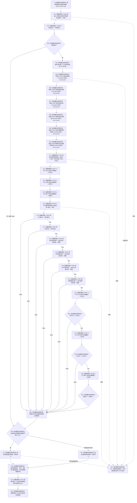

# CF-L5-0134 `运行概念图重复初始化结构不变自检` 现状流程图

图类型：现状流程图
代码版本：`a48a70b2d678dea64dd8228adb4f26f0badd9506`
覆盖文件：`海中鱼巣/自检.入口初始化.ixx:192-222`
唯一根函数：F0258
完整签名：`海中鱼巣::自检单元结果 海中鱼巣::运行概念图重复初始化结构不变自检(const 海中鱼巣::入口初始化自检运行配置& 配置)`
参数：`配置` 是调用期间有效的只读非拥有借用；函数不保存其引用
返回结果：独立值式 `自检单元结果`；编号固定 `ENTRY-ONLY-S05`，名称固定“概念图重复初始化结构不变”，验收项固定 1，失败项为 0 或 1
调用方：F0084 `登记入口初始化自检单元(...)::<lambda@494>::operator()() const`
直接被调函数：F0468、F0469、F0015、F0197（两个调用点）、F0198（两个调用点）、F0199（两个调用点）、F0048、F0016、F0049、F0051（四个调用点）；隔离环境销毁显式可达 F0131
同步回调函数：F0015 按端口顺序调用 F0498—F0503；这些回调不是 F0258 的直接调用
调用图：`流程图/代码流程图/00_调用知识图谱.md`
逐行映射表：`流程图/代码流程图/L5/CF-L5-0134_运行概念图重复初始化结构不变自检_逐行代码映射表.md`
入口前置：仅完整自检模式 S05 可达；其它当前根模式不可达
结构读取与写入：首轮 F0015 与第二轮 F0048 都只写局部隔离上下文；第二轮前后读取节点、关系、索引有效总量
逻辑内返回：环境、首轮、第二轮、句柄或计数验收失败及强制失败命中均折叠为一项自检失败
内部错误：任一轮已宣称成功后四根句柄变化或三个总量变化属于内部结构不一致证据；当前结果不保留具名原因
生命周期与资源释放：环境独占上下文；六个端口闭包同步借用；两轮结果与计数按值局部持有；退出时销毁隔离上下文
异常：根函数无 `noexcept` 且无 `catch`；异常不形成 `自检单元结果`，局部对象按 RAII 展开
验证入口：冻结源码、16 个显式根调用点、1 个项目成员隐式析构调用、12 条回调/下层调用边、5 组外部边界和逐行映射机械核对；未运行构建或程序
依据：`规范/0050_项目通用机器逻辑与禁止性规则总纲_20260721.md`、`规范/4010_子规范_统一仓库稳定句柄与通用关系索引边界.md`、`规范/4050_子规范_入口拒绝逻辑内结果与内部逻辑错误.md`、`规范/7140_子规范_概念身份生命周期退役删除与活动投影分账.md`、`规范/8120_子规范_程序入口启动模式与运行宿主边界_20260726.md`
不得作为施工许可：是
不得宣称：四根句柄和三个有效总量不变只证明当前旧实现的局部幂等投影，不证明全部权威关系、版本、历史和正式根身份未变化

## 流程图

## 节点合同

| 节点 | 类型 | 参数 / 输入绑定 | 结果 / 输出绑定 | 事实读写 | 后继条件 | 验证 |
| --- | --- | --- | --- | --- | --- | --- |
| S | 本函数内具体指令 | `配置` | 固定编号 | 无 | 到 C01 | 192—193 行 |
| C01 / C02 / B03 | 函数调用 / 本函数内具体指令 | `配置,编号`；环境 | 环境与成功位 | F0468 形成隔离上下文 | 成功到 X04；失败到 B29 | F0468/F0469 |
| X04 / N05—N10 | 本函数内具体指令 | 独占上下文 | 上下文借用、F0498—F0503 端口 | 只构造回调 | 到 C11 | X0208/X0209 |
| C11 | 函数调用 | 端口和请求 | 首次结果 | 首轮写入隔离上下文 | 到 C12 | F0015 |
| C12—C14 | 函数调用 | 三个仓库隐式 `this` | 第二轮前三个总量 | 只读隔离结构 | 依次到 C15 | F0197—F0199 |
| C15 | 函数调用 | `this=&上下文.概念图初始化` | 再次结果 | 第二轮写入隔离上下文 | 无论首次结果均执行 | F0048 |
| C16—C21 | 函数调用 | 两轮结果和四对完整句柄 | 两轮成功位和四个相等位 | 只读局部结果 | 首个 false 短路 | F0016/F0049/F0051 |
| C22—C26 / B23—B27 / N28 | 函数调用 / 本函数内具体指令 | 三个前值和三个仓库 | 三个后值及总通过位 | 只读隔离结构 | 首个不等短路 | F0197—F0199、X0210 |
| B29 / RT / RF / D30 / D32 | 本函数内具体指令 | 通过位与故障注入 | 一项值式结果；释放资源 | 不发布隔离上下文 | 经 C31 后返回 | X0211 |
| C31 | 函数调用 | `this=&环境.上下文->自我线程实例` | 无返回值 | 停止并收口隔离自我线程 | 正常到 D32；异常展开也可达 | F0131 |
| E31 | 本函数内具体指令 | 异常 | 无正常结果 | 局部结构随环境销毁 | 向上层传播 | 根异常合同 |

## 输入契约与非成功语境

| 语境 | 非成功条件 | 结构变化 | 分类与后继 |
| --- | --- | --- | --- |
| 环境 | F0468/F0469 不成功 | 不进入两轮初始化 | 自检失败 |
| 首轮 | F0015 非成功 | 第二轮前计数仍读取，F0048 仍执行 | 最终在 C16 失败；具体首轮状态被压缩 |
| 第二轮 | F0048/F0049 非成功 | 第二轮可能已收口或留下完整旧结构 | 自检失败；具体原因被压缩 |
| 幂等读回 | 任一完整句柄或三个总量不等 | 只读 | 内部不一致证据 |
| 强制失败 | 配置编号命中 S05 | 隔离结构可以已完整形成 | 测试故障注入 |
| 异常 | 下层或分配抛出 | 不发布全局结构 | 无结果；RAII 展开 |

## 外部与偏差边界

- X0207—X0211 分账固定编号、独占上下文、六个 `std::function`、三个计数快照和结果字符串生命周期。
- F0498—F0503 是独立待展开端口函数；F0015 的六条回调边必须带“端口绑定来自 F0258”语境。
- 第二轮 F0048 是 F0258 的直接调用，且在检查 `首次.成功()` 之前执行；不得并入 F0015 的首轮端口回调。
- 四个完整句柄相等是局部稳定性证据，但节点、关系、索引总量不变不能证明关系身份、版本、历史、索引映射和生命周期未被替换。
- 本函数未核对 7140 的固定系统角色完整稳定主键、命名域、本类对象结构和永久活跃关系；F0049 仍继承旧名称入口和登记投影成功条件。
