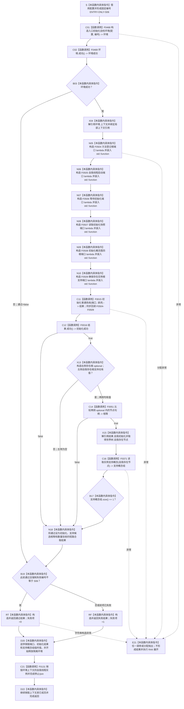

# CF-L5-0135 `运行自我存在实例根支持自检` 现状流程图

图类型：现状流程图
代码版本：`a48a70b2d678dea64dd8228adb4f26f0badd9506`
覆盖文件：`海中鱼巣/自检.入口初始化.ixx:224-246`
唯一根函数：F0259
完整签名：`海中鱼巣::自检单元结果 海中鱼巣::运行自我存在实例根支持自检(const 海中鱼巣::入口初始化自检运行配置& 配置)`
参数：`配置` 是调用期间有效的只读非拥有借用；函数不保存其引用
返回结果：独立值式 `自检单元结果`；编号固定 `ENTRY-ONLY-S06`，名称固定“自我存在实例根支持”，验收项固定 1，失败项为 0 或 1
调用方：F0085 `登记入口初始化自检单元(...)::<lambda@496>::operator()() const`
直接或显式可达的项目函数：F0468、F0469、F0015、F0016、F0051（`std::optional<节点句柄>` 值比较时回调）、F0371；隔离环境销毁显式可达 F0131
同步回调函数：F0015 按端口顺序调用 F0504—F0509；这些回调不是 F0259 的直接调用
调用图：`流程图/代码流程图/00_调用知识图谱.md`
逐行映射表：`流程图/代码流程图/L5/CF-L5-0135_运行自我存在实例根支持自检_逐行代码映射表.md`
入口前置：仅完整自检模式 S06 可达；其它当前根模式不可达
结构读取与写入：在局部隔离上下文执行系统初始化；随后比较结果中的存在根支持材料，并只读自我存在节点的支持概念组
逻辑内返回：环境或初始化失败、支持候选为空/不等、支持概念数量不为 1、强制失败命中均折叠为一项自检失败
内部错误：F0016 已成功但存在根支持材料或自我实例支持关系读回不符属于内部不一致证据；当前结果只保留总通过位
生命周期与资源释放：环境独占上下文；六个端口闭包同步借用；结果、optional 和返回向量按值局部持有；退出时销毁隔离上下文
异常：根函数无 `noexcept` 且无 `catch`；异常不形成 `自检单元结果`，局部对象按 RAII 展开
验证入口：冻结源码、6 个显式或元素比较项目调用点、1 个项目成员隐式析构调用、12 条回调/下层调用边、5 组外部边界和逐行映射机械核对；未运行构建或程序
依据：`规范/0050_项目通用机器逻辑与禁止性规则总纲_20260721.md`、`规范/4050_子规范_入口拒绝逻辑内结果与内部逻辑错误.md`、`规范/7100_子规范_存在概念与实例创建最小闭环_20260720.md`、`规范/7140_子规范_概念身份生命周期退役删除与活动投影分账.md`、`规范/8120_子规范_程序入口启动模式与运行宿主边界_20260726.md`
不得作为施工许可：是
不得宣称：结果候选等于存在根且支持概念组数量为 1，不证明该唯一元素就是正式存在根，也不证明关系 9 的完整身份、版本和历史合同成立

## 流程图

## 节点合同

| 节点 | 类型 | 参数 / 输入绑定 | 结果 / 输出绑定 | 事实读写 | 后继条件 | 验证 |
| --- | --- | --- | --- | --- | --- | --- |
| S | 本函数内具体指令 | `配置` | 固定编号 | 无 | 到 C01 | 224—225 行 |
| C01 / C02 / B03 | 函数调用 / 本函数内具体指令 | `配置,编号`；环境 | 环境与成功位 | F0468 形成隔离上下文 | 成功到 X04；失败到 B19 | F0468/F0469 |
| X04 / N05—N10 | 本函数内具体指令 | 独占上下文 | 上下文借用、F0504—F0509 端口 | 只构造回调 | 到 C11 | X0213/X0214 |
| C11 | 函数调用 | 端口和请求 | 初始化结果 | 写入隔离上下文 | 到 C12 | F0015 |
| C12 / X13 / C14 | 函数调用 / 本函数内具体指令 | 初始化结果、支持 optional、存在根句柄 | 初始化成功和支持相等位 | 只读结果 DTO | 首个 false 短路 | F0016、F0051、X0215 |
| X15 / C16 / B17 / N18 | 本函数内具体指令 / 函数调用 | 自我初始化快照和自我存在节点 | 支持概念组、数量位和总通过位 | F0371 只读实例支持关系 | 数量 1 到 B19 | F0371、X0215 |
| B19 / RT / RF / D20 / D22 | 本函数内具体指令 | 通过位与故障注入 | 一项值式结果；释放资源 | 不发布隔离上下文 | 经 C21 后返回 | X0216 |
| C21 | 函数调用 | `this=&环境.上下文->自我线程实例` | 无返回值 | 停止并收口隔离自我线程 | 正常到 D22；异常展开也可达 | F0131 |
| E21 | 本函数内具体指令 | 异常 | 无正常结果 | 局部结构随环境销毁 | 向上层传播 | 根异常合同 |

## 输入契约与非成功语境

| 语境 | 非成功条件 | 结构变化 | 分类与后继 |
| --- | --- | --- | --- |
| 环境/初始化 | 环境或 F0015 不成功 | 只存在隔离测试结构 | 自检失败 |
| 支持结果 | F0016 成功但 `自我存在根支持` 为空或与存在根句柄不等 | 只读 | 内部不一致证据 |
| 支持关系读回 | 自我存在节点的支持概念组数量不为 1 | 只读 | 内部不一致证据 |
| 强制失败 | 配置编号命中 S06 | 隔离结构可以已完整形成 | 测试故障注入 |
| 异常 | 下层或分配抛出 | 不发布全局结构 | 无结果；RAII 展开 |

## 外部与偏差边界

- X0212—X0216 分账固定编号、独占上下文、六个 `std::function`、optional/向量访问和结果字符串生命周期。
- F0504—F0509 是独立待展开端口函数；F0015 的六条回调边必须带“端口绑定来自 F0259”语境。
- `std::optional<节点句柄>` 相等在两侧均有值时回调项目 F0051；不得把该句柄比较漏记成纯标准库比较。
- F0371 的返回组只检查 `size()==1`，未比较唯一元素与正式存在根句柄；一项错误概念也可能满足当前数量检查。
- 本函数未核对关系 9 的完整源、目标、类型、顺序号、当前性、版本和历史，也未核对自我存在节点及存在根的正式稳定主键和本域结构。
- F0016 成功保证当前旧结果中的 `自我初始化` 有值；本函数依赖该谓词后直接 `operator->`，没有独立读回完整性分型。
