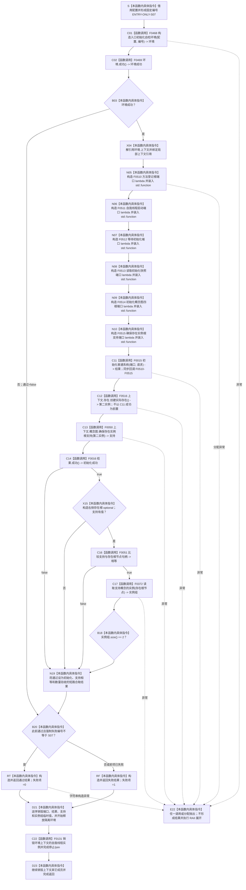

# CF-L5-0136 `运行多存在实例根支持自检` 现状流程图

图类型：现状流程图
代码版本：`0a93526882cb33c61c2fbb04ecad1aeaddcfe225`
覆盖文件：`海中鱼巣/自检.入口初始化.ixx:249-271`
唯一根函数：F0260
完整签名：`海中鱼巣::自检单元结果 海中鱼巣::运行多存在实例根支持自检(const 海中鱼巣::入口初始化自检运行配置& 配置)`
参数：`配置` 是调用期间有效的只读非拥有借用；函数不保存其引用
返回结果：独立值式 `自检单元结果`；编号固定 `ENTRY-ONLY-S07`，名称固定“多存在实例根支持”，验收项固定 1，失败项为 0 或 1
调用方：F0086 `登记入口初始化自检单元(...)::<lambda@498>::operator()() const`
直接或显式可达的项目函数：F0468、F0469、F0015、F0516、F0050、F0016、F0051（`std::optional<节点句柄>` 元素比较）、F0372；隔离环境销毁显式可达 F0131
同步回调函数：F0015 按端口顺序调用 F0510—F0515；这些回调不是 F0260 的直接调用
调用图：`流程图/代码流程图/00_调用知识图谱.md`
逐行映射表：`流程图/代码流程图/L5/CF-L5-0136_运行多存在实例根支持自检_逐行代码映射表.md`
入口前置：仅完整自检模式 S07 可达；其它当前根模式不可达
结构读取与写入：在局部隔离上下文执行系统初始化；无论初始化结果是否成功，随后创建第二个旧式存在节点、尝试增加其存在根支持关系，并只读存在根反向实例组数量
逻辑内返回：环境失败、初始化失败、第二实例创建或支持失败、支持候选不等于存在根、反向实例组数量不为 2、强制失败命中均折叠为一项自检失败
内部错误：F0016 已成功但第二实例支持或反向数量不符属于内部不一致证据；当前结果只保留总通过位
生命周期与资源释放：环境独占上下文；六个端口闭包同步借用；结果、第二实例、支持 optional 和反向读取临时向量均为局部值；退出时销毁隔离上下文
异常：根函数无 `noexcept` 且无 `catch`；异常不形成 `自检单元结果`，局部对象按 RAII 展开
验证入口：冻结源码、9 个根级项目调用点、12 条回调/下层调用边、5 组外部边界和逐行映射机械核对；未运行构建或程序
依据：`规范/0050_项目通用机器逻辑与禁止性规则总纲_20260721.md`、`规范/4050_子规范_入口拒绝逻辑内结果与内部逻辑错误.md`、`规范/7100_子规范_存在概念与实例创建最小闭环_20260720.md`、`规范/7140_子规范_概念身份生命周期退役删除与活动投影分账.md`、`规范/8120_子规范_程序入口启动模式与运行宿主边界_20260726.md`
不得作为施工许可：是
不得宣称：支持 optional 等于存在根且反向实例组数量为 2，只证明当前旧接口的数量条件；不证明集合恰由自我实例与第二实例组成，也不证明关系 9 的完整身份、版本、历史和节点直接结构成立

## 流程图

## 节点合同

| 节点 | 类型 | 参数 / 输入绑定 | 结果 / 输出绑定 | 事实读写 | 后继条件 | 验证 |
| --- | --- | --- | --- | --- | --- | --- |
| S | 本函数内具体指令 | `配置` | 固定编号 | 无 | 到 C01 | 249—250 行 |
| C01 / C02 / B03 | 函数调用 / 本函数内具体指令 | `配置,编号`；环境 | 环境与成功位 | F0468 形成隔离上下文 | 成功到 X04；失败到 B20 | F0468/F0469 |
| X04 / N05—N10 | 本函数内具体指令 | 独占上下文 | 上下文借用、F0510—F0515 端口 | 只构造回调 | 到 C11 | X0218/X0219 |
| C11 | 函数调用 | 端口和请求 | 初始化结果 | 写入隔离上下文 | 无条件到 C12 | F0015 |
| C12 | 函数调用 | `this=&上下文.存在` | 第二实例句柄 | F0516 以旧主信息和节点接口创建存在 | 无条件到 C13 | F0516 |
| C13 | 函数调用 | 第二实例 | 支持 optional | F0050 可能创建存在根支持关系 | 无条件到 C14 | F0050 |
| C14 / X15 / C16 | 函数调用 / 本函数内具体指令 | 初始化结果、支持 optional、存在根节点 | 初始化成功与支持相等位 | 只读结果 DTO | 首个 false 短路 | F0016、F0051、X0220 |
| C17 / B18 / N19 | 函数调用 / 本函数内具体指令 | 存在根节点 | 反向实例组、数量位和总通过位 | F0372 只读关系投影 | 数量 2 到 B20 | F0372、X0220 |
| B20 / RT / RF / D21 / D23 | 本函数内具体指令 | 通过位与故障注入 | 一项值式结果；释放资源 | 不发布隔离上下文 | 经 C22 后返回 | X0221 |
| C22 | 函数调用 | `this=&环境.上下文->自我线程实例` | 无返回值 | 停止并收口隔离自我线程 | 正常到 D23；异常展开也可达 | F0131 |
| E22 | 本函数内具体指令 | 异常 | 无正常结果 | 局部结构随环境销毁 | 向上层传播 | 根异常合同 |

## 输入契约与非成功语境

| 语境 | 非成功条件 | 结构变化 | 分类与后继 |
| --- | --- | --- | --- |
| 环境/初始化 | 环境或 F0015 不成功 | 只存在隔离测试结构；F0015 失败后仍继续 C12/C13 | 自检失败 |
| 第二实例创建 | F0516 返回无效句柄 | 可能已经写入旧主信息或节点半结构，需由 F0516 独立展开 | 当前根仍调用 F0050；最终自检失败 |
| 支持创建 | F0050 返回空或非存在根句柄 | 可能无写入或已发生候选撤销 | 自检失败；F0016 成功后属于内部不一致证据 |
| 反向关系读回 | 实例组数量不为 2 | 只读 | 内部不一致证据；数量 2 仍不能证明集合成员 |
| 强制失败 | 配置编号命中 S07 | 隔离结构可以已完整形成 | 测试故障注入 |
| 异常 | 下层或分配抛出 | 不发布全局结构 | 无结果；RAII 展开 |

## 外部与偏差边界

- X0217—X0221 分账固定编号、独占上下文、六个 `std::function`、句柄/optional/临时向量和结果字符串生命周期。
- F0510—F0515 是独立待展开端口函数；F0015 的六条回调边必须带“端口绑定来自 F0260”语境。
- F0516 是首次进入图谱的旧式创建入口，当前仍创建通用主信息再创建存在节点；这与节点直接身份目标不一致，只登记偏差，不在本现状图中补造目标实现。
- 根函数在判断 F0016 成功前就调用 F0516 和 F0050；初始化失败不会阻止第二实例创建与支持尝试。
- F0372 的返回组只检查 `size()==2`，未验证集合恰含初始化产生的自我存在实例和本函数第二实例，重复或错误成员仍需下层及独立读回合同排除。
- 本函数未核对第二实例的完整节点直接字段、稳定主键、关系 9 的源/目标/类型/顺序/当前性/版本/历史或写后审计。
