# CF-L5-0137 `运行存在根支持拒绝自检` 现状流程图

图类型：现状流程图
代码版本：`a48a70b2d678dea64dd8228adb4f26f0badd9506`
覆盖文件：`海中鱼巣/自检.入口初始化.ixx:272-303`
唯一根函数：F0261
完整签名：`海中鱼巣::自检单元结果 海中鱼巣::运行存在根支持拒绝自检(const 海中鱼巣::入口初始化自检运行配置& 配置)`
参数：`配置` 是调用期间有效的只读非拥有借用；函数不保存其引用
返回结果：独立值式 `自检单元结果`；编号固定 `ENTRY-ONLY-S08`，名称固定“存在根支持拒绝”，验收项固定 1，失败项为 0 或 1
调用方：F0087 `登记入口初始化自检单元(...)::<lambda@500>::operator()() const`
直接项目函数：F0468、F0469、F0015、F0516、F0523、F0197（两次）、F0198（两次）、F0199（两次）、F0050（三次）、F0016；隔离环境销毁显式可达 F0131
同步回调函数：F0015 按端口顺序调用 F0517—F0522；这些回调不是 F0261 的直接调用
调用图：`流程图/代码流程图/00_调用知识图谱.md`
逐行映射表：`流程图/代码流程图/L5/CF-L5-0137_运行存在根支持拒绝自检_逐行代码映射表.md`
入口前置：仅完整自检模式 S08 可达；其它当前根模式不可达
结构读取与写入：在局部隔离上下文执行系统初始化；随后创建并直接删除一个存在节点，取得三类总量快照，对概念根、错误类型根、已删除节点分别尝试存在根支持，并在最终短路表达式中复读三类总量
逻辑内返回：环境/初始化失败、删除准备失败、任一非法支持请求未被拒绝、任一总量变化或强制失败命中均折叠为一项自检失败
内部错误：已初始化语境中非法支持请求返回有值或拒绝后总量改变属于内部不一致证据；当前结果只保留总通过位
生命周期与资源释放：环境独占上下文；六个端口闭包同步借用；结果、节点句柄、三个拒绝 optional 和计数快照均局部持有；退出时销毁隔离上下文
异常：根函数无 `noexcept` 且无 `catch`；异常不形成 `自检单元结果`，局部对象按 RAII 展开
验证入口：冻结源码、16 个根级项目调用点、12 条回调/下层调用边、6 组外部边界和逐行映射机械核对；未运行构建或程序
依据：`规范/0050_项目通用机器逻辑与禁止性规则总纲_20260721.md`、`规范/4050_子规范_入口拒绝逻辑内结果与内部逻辑错误.md`、`规范/7100_子规范_存在概念与实例创建最小闭环_20260720.md`、`规范/7140_子规范_概念身份生命周期退役删除与活动投影分账.md`、`规范/8120_子规范_程序入口启动模式与运行宿主边界_20260726.md`
不得作为施工许可：是
不得宣称：三类请求返回空且节点/关系/索引总量不变，只证明当前隔离夹具的粗粒度拒绝结果；不证明创建—删除链、关系明细、索引映射、版本、历史和领域删除合同完整

## 流程图

```mermaid
flowchart TD
    S["S【本函数内具体指令】借用配置并形成固定编号 ENTRY-ONLY-S08"]
    C01["C01【函数调用】F0468 构造入口初始化自检环境(配置, 编号) -> 环境"]
    C02["C02【函数调用】F0469 环境.成功() -> 环境成功"]
    B03{"B03【本函数内具体指令】环境成功？"}
    X04["X04【本函数内具体指令】解引用环境.上下文并绑定局部上下文引用"]
    N05["N05【本函数内具体指令】构造 F0517 方法登记根端口 lambda 并装入 std::function"]
    N06["N06【本函数内具体指令】构造 F0518 自我线程启动端口 lambda 并装入 std::function"]
    N07["N07【本函数内具体指令】构造 F0519 等待初始化端口 lambda 并装入 std::function"]
    N08["N08【本函数内具体指令】构造 F0520 读取初始化快照端口 lambda 并装入 std::function"]
    N09["N09【本函数内具体指令】构造 F0521 初始化概念图四根端口 lambda 并装入 std::function"]
    N10["N10【本函数内具体指令】构造 F0522 确保存在实例根支持端口 lambda 并装入 std::function"]
    C11["C11【函数调用】F0015 初始化普通系统(端口, 请求) -> 结果；同步回调 F0517-F0522"]
    C12["C12【函数调用】F0516 上下文.存在.创建实际存在() -> 已删除句柄；不以 C11 成功为前置"]
    C13["C13【函数调用】F0523 上下文.节点.删除节点(已删除) -> 已删除准备"]
    C14["C14【函数调用】F0197 读取前节点数量"]
    C15["C15【函数调用】F0198 读取前关系数量"]
    C16["C16【函数调用】F0199 读取前索引数量"]
    C17["C17【函数调用】F0050 对存在根节点确保支持 -> 根拒绝"]
    C18["C18【函数调用】F0050 对动态根节点确保支持 -> 类型拒绝"]
    C19["C19【函数调用】F0050 对已删除节点确保支持 -> 删除拒绝"]
    C20["C20【函数调用】F0016 结果.成功() -> 初始化成功；三次拒绝调用已先发生"]
    B21{"B21【本函数内具体指令】已删除准备为 true？"}
    B22{"B22【本函数内具体指令】根拒绝无值？"}
    B23{"B23【本函数内具体指令】类型拒绝无值？"}
    B24{"B24【本函数内具体指令】删除拒绝无值？"}
    C25["C25【函数调用】F0197 读取后节点数量"]
    B26{"B26【本函数内具体指令】前后节点数量相等？"}
    C27["C27【函数调用】F0198 读取后关系数量"]
    B28{"B28【本函数内具体指令】前后关系数量相等？"}
    C29["C29【函数调用】F0199 读取后索引数量"]
    B30{"B30【本函数内具体指令】前后索引数量相等？"}
    N31["N31【本函数内具体指令】形成全部拒绝及总量不变的短路合取结果"]
    B32{"B32【本函数内具体指令】此前通过且强制失败编号不等于 S08？"}
    RT["RT【本函数内具体指令】构造并返回通过结果；失败项=0"]
    RF["RF【本函数内具体指令】构造并返回失败结果；失败项=1"]
    D33["D33【本函数内具体指令】逆序销毁端口、结果、拒绝 optional 和计数快照，并开始释放隔离环境"]
    C34["C34【函数调用】F0131 销毁环境上下文的自我线程实例并完成停止/join"]
    D35["D35【本函数内具体指令】继续销毁上下文其它成员并完成返回"]
    E34["E34【本函数内具体指令】任一调用或分配抛出；不形成结果并执行 RAII 展开"]

    S --> C01 --> C02 --> B03
    B03 -- "否；通过=false" --> B32
    B03 -- "是" --> X04 --> N05 --> N06 --> N07 --> N08 --> N09 --> N10 --> C11 --> C12 --> C13 --> C14 --> C15 --> C16 --> C17 --> C18 --> C19 --> C20
    C20 -- "false" --> N31
    C20 -- "true" --> B21
    B21 -- "false" --> N31
    B21 -- "true" --> B22
    B22 -- "false" --> N31
    B22 -- "true" --> B23
    B23 -- "false" --> N31
    B23 -- "true" --> B24
    B24 -- "false" --> N31
    B24 -- "true" --> C25 --> B26
    B26 -- "false" --> N31
    B26 -- "true" --> C27 --> B28
    B28 -- "false" --> N31
    B28 -- "true" --> C29 --> B30 --> N31 --> B32
    B32 -- "是" --> RT --> D33
    B32 -- "否或前项已失败" --> RF --> D33
    D33 --> C34 --> D35
    C01 -. "异常" .-> E34
    N05 -. "分配异常" .-> E34
    C11 -. "异常" .-> E34
    C12 -. "异常" .-> E34
    C13 -. "异常" .-> E34
    C17 -. "异常" .-> E34
    RT -. "字符串构造异常" .-> E34
```

## 节点合同

| 节点 | 类型 | 参数 / 输入绑定 | 结果 / 输出绑定 | 事实读写 | 后继条件 | 验证 |
| --- | --- | --- | --- | --- | --- | --- |
| S | 本函数内具体指令 | `配置` | 固定编号 | 无 | 到 C01 | 272—273 行 |
| C01 / C02 / B03 | 函数调用 / 本函数内具体指令 | `配置,编号`；环境 | 环境与成功位 | F0468 形成隔离上下文 | 成功到 X04；失败到 B32 | F0468/F0469 |
| X04 / N05—N10 | 本函数内具体指令 | 独占上下文 | 上下文借用、F0517—F0522 端口 | 只构造回调 | 到 C11 | X0223/X0224 |
| C11 | 函数调用 | 端口和请求 | 初始化结果 | 写入隔离上下文 | 无条件到 C12 | F0015 |
| C12 / C13 | 函数调用 | 存在服务、节点仓库 | 已删除句柄、删除成功位 | 旧式创建后绕过存在服务直接删节点 | 到 C14 | F0516/F0523 |
| C14—C16 | 函数调用 | 三个仓库 | 拒绝前总量快照 | 只读总量 | 到 C17 | F0197/F0198/F0199 |
| C17—C19 | 函数调用 | 三个非法或不适用句柄 | 三个 optional 拒绝结果 | F0050 应拒绝且不写支持关系 | 三次均执行后到 C20 | F0050 |
| C20 / B21—B24 | 函数调用 / 本函数内具体指令 | 初始化结果、删除位、三个 optional | 前半验收位 | 只读局部结果 | 首个 false 短路 | F0016、X0225 |
| C25—C29 / B26—B30 / N31 | 函数调用 / 本函数内具体指令 | 三项前计数 | 后计数和总通过位 | 只读总量 | 首个不等短路 | F0197/F0198/F0199、X0226 |
| B32 / RT / RF / D33 / D35 | 本函数内具体指令 | 通过位与故障注入 | 一项值式结果；释放资源 | 不发布隔离上下文 | 经 C34 后返回 | X0227 |
| C34 | 函数调用 | `this=&环境.上下文->自我线程实例` | 无返回值 | 停止并收口隔离自我线程 | 正常到 D35；异常展开也可达 | F0131 |
| E34 | 本函数内具体指令 | 异常 | 无正常结果 | 局部结构随环境销毁 | 向上层传播 | 根异常合同 |

## 输入契约与非成功语境

| 语境 | 非成功条件 | 结构变化 | 分类与后继 |
| --- | --- | --- | --- |
| 环境/初始化 | 环境或 F0015 不成功 | 只存在隔离测试结构；F0015 失败后仍继续创建、删除和三次拒绝 | 自检失败 |
| 创建/删除准备 | F0516 无效或 F0523 返回 false | 可能已经形成旧主信息或节点；前计数在删除尝试后取得 | 自检失败；下层失败需独立分型 |
| 根拒绝 | 把存在根自身作为“实例”仍返回支持候选 | 可能错误写入自关系 | 初始化成功后属于内部不一致 |
| 类型拒绝 | 把动态根作为存在实例仍返回支持候选 | 可能错误写入跨类型关系 | 初始化成功后属于内部不一致 |
| 删除拒绝 | 已删除句柄仍返回支持候选 | 可能错误写入失效端点关系 | 初始化成功后属于内部不一致 |
| 总量后验 | 任一总量改变 | 只读后验发现粗粒度变化 | 内部不一致；总量相同不证明明细不变 |
| 强制失败 | 配置编号命中 S08 | 隔离结构可以已完整形成 | 测试故障注入 |
| 异常 | 下层或分配抛出 | 不发布全局结构 | 无结果；RAII 展开 |

## 外部与偏差边界

- X0222—X0227 分账固定编号、独占上下文、六个 `std::function`、三个拒绝 optional、三项计数和结果字符串生命周期。
- F0517—F0522 是独立待展开端口函数；F0015 的六条回调边必须带“端口绑定来自 F0261”语境。
- F0516 与 F0523 分别是首次入图的旧式存在创建和节点仓直接删除入口；后者绕过存在服务的领域删除边界，只登记当前事实与偏差。
- 三次 F0050 调用在最终 `结果.成功()` 判断前全部执行；初始化失败不会阻止非法请求试探。
- `前节点/前关系/前索引` 在创建和删除尝试之后才取得，不能证明创建—删除过程自身没有产生又隐藏的结构、历史或审计差异。
- 前后总量相等不证明具体节点版本、关系身份、索引映射、失效记录和历史事实不变；本函数也未逐项读回三个拒绝调用的零写入。
