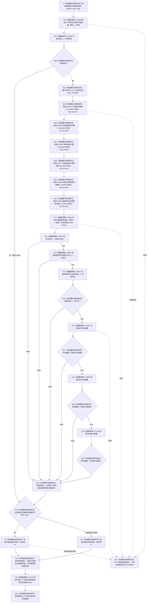

# CF-L5-0138 `运行自我线程进入与初始化自检` 现状流程图

图类型：现状流程图
代码版本：`a48a70b2d678dea64dd8228adb4f26f0badd9506`
覆盖文件：`海中鱼巣/自检.入口初始化.ixx:305-328`
唯一根函数：F0262
完整签名：`海中鱼巣::自检单元结果 海中鱼巣::运行自我线程进入与初始化自检(const 海中鱼巣::入口初始化自检运行配置& 配置)`
参数：`配置` 是调用期间有效的只读非拥有借用；函数不保存其引用
返回结果：独立值式 `自检单元结果`；编号固定 `ENTRY-ONLY-S09`，名称固定“自我线程进入与初始化”，验收项固定 1，失败项为 0 或 1
调用方：F0088 `登记入口初始化自检单元(...)::<lambda@502>::operator()() const`
直接项目函数：F0468、F0469、F0015、F0016、F0530、F0531、F0197、F0198、F0199；隔离环境销毁显式可达 F0131
同步回调函数：F0015 按端口顺序调用 F0524—F0529；这些回调不是 F0262 的直接调用
调用图：`流程图/代码流程图/00_调用知识图谱.md`
逐行映射表：`流程图/代码流程图/L5/CF-L5-0138_运行自我线程进入与初始化自检_逐行代码映射表.md`
入口前置：仅完整自检模式 S09 可达；其它当前根模式不可达
结构读取与写入：在局部隔离上下文执行系统初始化；随后读取线程进入原子位、线程状态原子值以及节点/关系/索引总量，并与环境构造后的初始计数比较
逻辑内返回：环境/初始化失败、线程未进入、状态非运行中、任一总量未增加或强制失败命中均折叠为一项自检失败
内部错误：F0016 已成功但线程状态或任一结构总量不满足条件属于内部不一致证据；当前结果只保留总通过位
生命周期与资源释放：环境独占上下文；六个端口闭包同步借用；初始化结果和计数值局部持有；F0530/F0531 只读原子成员；退出时销毁隔离上下文
异常：根函数无 `noexcept` 且无 `catch`；异常不形成 `自检单元结果`，局部对象按 RAII 展开
验证入口：冻结源码、10 个根级项目调用点、12 条回调/下层调用边、6 组外部边界和逐行映射机械核对；未运行构建或程序
依据：`规范/0050_项目通用机器逻辑与禁止性规则总纲_20260721.md`、`规范/4050_子规范_入口拒绝逻辑内结果与内部逻辑错误.md`、`规范/6100_子规范_自我根特征需求状态与服务抽象_20260720.md`、`规范/6140_子规范_自我线程生命周期与初始化合同_20260720.md`、`规范/8120_子规范_程序入口启动模式与运行宿主边界_20260726.md`
不得作为施工许可：是
不得宣称：线程进入位、运行中状态和三类总量增加只证明当前隔离初始化的粗粒度条件；不证明完整自我结构、觉醒、连续治理循环、需求—任务—方法闭环或恢复后续跑成立

## 流程图

## 节点合同

| 节点 | 类型 | 参数 / 输入绑定 | 结果 / 输出绑定 | 事实读写 | 后继条件 | 验证 |
| --- | --- | --- | --- | --- | --- | --- |
| S | 本函数内具体指令 | `配置` | 固定编号 | 无 | 到 C01 | 305—306 行 |
| C01 / C02 / B03 | 函数调用 / 本函数内具体指令 | `配置,编号`；环境 | 环境与成功位 | F0468 形成隔离上下文 | 成功到 X04；失败到 B23 | F0468/F0469 |
| X04 / N05—N10 | 本函数内具体指令 | 独占上下文 | 上下文借用、F0524—F0529 端口 | 只构造回调 | 到 C11 | X0229/X0230 |
| C11 | 函数调用 | 端口和请求 | 初始化结果 | 写入隔离上下文 | 到 C12 | F0015 |
| C12 / C13 / C14 / B15 | 函数调用 / 本函数内具体指令 | 初始化结果和自我线程实例 | 初始化、进入、状态三个验收值 | F0530/F0531 只读原子成员 | 首个 false 短路 | F0016、F0530、F0531、X0232/X0233 |
| C16—C20 / B17—B21 / N22 | 函数调用 / 本函数内具体指令 | 当前三仓库和环境初始计数 | 三个数量及总通过位 | 只读仓库总量 | 首个不增加短路 | F0197/F0198/F0199 |
| B23 / RT / RF / D24 / D26 | 本函数内具体指令 | 通过位与故障注入 | 一项值式结果；释放资源 | 不发布隔离上下文 | 经 C25 后返回 | X0231 |
| C25 | 函数调用 | `this=&环境.上下文->自我线程实例` | 无返回值 | 停止并收口隔离自我线程 | 正常到 D26；异常展开也可达 | F0131 |
| E25 | 本函数内具体指令 | 异常 | 无正常结果 | 局部结构随环境销毁 | 向上层传播 | 根异常合同 |

## 输入契约与非成功语境

| 语境 | 非成功条件 | 结构变化 | 分类与后继 |
| --- | --- | --- | --- |
| 环境/初始化 | 环境或 F0015 不成功 | 只存在隔离测试结构 | 自检失败 |
| 线程进入 | F0016 成功但 F0530 为 false | 只读线程原子位 | 内部不一致证据 |
| 线程状态 | 已进入但 F0531 不为运行中 | 只读线程状态原子值 | 内部不一致证据 |
| 结构总量 | 任一当前总量不大于环境初始计数 | 只读仓库总量 | 内部不一致证据；总量增加不证明结构完整 |
| 强制失败 | 配置编号命中 S09 | 隔离结构可以已完整形成 | 测试故障注入 |
| 异常 | 下层或分配抛出 | 不发布全局结构 | 无结果；RAII 展开 |

## 外部与偏差边界

- X0228—X0233 分账固定编号、独占上下文、六个 `std::function`、结果字符串以及 F0530/F0531 的两个原子读取边界。
- F0524—F0529、F0530、F0531 是独立待展开函数；F0015 的六条回调边必须带“端口绑定来自 F0262”语境。
- F0530/F0531 分别读取两个独立原子；本函数没有取得同一锁或同一版本快照，两个观察值之间可能存在并发变化。
- 三类总量只与环境构造后的初始计数比较，未验证新增节点、关系和索引的具名身份、互相对应、版本或发布代次。
- “已进入 + 运行中 + 三类总量增加”不能升级为自我完整结构、觉醒、治理闭环或恢复能力完成证据。
