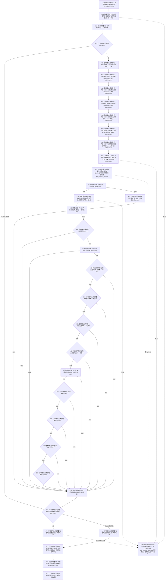

# CF-L5-0139 `运行语素与世界树快照读回自检` 现状流程图

图类型：现状流程图
代码版本：`0a93526882cb33c61c2fbb04ecad1aeaddcfe225`
覆盖文件：`海中鱼巣/自检.入口初始化.ixx:331-360`
唯一根函数：F0263
完整签名：`海中鱼巣::自检单元结果 海中鱼巣::运行语素与世界树快照读回自检(const 海中鱼巣::入口初始化自检运行配置& 配置)`
参数：`配置` 是调用期间有效的只读非拥有借用；函数不保存其引用
返回结果：独立值式 `自检单元结果`；编号固定 `ENTRY-ONLY-S10`，名称固定“语素与世界树快照读回”，验收项固定 1，失败项为 0 或 1
调用方：F0089 `登记入口初始化自检单元(...)::<lambda@504>::operator()() const`
直接项目函数：F0468、F0469、F0015、F0016（两个调用点）、F0059、F0173、F0174；隔离环境销毁显式可达 F0131
同步回调函数：F0015 按端口顺序调用 F0532—F0537；这些回调不是 F0263 的直接调用
调用图：`流程图/代码流程图/00_调用知识图谱.md`
逐行映射表：`流程图/代码流程图/L5/CF-L5-0139_运行语素与世界树快照读回自检_逐行代码映射表.md`
入口前置：仅完整自检模式 S10 可达；其它当前根模式不可达
结构读取与写入：在局部隔离上下文执行系统初始化；读取初始化快照、旧世界树坐标接口并比较四个语素文本、代次、世界树成功位和三个零坐标
逻辑内返回：环境失败、初始化/语素/世界树/名称/坐标验收失败或强制失败命中时，意图折叠为一项自检失败
内部错误：第 346 行在 F0016 成功检查前调用 `自我初始化.value()`；空 optional 会抛 `std::bad_optional_access`，无法形成固定 S10 失败结果
生命周期与资源释放：环境独占上下文；六个端口闭包同步借用；`快照` 是 `结果` 内部对象的局部引用；坐标值局部持有；退出时销毁隔离上下文
异常：根函数无 `noexcept` 且无 `catch`；普通异常向运行器传播并按 RAII 展开
验证入口：冻结源码、9 个根级项目调用点、12 条回调/下层调用边、7 组外部边界和逐行映射机械核对；未运行构建或程序
依据：`规范/0050_项目通用机器逻辑与禁止性规则总纲_20260721.md`、`规范/0600_代码函数流程图应用与维护规范.md`、`规范/4050_子规范_入口拒绝逻辑内结果与内部逻辑错误.md`、`规范/8120_子规范_程序入口启动模式与运行宿主边界_20260726.md`、`规范/详细设计/20260726_ENTRY-ONLY_入口职责单一化详细设计_v0.3.md`
不得作为施工许可：是
不得宣称：当前只比较四个语素文本、六句柄成功谓词和旧坐标读数；不证明 18 个语素文本、完整世界结构、节点直接类型化坐标、自我治理或觉醒闭环成立

## 流程图

## 节点合同

| 节点 | 类型 | 参数 / 输入绑定 | 结果 / 输出绑定 | 事实读写 | 后继条件 | 验证 |
| --- | --- | --- | --- | --- | --- | --- |
| S / C01 / C02 / B03 | 本函数内具体指令 / 函数调用 | `配置,编号` | 环境与初始通过位 | F0468 形成隔离上下文 | 环境成功进入主体 | 331—335 行 |
| X04 / N05—N10 / C11 | 本函数内具体指令 / 函数调用 | 独占上下文、默认请求 | 上下文借用、F0532—F0537 端口、系统结果 | 初始化隔离上下文 | C11 返回后到 X12 | E1186、E1193—E1204 |
| X12 | 本函数内具体指令 | `结果.自我初始化` | 快照引用或异常 | 无新增写入 | 有值到 C13；空值到 E34 | X0237 |
| C13—C18 / B17 | 函数调用 / 本函数内具体指令 | 结果、快照、上下文 | 坐标、初始化/代次/语素验收值 | F0059 读取旧坐标承载 | 首个 false 短路 | E1187—E1190 |
| B19—B27 / C23 / N28 | 函数调用 / 本函数内具体指令 | 快照文本、世界树、坐标 | 总通过位 | 只读快照与坐标 | 首个 false 短路 | E1191、X0238/X0239 |
| B30 / RT / RF / D31 / D33 | 本函数内具体指令 | 通过位与故障注入 | 一项值式结果；释放资源 | 不发布隔离上下文 | 经 C32 后返回 | X0240 |
| C32 | 函数调用 | `this=&环境.上下文->自我线程实例` | 无返回值 | 停止并收口隔离自我线程 | 正常到 D33；异常展开也可达 | F0131 |
| E34 | 本函数内具体指令 | 异常 | 无正常结果 | 局部结构随环境销毁 | 向 F0089/运行器传播 | 根异常合同 |

## 输入契约与非成功语境

| 语境 | 非成功条件 | 结构变化 | 分类与后继 |
| --- | --- | --- | --- |
| 环境 | F0468/F0469 不成功 | 无可读全局结构 | 一项自检失败 |
| 初始化结果 | `自我初始化` 为空 | 隔离初始化可能已部分执行 | `bad_optional_access`；当前不是结构化失败 |
| 初始化/快照验收 | 第二次 F0016、代次、F0173、文本、F0174 或坐标不满足 | 只读既有隔离结构 | 一项自检失败；前置成功后的不一致未具名 |
| 强制失败 | 配置编号命中 S10 | 隔离结构可以已完整形成 | 测试故障注入 |
| 异常 | 下层、分配、optional::value 或字符串构造抛出 | 不发布全局结构 | 无结果；RAII 展开 |

## 外部与偏差边界

- X0234—X0240 分账固定编号、独占上下文、六个 `std::function`、optional、宽字符串、数值比较与返回生命周期。
- F0532—F0537 是独立待展开函数；F0015 的六条回调边必须带“端口绑定来自 F0263”语境。
- X12 在 F0016 前执行；空 `自我初始化` 会抛 `std::bad_optional_access`，不能稳定返回 S10 失败。
- F0173 只汇总 18 个语素项自身的 `成功()`；本函数只比较其中四个文本，未达到详细设计的 18 文本精确读回。
- F0174 只检查六个句柄有效；本函数未读回世界/场景/自我节点类型和三条正式关系。
- F0059 当前仍从旧主信息三槽读取 I64 后转为 `double`；本图只记录现状，不把该接口写成节点直接类型化结构符合证据。
