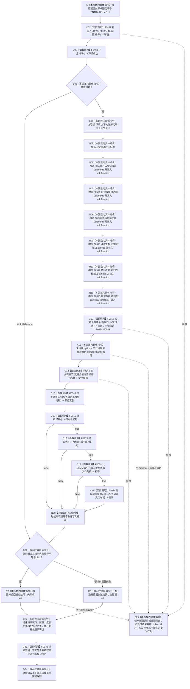

# CF-L5-0140 `运行根需求稳定语义与特征定义自检` 现状流程图

图类型：现状流程图
代码版本：`0a93526882cb33c61c2fbb04ecad1aeaddcfe225`
覆盖文件：`海中鱼巣/自检.入口初始化.ixx:362-387`
唯一根函数：F0264
完整签名：`海中鱼巣::自检单元结果 海中鱼巣::运行根需求稳定语义与特征定义自检(const 海中鱼巣::入口初始化自检运行配置& 配置)`
参数：`配置` 是调用期间有效的只读非拥有借用；函数不保存其引用
返回结果：独立值式 `自检单元结果`；编号固定 `ENTRY-ONLY-S11`，名称固定“根需求稳定语义与特征定义”，验收项固定 1，失败项为 0 或 1
调用方：F0090 `登记入口初始化自检单元(...)::<lambda@506>::operator()() const`
直接项目函数：F0468、F0469、F0015、F0544（两个调用点）、F0016、F0175、F0051（两个比较调用点）；隔离环境销毁显式可达 F0131
同步回调函数：F0015 按端口顺序调用 F0538—F0543；这些回调不是 F0264 的直接调用
调用图：`流程图/代码流程图/00_调用知识图谱.md`
逐行映射表：`流程图/代码流程图/L5/CF-L5-0140_运行根需求稳定语义与特征定义自检_逐行代码映射表.md`
入口前置：仅完整自检模式 S11 可达；其它当前根模式不可达
结构读取与写入：在局部隔离上下文执行系统初始化；随后从旧裸主键索引读取安全/服务语素入口候选，并与初始化结果中的两个入口句柄比较
逻辑内返回：环境/初始化/根需求成功谓词/索引比较失败或强制失败命中时，意图折叠为一项自检失败
内部错误：第 378 行在 F0016 成功检查前以 `operator->` 解引用 `自我初始化`；空 optional 违反前置并产生潜在未定义行为，无法形成稳定 S11 失败结果
生命周期与资源释放：环境独占上下文；固定配置与初始化结果值式持有；`根` 是 `结果.自我初始化` payload 的局部非拥有引用；两个索引结果局部持有；退出时销毁隔离上下文
异常：根函数无 `noexcept` 且无 `catch`；普通异常向运行器传播；第 378 行空 optional 不是可靠的异常分支
验证入口：冻结源码、10 个根级项目调用点、12 条回调/下层调用边、5 组外部边界和逐行映射机械核对；未运行构建或程序
依据：`规范/0050_项目通用机器逻辑与禁止性规则总纲_20260721.md`、`规范/0600_代码函数流程图应用与维护规范.md`、`规范/4010_子规范_统一仓库稳定句柄与通用关系索引边界.md`、`规范/4060_子规范_非权威缓存统计失效与确定重建.md`、`规范/6130_子规范_自我根特征抽象定义与自检缺口_20260720.md`、`规范/8120_子规范_程序入口启动模式与运行宿主边界_20260726.md`、`规范/详细设计/20260726_ENTRY-ONLY_入口职责单一化详细设计_v0.3.md`
不得作为施工许可：是
不得宣称：两个裸键索引命中及成功谓词不证明命名域稳定身份、语素绑定/追溯、特征定义、值域、版本或合法生产者成立

## 流程图

## 节点合同

| 节点 | 类型 | 参数 / 输入绑定 | 结果 / 输出绑定 | 事实读写 | 后继条件 | 验证 |
| --- | --- | --- | --- | --- | --- | --- |
| S / C01 / C02 / B03 | 本函数内具体指令 / 函数调用 | `配置,编号` | 环境与初始通过位 | F0468 形成隔离上下文 | 环境成功进入主体 | 362—366 行 |
| X04 / N05—N11 / C12 | 本函数内具体指令 / 函数调用 | 独占上下文、固定配置 | F0538—F0543 端口、系统结果 | 初始化隔离上下文 | C12 返回后到 X13 | E1207、E1215—E1226 |
| X13 | 本函数内具体指令 | `结果.自我初始化` | 根需求引用或前置违规 | 无新增写入 | 当前无保护进入 C14 | X0244 |
| C14 / C15 | 函数调用 | 两个裸 `uint64_t` 键 | 两个索引候选 | 只读可重建索引 | 无条件顺序读取 | E1208/E1209 |
| C16—C19 / N20 | 函数调用 / 本函数内具体指令 | 结果、根需求、索引候选 | 初始化/根成功位与两次句柄相等结果 | 无新增写入 | 首个 false 短路 | E1210—E1213 |
| B21 / RT / RF / D22 / D24 | 本函数内具体指令 | 通过位与故障注入 | 一项值式结果；释放资源 | 不发布隔离上下文 | 经 C23 后返回 | X0245 |
| C23 | 函数调用 | `this=&环境.上下文->自我线程实例` | 无返回值 | 停止并收口隔离自我线程 | 正常到 D24；异常展开也可达 | F0131 |
| E25 | 本函数内具体指令 | 异常或前置违规 | 无正常结果 | 局部结构随环境销毁 | 普通异常向上层传播 | 根异常合同 |

## 输入契约与非成功语境

| 语境 | 非成功条件 | 结构变化 | 分类与后继 |
| --- | --- | --- | --- |
| 环境 | F0468/F0469 不成功 | 无可读全局结构 | 一项自检失败 |
| 初始化结果 | `自我初始化` 为空 | 隔离初始化可能已部分执行 | X13 前置违规；不能稳定形成 S11 失败 |
| 索引 | 裸主键为 0、索引未命中或节点失效 | 只读索引 | 后续合取失败；不证明命名域 |
| 初始化/根/比较 | F0016、F0175 或任一句柄比较失败 | 只读既有隔离结构 | 一项自检失败；前置成功后的不一致未具名 |
| 强制失败 | 配置编号命中 S11 | 隔离结构可以已完整形成 | 测试故障注入 |

## 外部与偏差边界

- X0241—X0245 分账固定编号、独占上下文、固定配置与六个 `std::function`、optional 比较和返回生命周期。
- F0538—F0544 是独立待展开函数；F0544 是一参数旧裸主键重载，不得与 F0441 的事务令牌重载合并。
- X13 在 F0016 前执行；空 `自我初始化` 违反 `optional::operator->` 前置，不能稳定返回 S11 失败。
- 两次 F0544 读取在初始化成功/根需求成功检查前无条件执行；服务索引比较虽受安全比较短路，服务索引读取不受短路。
- 当前只核对两个索引候选等于两个语素入口句柄；未读取语素绑定/概念追溯，也未验证特征定义类型、值域、版本或来源。
- 可重建索引只加速定位，索引命中不能单独承担根需求语义或特征定义机器事实。
