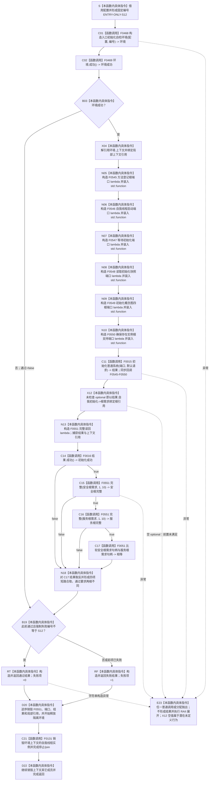

# CF-L5-0141 `运行安全与服务根需求完整读回自检` 现状流程图

图类型：现状流程图
代码版本：`a48a70b2d678dea64dd8228adb4f26f0badd9506`
覆盖文件：`海中鱼巣/自检.入口初始化.ixx:388-423`
唯一根函数：F0265
完整签名：`海中鱼巣::自检单元结果 海中鱼巣::运行安全与服务根需求完整读回自检(const 海中鱼巣::入口初始化自检运行配置& 配置)`
参数：`配置` 是调用期间有效的只读非拥有借用；函数不保存其引用
返回结果：独立值式 `自检单元结果`；编号固定 `ENTRY-ONLY-S12`，名称固定“安全与服务根需求完整读回”，验收项固定 1，失败项为 0 或 1
调用方：F0091 `登记入口初始化自检单元(...)::<lambda@508>::operator()() const`
直接项目函数：F0468、F0469、F0015、F0016、F0551（两个调用点）、F0051；隔离环境销毁显式可达 F0131
同步回调函数：F0015 按端口顺序调用 F0545—F0550；这些回调不是 F0265 的直接调用
下层读取函数：F0551 同步调用 F0552、F0350、F0553、F0051（两个比较调用点）、F0554、F0555、F0329
调用图：`流程图/代码流程图/00_调用知识图谱.md`
逐行映射表：`流程图/代码流程图/L5/CF-L5-0141_运行安全与服务根需求完整读回自检_逐行代码映射表.md`
入口前置：仅完整自检模式 S12 可达；其它当前根模式不可达
结构读取与写入：在局部隔离上下文执行系统初始化；随后以 F0551 两次读取需求承接、目标特征、宿主槽位、当前 I64 值和目标状态值，并比较两根需求句柄不同
逻辑内返回：环境/初始化/任一完整读回/两根不同验收失败或强制失败命中时，意图折叠为一项自检失败
内部错误：第 403 行在 F0016 成功检查前以 `operator->` 解引用 `自我初始化`；空 optional 违反前置并产生潜在未定义行为，无法形成稳定 S12 失败结果
生命周期与资源释放：环境独占上下文；六个端口闭包同步借用；`根` 是 `结果.自我初始化` payload 的局部非拥有引用；F0551 捕获结果与上下文引用并只同步调用；退出时销毁隔离上下文
异常：根函数无 `noexcept` 且无 `catch`；普通异常向运行器传播；第 403 行空 optional 不是可靠异常分支
验证入口：冻结源码、8 个根级项目调用点、20 条回调/下层调用边、6 组外部边界和逐行映射机械核对；未运行构建或程序
依据：`规范/0050_项目通用机器逻辑与禁止性规则总纲_20260721.md`、`规范/0600_代码函数流程图应用与维护规范.md`、`规范/3100_根规范_需求_20260720.md`、`规范/4020_子规范_领域类型化数据记录与组合读取投影边界.md`、`规范/6130_子规范_自我根特征抽象定义与自检缺口_20260720.md`、`规范/6140_子规范_分层安全值被动变化与残余风险维护.md`、`规范/6160_子规范_服务需求合同预算与准备结算.md`、`规范/6170_子规范_服务值时间维护生存安全回归与任务门控.md`、`规范/8120_子规范_程序入口启动模式与运行宿主边界_20260726.md`、`规范/详细设计/20260726_ENTRY-ONLY_入口职责单一化详细设计_v0.3.md`
不得作为施工许可：是
不得宣称：承接存在、四项局部读回和根句柄不同不证明需求完整事实、安全/服务正式值域、阈值、合同、结算、因果、自我苏醒或治理闭环成立

## 流程图

## 节点合同

| 节点 | 类型 | 参数 / 输入绑定 | 结果 / 输出绑定 | 事实读写 | 后继条件 | 验证 |
| --- | --- | --- | --- | --- | --- | --- |
| S / C01 / C02 / B03 | 本函数内具体指令 / 函数调用 | `配置,编号` | 环境与初始通过位 | F0468 形成隔离上下文 | 环境成功进入主体 | 388—392 行 |
| X04 / N05—N10 / C11 | 本函数内具体指令 / 函数调用 | 独占上下文、默认请求 | F0545—F0550 端口、系统结果 | 初始化隔离上下文 | C11 返回后到 X12 | E1229、E1235—E1246 |
| X12 | 本函数内具体指令 | `结果.自我初始化` | 根需求引用或前置违规 | 无新增写入 | 当前无保护进入 N13 | X0250 |
| N13 | 本函数内具体指令 | 结果、上下文引用 | F0551 闭包 | 尚不执行读取 | 到 C14 | 404—416 行 |
| C14—C17 / N18 | 函数调用 / 本函数内具体指令 | 结果、两个单根、固定值 1/10 | 初始化、两根完整和两根不同验收值 | F0551 只读需求/特征/状态；F0051 比较句柄 | 首个 false 短路 | E1230—E1233 |
| B19 / RT / RF / D20 / D22 | 本函数内具体指令 | 通过位与故障注入 | 一项值式结果；释放资源 | 不发布隔离上下文 | 经 C21 后返回 | X0251 |
| C21 | 函数调用 | `this=&环境.上下文->自我线程实例` | 无返回值 | 停止并收口隔离自我线程 | 正常到 D22；异常展开也可达 | F0131 |
| E23 | 本函数内具体指令 | 异常或前置违规 | 无正常结果 | 局部结构随环境销毁 | 普通异常向上层传播 | 根异常合同 |

## 输入契约与非成功语境

| 语境 | 非成功条件 | 结构变化 | 分类与后继 |
| --- | --- | --- | --- |
| 环境 | F0468/F0469 不成功 | 无可读全局结构 | 一项自检失败 |
| 初始化结果 | `自我初始化` 为空 | 隔离初始化可能已部分执行 | X12 前置违规；不能稳定形成 S12 失败 |
| 单根完整读回 | F0551 任一读取、optional 比较或固定 I64 比较失败 | F0015 后只读隔离结构 | 一项自检失败；前置成功后的不一致未具名 |
| 两根身份 | 安全与服务根需求句柄相等 | 只读初始化 DTO | 一项自检失败 |
| 强制失败 | 配置编号命中 S12 | 隔离结构可以已完整形成 | 测试故障注入 |

## 外部与偏差边界

- X0246—X0251 分账固定编号、独占上下文、六个 `std::function`、局部 F0551、optional/I64 比较和返回生命周期。
- F0545—F0555 是独立待展开函数；F0015 的六条回调边必须带“端口绑定来自 F0265”语境。
- X12 在 F0016 前执行；空 `自我初始化` 违反 `optional::operator->` 前置，不能稳定返回 S12 失败。
- F0551 只要求承接材料存在，未核对主体、目标宿主、场景和目标状态分别等于预期对象。
- 当前固定比较 I64 `1/10`，未读回正式安全阈值、维护规则、服务合同、规则版本、来源或合法生产者。
- 两个根只以根需求句柄不等区分，未证明其特征定义、实例槽、状态、语义角色和稳定身份分别唯一且正确。
