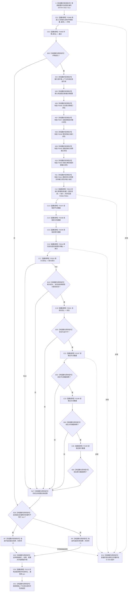

# CF-L5-0142 `运行自我线程重复启动结构不变自检` 现状流程图

图类型：现状流程图
代码版本：`a48a70b2d678dea64dd8228adb4f26f0badd9506`
覆盖文件：`海中鱼巣/自检.入口初始化.ixx:425-454`
唯一根函数：F0266
完整签名：`海中鱼巣::自检单元结果 海中鱼巣::运行自我线程重复启动结构不变自检(const 海中鱼巣::入口初始化自检运行配置& 配置)`
参数：`配置` 是调用期间有效的只读非拥有借用；函数不保存其引用
返回结果：独立值式 `自检单元结果`；编号固定 `ENTRY-ONLY-S13`，名称固定“自我线程重复启动结构不变”，验收项固定 1，失败项为 0 或 1
调用方：F0092 `登记入口初始化自检单元(...)::<lambda@510>::operator()() const`
直接项目函数：F0468、F0469、F0015、F0197（两个调用点）、F0198（两个调用点）、F0199（两个调用点）、F0044、F0016、F0531；隔离环境销毁显式可达 F0131
同步回调函数：F0015 按端口顺序调用 F0556—F0561；六个闭包分别调用 F0043、F0044、F0045、F0046、F0048、F0050
调用图：`流程图/代码流程图/00_调用知识图谱.md`
逐行映射表：`流程图/代码流程图/L5/CF-L5-0142_运行自我线程重复启动结构不变自检_逐行代码映射表.md`
入口前置：仅完整自检模式 S13 可达；其它当前根模式不可达
结构读取与写入：在独占隔离上下文内调用 F0015 完成首轮初始化，读取三仓库总量，直接再次调用 F0044，并以线程状态和三项总量相等形成粗粒度结构不变证据
逻辑内返回：第二次 F0044 返回“成功、复用初始化结果、重复启动”是协议允许的目标已满足结果；环境失败或强制失败编号命中时形成一项自检失败
内部错误：默认有效配置和完整端口下，首轮失败、重复结果不符、线程状态不符或总量变化均应追根因；当前代码统一折叠为一项失败
生命周期与资源释放：环境独占上下文；固定配置、端口、两次结果和计数均为局部值；六闭包同步借用上下文且不逃逸；退出或异常展开时 F0131 停止并 join 自我线程
异常：根函数无 `noexcept` 且无 `catch`；普通异常向 F0092/F0031 传播；F0131 隐式 `noexcept` 析构若 join 抛出会终止
验证入口：冻结源码、25 条新增项目调用边、5 组外部边界和逐行映射机械核对；未运行构建或程序
依据：`规范/0050_项目通用机器逻辑与禁止性规则总纲_20260721.md`、`规范/0600_代码函数流程图应用与维护规范.md`、`规范/4050_子规范_入口拒绝逻辑内结果与内部逻辑错误.md`、`规范/8100_子规范_自我线程与任务管理线程权责边界_20260720.md`、`规范/8110_子规范_线程生命周期状态上报与控制面板线程信息_20260720.md`、`规范/8120_子规范_程序入口启动模式与运行宿主边界_20260726.md`、`规范/详细设计/20260726_ENTRY-ONLY_入口职责单一化详细设计_v0.3.md`
不得作为施工许可：是
不得宣称：总量相等和复用字段不证明节点、关系、索引、领域记录、版本、历史和初始化快照在同一代次完整不变，也不证明生产线程生命周期闭环

## 流程图

## 节点合同

| 节点 | 类型 | 参数 / 输入绑定 | 结果 / 输出绑定 | 事实读写 | 后继条件 | 验证 |
| --- | --- | --- | --- | --- | --- | --- |
| S / C01 / C02 / B03 | 本函数内具体指令 / 函数调用 | `配置,编号` | 环境与初始通过位 | F0468 形成隔离上下文 | 环境成功进入主体 | 425—429 行 |
| X04 / N05—N11 / C12 | 本函数内具体指令 / 函数调用 | 独占上下文、固定配置和六闭包 | 首次初始化结果 | F0015 初始化隔离结构 | 返回后无条件读取总量 | E1257、E1268—E1279 |
| C13—C16 | 函数调用 | 三仓库和固定根需求参数 | 三项前总量与再次启动结果 | 只读三仓库后调用线程启动 | 尚未检查首次成功 | E1258—E1261 |
| C17—B20 | 函数调用 / 本函数内具体指令 | 首次、再次和线程 | 成功、复用、拒绝原因、状态 | 只读结果 DTO 和原子状态 | 首个 false 短路 | E1262—E1263 |
| C21—N27 | 函数调用 / 本函数内具体指令 | 三仓库与前总量 | 后总量和主体通过位 | 只读三个聚合总量 | 首个不等短路 | E1264—E1266 |
| B28 / RT / RF | 本函数内具体指令 | 通过位与故障注入 | 一项值式结果 | 无机器事实写入 | 返回前释放资源 | 452—453 行 |
| D29 / C30 / D31 / E32 | 本函数内具体指令 / 函数调用 | 局部值和独占环境 | 无 | 销毁隔离结构 | 正常或异常展开 | F0131 |

## 输入契约与非成功语境

| 语境 | 非成功条件 | 结构变化 | 分类与后继 |
| --- | --- | --- | --- |
| 环境 | F0468/F0469 不成功 | 无可读生产结构 | 自检合同允许的一项失败 |
| 首轮初始化 | F0015/F0016 不成功 | 隔离初始化可能已部分执行 | 当前仍读取总量并调用 F0044；设计缺口，需追根因 |
| 重复启动 | F0044 未返回成功复用或原因不是重复启动 | 隔离线程状态可能变化 | 前置明确后的内部不一致，需追根因 |
| 状态与总量 | 状态非运行中或任一总量变化 | 只读后验 | 内部不一致，当前折叠为一项失败 |
| 强制失败 | 配置编号命中 S13 | 隔离结构可以已完整形成 | 测试故障注入逻辑内失败 |

## 外部与偏差边界

- X0252—X0256 分账固定编号、独占上下文、固定配置/六闭包、三总量比较和结果生命周期。
- 首次是否成功在第二次启动之后才读取；若首轮失败，当前路径仍继续调用 F0044，违反依赖路径应先停止的设计期望。
- 三仓库前后读取不在同一事务快照；总量相等不能排除同量替换，也不覆盖领域类型化记录和历史事实。
- `复用初始化结果` 和拒绝枚举是结果材料，未独立读回同一初始化快照、代次和完整身份。
- 现有旧施工图遗漏 F0469、六闭包身份、三仓库函数调用、F0131、异常和真实日志调用归属；本现状图不据此修改施工合同。
