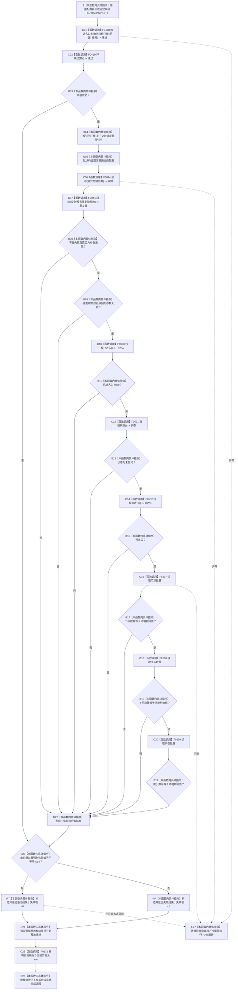

# CF-L5-0143 `运行自我线程无效参数拒绝与生命周期自检` 现状流程图

图类型：现状流程图
代码版本：`0a93526882cb33c61c2fbb04ecad1aeaddcfe225`
覆盖文件：`海中鱼巣/自检.入口初始化.ixx:457-481`
唯一根函数：F0267
完整签名：`海中鱼巣::自检单元结果 海中鱼巣::运行自我线程无效参数拒绝与生命周期自检(const 海中鱼巣::入口初始化自检运行配置& 配置)`
参数：`配置` 是调用期间有效的只读非拥有借用；函数不保存其引用
返回结果：独立值式 `自检单元结果`；编号固定 `ENTRY-ONLY-S14`，名称固定“自我线程无效参数拒绝与生命周期”，验收项固定 1，失败项为 0 或 1
调用方：F0093 `登记入口初始化自检单元(...)::<lambda@512>::operator()() const`
直接项目函数：F0468、F0469、F0044（两个调用点）、F0530、F0531、F0562、F0197、F0198、F0199；隔离环境销毁显式可达 F0131
调用图：`流程图/代码流程图/00_调用知识图谱.md`
逐行映射表：`流程图/代码流程图/L5/CF-L5-0143_运行自我线程无效参数拒绝与生命周期自检_逐行代码映射表.md`
入口前置：仅完整自检模式 S14 可达；其它当前根模式不可达
结构读取与写入：F0468 建立未初始化隔离上下文并保存初始三仓库计数；两个 F0044 调用均应在参数校验阶段写前拒绝；随后只读线程三项材料和三仓库总量
逻辑内返回：两个无效参数被 F0044 以 `参数无效` 拒绝是预期通过证据；环境失败或强制失败编号命中时形成一项自检失败
内部错误：任一拒绝结果不符、线程进入、状态变化、线程可 join 或三仓库数量变化都属于前置明确后的内部不一致；当前统一折叠为一项失败
生命周期与资源释放：环境独占上下文；两个参数临时量和结果值只在块内有效；当前负例不构造线程；退出或异常展开时 F0131 仍设置停止请求、通知并检查 joinable
异常：根函数无 `noexcept` 且无 `catch`；普通异常向 F0093/F0031 传播；当前负例 F0131 不进入 join
验证入口：冻结源码、11 条新增项目调用边、6 组外部边界和逐行映射机械核对；未运行构建或程序
依据：`规范/0050_项目通用机器逻辑与禁止性规则总纲_20260721.md`、`规范/0600_代码函数流程图应用与维护规范.md`、`规范/4050_子规范_入口拒绝逻辑内结果与内部逻辑错误.md`、`规范/8100_子规范_自我线程与任务管理线程权责边界_20260720.md`、`规范/8110_子规范_线程生命周期状态上报与控制面板线程信息_20260720.md`、`规范/8120_子规范_程序入口启动模式与运行宿主边界_20260726.md`、`规范/详细设计/20260726_ENTRY-ONLY_入口职责单一化详细设计_v0.3.md`
不得作为施工许可：是
不得宣称：线程三项观察和三仓库总量相等不证明完整线程消息、领域记录、历史、版本、索引明细或生产线程生命周期闭环

## 流程图

## 节点合同

| 节点 | 类型 | 参数 / 输入绑定 | 结果 / 输出绑定 | 事实读写 | 后继条件 | 验证 |
| --- | --- | --- | --- | --- | --- | --- |
| S / C01 / C02 / B03 | 本函数内具体指令 / 函数调用 | `配置,编号` | 环境与初始通过位 | F0468 构造未初始化隔离上下文 | 环境成功进入主体 | 457—462 行 |
| X04 / N05 / C06 / C07 | 本函数内具体指令 / 函数调用 | 上下文和两个无效聚合参数 | 两个操作结果 | F0044 当前实路在写前拒绝 | 两次调用均顺序执行 | E1282—E1283 |
| B08—B15 | 本函数内具体指令 / 函数调用 | 两结果和线程 | 拒绝、进入、状态、可收口材料 | 只读线程状态 | 首个 false 短路 | E1284—E1286 |
| C16—N22 | 函数调用 / 本函数内具体指令 | 三仓库与环境初值 | 三项总量和主体通过位 | 只读聚合总量 | 首个不等短路 | E1287—E1289 |
| B23 / RT / RF | 本函数内具体指令 | 通过位与故障注入 | 一项值式结果 | 无机器事实写入 | 返回前释放资源 | 479—480 行 |
| D24 / C25 / D26 / E27 | 本函数内具体指令 / 函数调用 | 局部值与独占环境 | 无 | 销毁隔离结构 | 正常或异常展开 | F0131 |

## 输入契约与非成功语境

| 语境 | 非成功条件 | 结构变化 | 分类与后继 |
| --- | --- | --- | --- |
| 两个无效参数 | F0044 返回 `参数无效` | 当前实路在任何线程/结构写入前拒绝 | F0044 层逻辑内拒绝；F0267 层预期通过证据 |
| 拒绝后验 | 线程进入、状态改变、可 join 或任一总量改变 | 不应发生 | 内部不一致，需追根因 |
| 环境 | F0468/F0469 不成功 | 无生产结构 | 自检合同允许的一项失败 |
| 强制失败 | 配置编号命中 S14 | 隔离结构可以仍未变化 | 测试故障注入逻辑内失败 |

## 外部与偏差边界

- X0257—X0262 分账固定编号、独占上下文、参数/结果生命周期、字段/总量比较、结果构造和 F0562 的 `std::thread::joinable()`。
- 两项无效请求在同一环境连续执行，最后才统一读回；现有验收不能独立证明每一项拒绝后立即零变化。
- 三项线程观察是分离读取，不形成同一版本快照；`线程可收口()` 只证明底层线程当前不可 join。
- 三仓库总量相等不能排除同量替换，也不覆盖领域类型化记录、状态、动态、需求和历史事实。
- 现有旧施工图把日志放入 F0267、把三仓库读取写成指令并遗漏 F0469、F0562、F0131 与异常；本现状图不据此修改施工合同。
