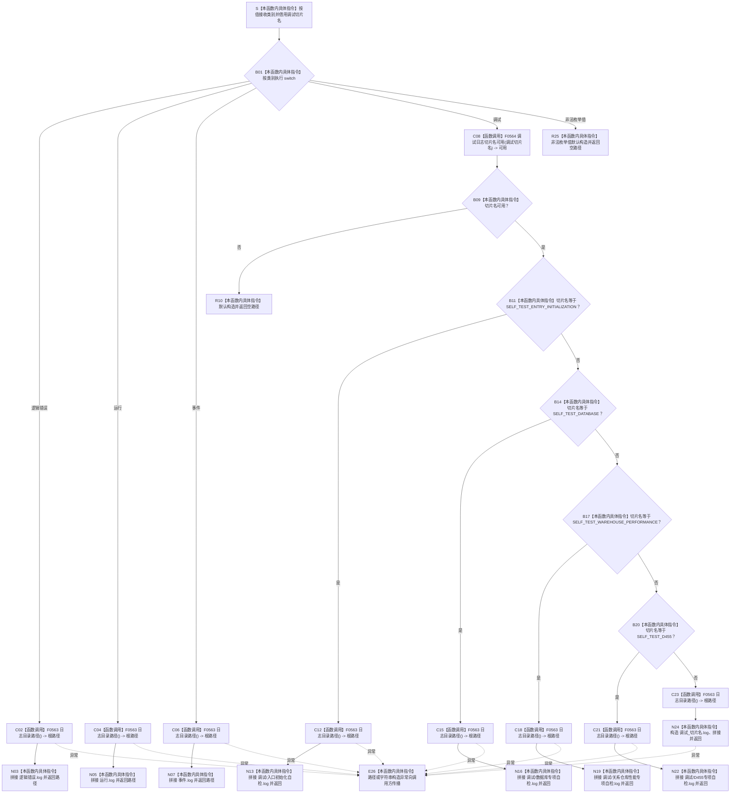

# CF-L5-0144 `日志文件路径` 现状流程图

图类型：现状流程图
代码版本：`a48a70b2d678dea64dd8228adb4f26f0badd9506`
覆盖文件：`海中鱼巣/核心/日志系统.h:85-112`
唯一根函数：F0268
完整签名：`inline std::filesystem::path 海中鱼巣::日志文件路径(海中鱼巣::日志类别 类别, std::wstring_view 调试切片名 = {})`
参数：`类别` 按值复制；`调试切片名` 是调用期间有效的只读非拥有借用，函数不保存
返回结果：独立拥有的 `std::filesystem::path`；合法类别形成具名路径，非法调试切片或非法枚举值形成空路径
已登记调用方：F0095 `写入日志(...)`；当前已登记上游只经 F0036 调试日志入口
待展开调用语境：控制面板两个源码调用点只有在 F0396 子图展开并取得稳定调用者身份后才能登记；`自检.运行线程.ixx:617` 所在根函数当前无可达证据
直接项目函数：F0563 `日志目录路径()`（八个调用点）、F0564 `调试日志切片名可用(...)`（一个调用点）
调用图：`流程图/代码流程图/00_调用知识图谱.md`
逐行映射表：`流程图/代码流程图/L5/CF-L5-0144_日志文件路径_逐行代码映射表.md`
入口前置：非调试类别忽略切片名；调试类别先校验切片名；代码未声明其它统一前置
结构读取与写入：只构造非权威路径材料；不访问文件系统，不写节点、关系、索引、领域事实或日志内容
逻辑内返回：任意直接调用者传入不可用调试切片时在文件操作前返回空路径；当前已登记调用语境只传入四个固定合法切片
内部错误：当前正式调用语境出现非法枚举值应追查调用方类型/值破坏；路径或字符串分配异常向上传播
生命周期与资源释放：所有路径和字符串临时值由本函数拥有并在返回物化或异常展开时销毁；切片名只同步借用
异常：函数无 `noexcept` 且无 `catch`；路径或字符串构造异常改变调用方控制流
验证入口：冻结源码、9 条新增项目调用边、3 组外部边界和逐行映射机械核对；未访问日志文件、未运行程序
依据：`规范/0050_项目通用机器逻辑与禁止性规则总纲_20260721.md`、`规范/0600_代码函数流程图应用与维护规范.md`、`规范/日志系统规范.md`、`规范/8120_子规范_程序入口启动模式与运行宿主边界_20260726.md`
不得作为施工许可：是
不得宣称：路径形成不证明目录或文件存在、日志已写入、分类隔离运行通过、日志可裁决机器事实或异常已经隔离

## 流程图

## 节点合同

| 节点 | 类型 | 参数 / 输入绑定 | 结果 / 输出绑定 | 事实读写 | 后继条件 | 验证 |
| --- | --- | --- | --- | --- | --- | --- |
| S / B01 | 本函数内具体指令 | 类别值、切片名借用 | 选中分支 | 无 | 四枚举或非法值 | 85—86 行 |
| C02—N07 | 函数调用 / 本函数内具体指令 | 无 | 三类固定路径 | 只形成非权威路径 | 各分支直接返回 | E1291—E1293 |
| C08 / B09 / R10 | 函数调用 / 本函数内具体指令 | 调试切片名 | 可用位或空路径 | 无文件访问 | 不可用直接返回 | E1294 |
| B11—N22 | 本函数内具体指令 / 函数调用 | 四个固定切片名 | 四个具名调试路径 | 只形成路径 | 首个相等分支返回 | E1295—E1298 |
| C23 / N24 | 函数调用 / 本函数内具体指令 | 合法未知切片 | 通用调试路径 | 只形成路径 | 返回 | E1299 |
| R25 / E26 | 本函数内具体指令 | 非法枚举或分配异常 | 空路径或无返回 | 无机器事实 | 返回或上抛 | 111—112 行 |

## 输入契约与非成功语境

| 语境 | 非成功条件 | 结构变化 | 分类与后继 |
| --- | --- | --- | --- |
| 已登记 F0095 调试入口 | 四个固定切片中任一被判不可用 | 尚未创建目录或文件 | 上游合同已固定，若发生需追根因 |
| 任意直接调用者 | 空切片或含禁用字符 | 无 | 当前实现的写前逻辑内拒绝；正式字符集合同证据不足 |
| 非法日志类别 | 不属于四个枚举项 | 无 | 当前已知调用方不应产生；正式调用语境中需追根因 |
| 合法未知切片 | 不等于四个固定名 | 无 | 成功形成通用路径 |
| 分配异常 | 路径或字符串构造抛出 | 无 | 内部错误；当前向上传播 |

## 外部与偏差边界

- X0263—X0265 分账 `std::filesystem::path` 构造/拼接、四次 `wstring_view` 比较和 fallback 字符串构造。
- F0268 只生成路径；F0095 才创建目录、打开文件和写入内容。
- 路径/字符串分配异常未经隔离直接传播；当调试宏开启时可能改变调用方控制流，与日志宏只增加人读输出的工程边界存在实现偏差。
- 日志规范未冻结非法切片字符集、未知合法切片 fallback 命名和非法枚举返回空路径的精确 API 合同，当前实现只能作为现状证据。
- 四个具名调试切片位于 `日志/调试/`，通用切片位于日志根目录；现行规范允许独立文件或子目录，但未裁决统一布局。
- 控制面板两个源码调用点等待其真实调用者子图展开后登记；无调用证据的运行线程自检调用点保持排除。
