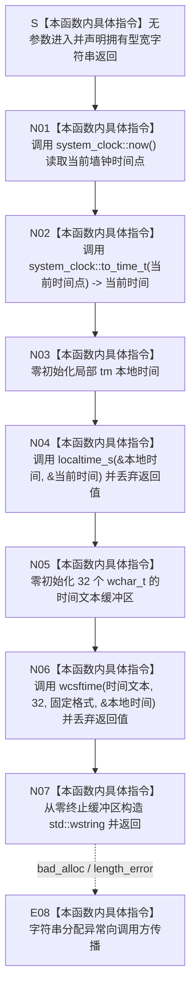

# CF-L5-0145 `当前日志时间文本` 现状流程图

图类型：现状流程图
代码版本：`a48a70b2d678dea64dd8228adb4f26f0badd9506`
覆盖文件：`海中鱼巣/核心/日志系统.h:114-123`
唯一根函数：F0269
完整签名：`inline std::wstring 海中鱼巣::当前日志时间文本()`
参数：无
返回结果：独立拥有的 `std::wstring`；正常路径按本机本地时间形成 `YYYY-MM-DD HH:MM:SS` 人读文本；时间转换或格式化失败没有结构化结果
已登记调用方：F0095 `写入日志(...)`
直接项目函数：无
调用图：`流程图/代码流程图/00_调用知识图谱.md`
逐行映射表：`流程图/代码流程图/L5/CF-L5-0145_当前日志时间文本_逐行代码映射表.md`
输入契约 / 调用语境表：本文“输入契约与非成功语境”
非成功返回二分审查表：本文“输入契约与非成功语境”
偏差清单：`流程图/代码流程图/00_规范偏差审计.md` 的 F0269 切片
依据提交 / 结构化消息：冻结源码提交 `a48a70b2d678dea64dd8228adb4f26f0badd9506`；用户允许同层三个函数并行只读分析，最终身份与写入由主智能体裁决
入口前置：当前登记路径由 F0095 在日志目录准备成功后调用；函数自身没有参数和显式前置
结构读取与写入：读取系统墙钟、进程可见的本地时区与 C 时间格式化环境，只形成非权威人读文本；不读取或写入项目机器结构
逻辑内返回：代码没有显式失败返回；`localtime_s` 与 `std::wcsftime` 的返回值均被丢弃
内部错误：`localtime_s` 失败后局部 `tm` 可被置为无效字段，`wcsftime` 失败后的缓冲区不保证仍是有效零终止串；当前仍继续构造字符串，极端情况下可能越界读取；字符串分配异常向调用方传播
生命周期与资源释放：时间点、`time_t`、`tm` 和 32 个宽字符缓冲区均为局部值；返回字符串独立拥有；不保存外部引用
并发与时间：没有项目共享状态或锁；使用 `system_clock` 墙钟而非单调时钟，文本可受系统校时、时区和区域设置变化影响，不能承担全局排序
异常：函数未声明 `noexcept` 且无 `catch`；`std::wstring` 构造分配异常向 F0095 传播
验证入口：冻结源码、3 组外部边界、逐行映射和 F0095 现有入边机械核对；未读取系统日志、未运行程序
验证输出：聚合身份 / 调用边 / 外部边界闭合 PASS；逐行与节点闭合 PASS；`git diff --check` PASS；strict 100 项 PASS
依据：`规范/0050_项目通用机器逻辑与禁止性规则总纲_20260721.md`、`规范/0600_代码函数流程图应用与维护规范.md`、`规范/日志系统规范.md`
不得作为施工许可：是
不得宣称：时间文本不证明事件发生顺序、单调时间、数据库时间、持久化成功、机器事实成立或日志已经写入

## 流程图

## 节点合同

| 节点 | 类型 | 参数 / 输入绑定 | 结果 / 输出绑定 | 事实读写 | 后继条件 | 验证 |
| --- | --- | --- | --- | --- | --- | --- |
| S / N01 / N02 | 本函数内具体指令 | 无 | 墙钟时间点、`time_t` | 读取系统时间材料 | 无条件继续 | 114—116 行 |
| N03 / N04 | 本函数内具体指令 | `当前时间` | 局部 `tm` | 读取本地时区转换结果；返回码丢弃 | 无条件继续 | 117—118 行 |
| N05 / N06 | 本函数内具体指令 | 局部 `tm`、固定格式和容量 32 | 宽字符缓冲区 | 写局部人读缓冲区；格式化结果丢弃 | 无条件继续 | 119—121 行 |
| N07 / E08 | 本函数内具体指令 | 零终止缓冲区 | 拥有型宽字符串或异常 | 无机器事实 | 返回或上抛 | 122—123 行 |

## 输入契约与非成功语境

| 语境 | 非成功条件 | 结构变化 | 分类与后继 |
| --- | --- | --- | --- |
| F0095 日志格式化 | `system_clock` 或 `to_time_t` 无法形成可表示时间 | 尚未打开日志文件 | 无结构化失败合同；当前继续进入本地时间转换 |
| 本地时间转换 | `localtime_s` 返回非零 | 只影响局部 `tm` | 前置后的时间材料异常，返回值被漏检 |
| 时间格式化 | `wcsftime` 返回 0 | 只影响局部缓冲区 | 前置后的格式化异常，返回值被漏检 |
| 字符串构造 | 分配异常 | 无机器结构变化 | 内部错误向 F0095 传播 |

## 外部与偏差边界

- X0266—X0268 分账墙钟读取与 `time_t` 转换、`localtime_s`、`wcsftime`、宽字符串构造和返回生命周期。
- 本函数使用墙钟本地时间，不是单调时间；系统校时或时区变化可使文本倒退、重复或跳变。
- `localtime_s` 和 `wcsftime` 的返回值均未检查；`wcsftime` 失败不保证目标缓冲区保持零终止，后续 `std::wstring(const wchar_t*)` 极端情况下可能越界读取。
- 无效参数处理器可能在部分 CRT 失败条件下终止进程；当前函数没有把该边界收口为结构化日志失败。
- 日志规范只要求人读“发生时间”字段，没有把该文本升级为机器顺序、事件时间戳或恢复依据。
- 字符串分配异常未经日志入口隔离；启用调试日志时可能改变调用方控制流。
