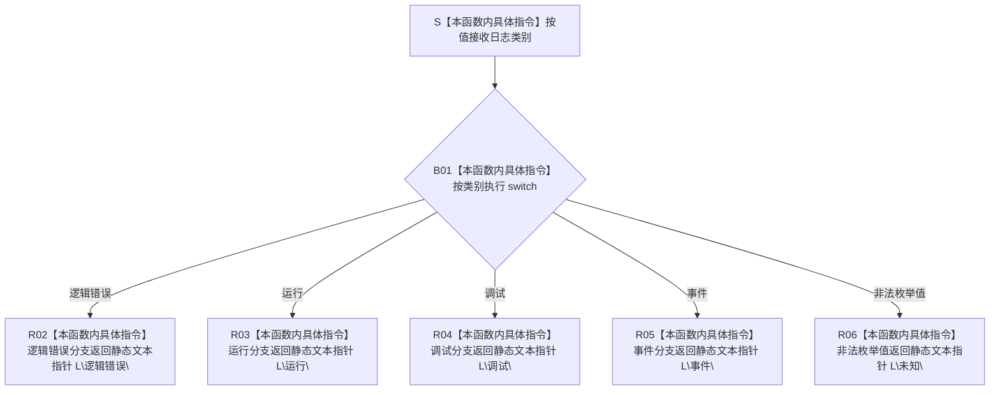

# CF-L5-0146 `日志类别文本` 现状流程图

图类型：现状流程图
代码版本：`a48a70b2d678dea64dd8228adb4f26f0badd9506`
覆盖文件：`海中鱼巣/核心/日志系统.h:125-137`
唯一根函数：F0270
完整签名：`inline const wchar_t* 海中鱼巣::日志类别文本(海中鱼巣::日志类别 类别)`
参数：`类别` 按值复制；函数不保存外部引用
返回结果：指向静态存储期宽字符串字面量的只读指针；四个具名类别返回对应文本，非法枚举值返回 `L"未知"`
已登记调用方：F0095 `写入日志(...)`
待展开调用语境：控制面板 `追加日志文件行(...)` 的源码调用点等待 F0396 子图建立稳定调用者身份后登记；`自检.运行线程.ixx:622` 所在根函数当前无可达证据
直接项目函数：无
调用图：`流程图/代码流程图/00_调用知识图谱.md`
逐行映射表：`流程图/代码流程图/L5/CF-L5-0146_日志类别文本_逐行代码映射表.md`
输入契约 / 调用语境表：本文“输入契约与非成功语境”
非成功返回二分审查表：本文“输入契约与非成功语境”
偏差清单：`流程图/代码流程图/00_规范偏差审计.md` 的 F0270 切片
依据提交 / 结构化消息：冻结源码提交 `a48a70b2d678dea64dd8228adb4f26f0badd9506`；用户允许同层三个函数并行只读分析，最终身份与写入由主智能体裁决
入口前置：函数自身接受任意枚举底层值；当前 F0095 语境已由 F0268 非空路径前置排除非法类别
结构读取与写入：只选择非权威人读类别文本；不读取或写入项目机器结构
逻辑内返回：非法枚举值返回 `未知` 文本，不形成拒绝、错误码或异常
内部错误：无显式内部错误分支；非法枚举若来自当前正式调用语境，应追查上游值破坏，不能把 `未知` 当作合法机器类别
生命周期与资源释放：参数为局部枚举值；返回指针指向静态存储期字面量，调用方不拥有且不得修改，无释放责任
异常：函数未声明 `noexcept`，但当前实现只执行枚举判断和返回字面量指针，不分配、不抛出普通 C++ 异常
验证入口：冻结源码、1 组外部边界、逐行映射和 F0095 现有入边机械核对；未运行程序
验证输出：聚合身份 / 调用边 / 外部边界闭合 PASS；逐行与节点闭合 PASS；`git diff --check` PASS；strict 100 项 PASS
依据：`规范/0050_项目通用机器逻辑与禁止性规则总纲_20260721.md`、`规范/0600_代码函数流程图应用与维护规范.md`、`规范/日志系统规范.md`
不得作为施工许可：是
不得宣称：类别文本不证明日志已经分类写入、日志类别是机器事实、非法枚举已经合法化或控制面板子图已经完成

## 流程图

## 节点合同

| 节点 | 类型 | 参数 / 输入绑定 | 结果 / 输出绑定 | 事实读写 | 后继条件 | 验证 |
| --- | --- | --- | --- | --- | --- | --- |
| S / B01 | 本函数内具体指令 | 类别值 | 选中四个具名分支或默认分支 | 无 | 枚举比较 | 125—126 行 |
| R02—R05 | 本函数内具体指令 | 具名日志类别 | 对应静态文本指针 | 只形成人读投影 | 直接返回 | 127—134 行 |
| R06 | 本函数内具体指令 | 非法枚举底层值 | `L"未知"` 静态指针 | 无 | 直接返回 | 135—137 行 |

## 输入契约与非成功语境

| 语境 | 非成功条件 | 结构变化 | 分类与后继 |
| --- | --- | --- | --- |
| F0095 日志写入 | 类别不是四个具名枚举项 | F0268 先返回空路径，F0095 不会到达 F0270 | 当前登记路径的写前拒绝由上游完成 |
| 任意直接调用者 | 非法枚举值 | 无 | 本函数逻辑内返回 `未知`；正式调用语境出现时仍应追根因 |
| 控制面板待展开路径 | 传入运行、逻辑错误或事件 | 无 | 人读显示成功路径；待调用者身份稳定后补边 |
| 无调用证据自检 | 传入事件类别 | 无 | 不纳入当前可达图，不据此删除函数 |

## 外部与偏差边界

- X0269 记录四个 `case` 分派、五个宽字符串字面量的静态存储期、数组到只读指针转换和返回生命周期边界。
- F0095 在调用 F0270 前已经通过 F0268 的非空路径间接确认类别有效，因此当前登记路径不会把非法枚举写成 `未知`。
- `未知` 只是不抛异常的人读 fallback，不能反向把非法底层值升级为正式日志类别。
- 控制面板调用点等待 F0396 子图形成 `日志文件状态文本`、`追加日志文件行` 和 `更新日志页` 的稳定函数身份后补入边。
- 日志类别文本不参与机器裁决，也不能替代日志路径、文件写入或写后持久化证据。
