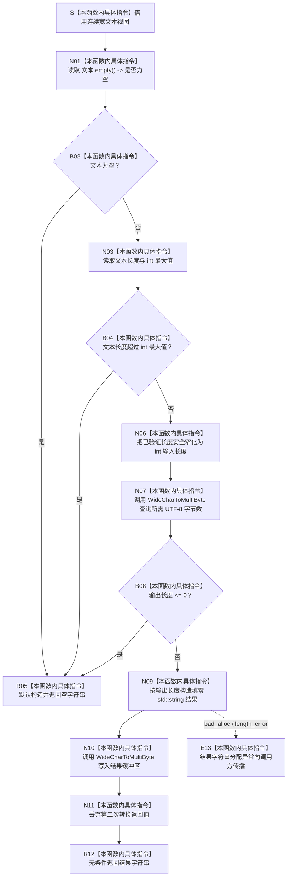

# CF-L5-0147 `转为UTF8` 现状流程图

图类型：现状流程图
代码版本：`a48a70b2d678dea64dd8228adb4f26f0badd9506`
覆盖文件：`海中鱼巣/核心/日志系统.h:202-216`
唯一根函数：F0271
完整签名：`inline std::string 海中鱼巣::转为UTF8(std::wstring_view 文本)`
参数：`文本` 是调用期间有效的只读、非拥有、连续宽字符视图；函数同步读取且不保存引用；底层缓冲区在两次转换期间必须保持稳定
返回结果：独立拥有的 UTF-8 字节字符串；空输入、长度超过 `INT_MAX` 或首轮 Win32 查询失败均返回空字符串；第二轮转换结果未核对
已登记调用方：F0095 `写入日志(...)`
排除调用点：`海中鱼巣/核心/事件日志段服务.cpp:166` 的调用位于当前无根图调用证据的 `严格转为UTF8`，本轮不伪造入边或函数身份
直接项目函数：无
调用图：`流程图/代码流程图/00_调用知识图谱.md`
逐行映射表：`流程图/代码流程图/L5/CF-L5-0147_转为UTF8_逐行代码映射表.md`
输入契约 / 调用语境表：本文“输入契约与非成功语境”
非成功返回二分审查表：本文“输入契约与非成功语境”
偏差清单：`流程图/代码流程图/00_规范偏差审计.md` 的 F0271 切片
依据提交 / 结构化消息：冻结源码提交 `a48a70b2d678dea64dd8228adb4f26f0badd9506`；用户允许同层三个函数并行只读分析，最终身份与写入由主智能体裁决
入口前置：当前 F0095 语境传入已经形成固定前缀和非空正文的临时 `std::wstring`；临时对象在完整表达式结束前有效
结构读取与写入：只读取输入文本并形成非权威编码材料；不访问文件、不写日志、不读写项目机器结构
逻辑内返回：空文本、超长文本或首轮 `WideCharToMultiByte` 失败统一返回空字符串；当前 F0095 随后返回 false 且不打开日志文件
内部错误：第二次转换返回值被丢弃；失败或长度不一致时仍可能返回预分配的非空填零或部分写入字符串
生命周期与资源释放：输入视图只同步借用；结果字符串独立拥有；F0095 的临时宽字符串在调用期间不悬空
异常：函数未声明 `noexcept` 且无 `catch`；结果字符串分配可抛 `bad_alloc` 或 `length_error` 并向 F0095 传播
验证入口：冻结源码、3 组外部边界、逐行映射和 F0095 现有入边机械核对；未调用 Win32 API、未运行程序
验证输出：聚合身份 / 调用边 / 外部边界闭合 PASS；逐行与节点闭合 PASS；`git diff --check` PASS；strict 100 项 PASS
依据：`规范/0050_项目通用机器逻辑与禁止性规则总纲_20260721.md`、`规范/0600_代码函数流程图应用与维护规范.md`、`规范/日志系统规范.md`
不得作为施工许可：是
不得宣称：返回非空不证明第二次转换成功、输入是严格合法 UTF-16、日志已经写入或编码材料可裁决机器事实

## 流程图

## 节点合同

| 节点 | 类型 | 参数 / 输入绑定 | 结果 / 输出绑定 | 事实读写 | 后继条件 | 验证 |
| --- | --- | --- | --- | --- | --- | --- |
| S / N01—B04 | 本函数内具体指令 | 文本视图 | 空位、长度和 `int` 上限 | 只读输入材料 | 空或超长返回 | 202—205 行 |
| R05 | 本函数内具体指令 | 空、超长或首轮失败 | 空字符串 | 无机器事实 | 返回 | 204、210 行 |
| N06—B08 | 本函数内具体指令 | 已验证长度和输入缓冲区 | `int` 输入长度、所需输出长度 | 调用 Win32 查询，不写项目结构 | 非正返回空 | 207—211 行 |
| N09 / E13 | 本函数内具体指令 | 正输出长度 | 填零结果缓冲区或异常 | 只写局部字符串 | 构造成功继续 | 213 行 |
| N10 / N11 / R12 | 本函数内具体指令 | 相同输入和结果缓冲区 | 返回字符串 | 第二次 Win32 返回值被丢弃 | 无条件返回 | 214—216 行 |

## 输入契约与非成功语境

| 语境 | 非成功条件 | 结构变化 | 分类与后继 |
| --- | --- | --- | --- |
| 当前 F0095 | 合法空文本 | 不可达；F0095 已形成固定前缀和非空正文 | 通用 API 逻辑内空结果，不属于当前调用语境 |
| 任意调用者 | 长度超过 `INT_MAX` | 无 | Win32 ABI 写前拒绝；正式日志内容预算尚未冻结 |
| 首轮转换 | 返回 0 或负值 | 无 | 空字符串逻辑内返回；错误原因未保留 |
| 非法 UTF-16 | `flags=0` 可形成替代字符 | 只形成有损人读材料 | 不是当前代码的失败；严格性合同证据不足 |
| 第二轮转换 | 返回 0 或不等于首轮长度 | 可能形成非空填零或部分材料 | 前置通过后的内部转换异常；当前漏检 |
| 字符串分配 | `bad_alloc` / `length_error` | 无机器结构变化 | 内部错误向 F0095 传播 |

## 外部与偏差边界

- X0270—X0272 分账宽文本视图与长度上限、两次 `WideCharToMultiByte`、结果字符串构造与缓冲访问。
- `size_t` 到 `int` 的窄化发生在长度上限检查之后；当前转换安全。
- 两次 Win32 调用都使用 `CP_UTF8` 和 flags 0；非法 UTF-16 通常会被替换而非严格拒绝。
- 第二次转换返回值未与首轮 `输出长度` 比较，也未读取错误原因；F0095 只检查 `empty()`，不能识别非空错误材料。
- 空输入、超长和首轮失败共用空字符串哨兵；当前 F0095 因输入必定非空可把空结果当失败，但该解释不能推广为通用合同。
- 日志规范未冻结普通日志对非法 UTF-16、嵌入 NUL、最大内容预算和结构化转换错误的精确合同。
- 字符串分配异常未经隔离；启用调试日志时可能改变调用方控制流。
