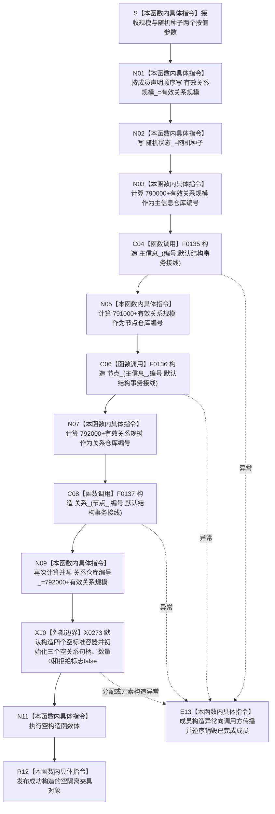

# CF-L5-0148 `隔离关系夹具::隔离关系夹具` 现状流程图

图类型：现状流程图
代码版本：`a48a70b2d678dea64dd8228adb4f26f0badd9506`
覆盖文件：`海中鱼巣/核心/自检.关系仓库性能基线.ixx:144-152`，成员声明顺序依据同文件 `601-615`
唯一根函数：F0272
完整签名：`海中鱼巣::关系仓库性能基线内部::隔离关系夹具::隔离关系夹具(std::size_t 有效关系规模, std::uint64_t 随机种子)`
参数：`有效关系规模` 与 `随机种子` 均按值传入；构造器不校验规模档位、编号加法回绕或种子取值
返回结果：成功时形成一个独立拥有三座仓库、参考容器和测量状态的空夹具对象；构造失败时不形成对象并逆序销毁已经构造的成员
已登记调用方：F0096 `运行无效参数写前拒绝`；F0097 `运行单规模基线`
直接项目函数：F0135 `主信息仓库::主信息仓库`、F0136 `节点仓库::节点仓库`、F0137 `关系仓库::关系仓库`
调用图：`流程图/代码流程图/00_调用知识图谱.md`
逐行映射表：`流程图/代码流程图/L5/CF-L5-0148_隔离关系夹具构造_逐行代码映射表.md`
输入契约 / 调用语境表：本文“输入契约与非成功语境”
非成功返回二分审查表：本文“输入契约与非成功语境”
偏差清单：`流程图/代码流程图/00_规范偏差审计.md` 的 F0272 切片
依据提交 / 结构化消息：冻结源码提交 `a48a70b2d678dea64dd8228adb4f26f0badd9506`；用户允许同层三个函数并行只读分析，最终身份与写入由主智能体裁决
入口前置：调用方只保证按值参数可复制；合法三档规模的业务准入实际延迟到 F0273
结构读取与写入：只创建夹具私有旧结构域和空容器；不接生产运行期上下文，不写生产仓库
逻辑内返回：无
内部错误：任一成员构造异常均向调用方传播；编号加法回绕没有具名拒绝
生命周期与资源释放：夹具独占三个仓库和值式容器；`节点_` 借用更早构造的 `主信息_`，`关系_` 借用更早构造的 `节点_`；声明顺序保证析构时关系先于节点、节点先于主信息
异常：未声明 `noexcept` 且无 `catch`；成员构造异常触发已经完成成员的逆序析构
验证入口：冻结源码、成员声明顺序、三个项目构造边和一个编译器 / 标准容器边界机械核对；未实例化夹具、未运行程序
验证输出：函数 / 队列 / JSON / Markdown 图谱身份集合一致；项目调用边正反闭合；有效源码行覆盖、节点类型、HTML 零差异、冻结源码零漂移、`git diff --check` 与 strict 100 项均 PASS
依据：`规范/4010_子规范_统一仓库稳定句柄与通用关系索引边界.md`、`规范/4040_子规范_不透明结构事务候选确认撤销与最后发布.md`、`规范/0600_代码函数流程图应用与维护规范.md`
不得作为施工许可：是
不得宣称：夹具已经构建关系分布、通过性能基线、符合当前节点直接身份生产结构或具备跨仓事务能力

## 流程图

## 节点合同

| 节点 | 类型 | 参数 / 输入绑定 | 结果 / 输出绑定 | 事实读写 | 后继条件 | 验证 |
| --- | --- | --- | --- | --- | --- | --- |
| S / N01 / N02 | 本函数内具体指令 | 两个按值参数 | 两个标量成员 | 只写未发布对象成员 | 无判断 | 146—147、601—602 行 |
| N03 / C04 | 指令 / 函数调用 | `790000+规模`、默认接线 | 空 `主信息_` | 创建夹具私有旧结构仓库 | 构造成功 | 148、603 行 |
| N05 / C06 | 指令 / 函数调用 | `主信息_`、`791000+规模`、默认接线 | 空 `节点_` | 节点仓库借用主信息仓库 | 构造成功 | 149、604 行 |
| N07 / C08 | 指令 / 函数调用 | `节点_`、`792000+规模`、默认接线 | 空 `关系_` | 关系仓库借用节点仓库 | 构造成功 | 150、605 行 |
| N09 / X10 | 指令 / 外部边界 | 编号、默认成员初始化器 | 空容器、空句柄和默认状态 | 只写未发布夹具状态 | 全部成功 | 151、606—615 行 |
| N11 / R12 | 本函数内具体指令 | 已完成成员 | 空隔离夹具 | 不执行额外结构写入 | 正常返回 | 151—152 行 |
| E13 | 本函数内具体指令 | 任一构造异常 | 不形成夹具对象 | 逆序释放已完成成员 | 异常传播 | C++ 构造展开规则 |

## 输入契约与非成功语境

| 语境 | 非成功条件 | 结构变化 | 分类与后继 |
| --- | --- | --- | --- |
| F0096 无效参数负例 | `有效关系规模=0` | 仍成功形成空夹具；拒绝延迟到 F0273 | 本构造器无拒绝，属于当前测试合同 |
| F0097 三档基线 | 规模为 1000 / 10000 / 100000 | 形成各自编号隔离仓库 | 正常构造后调用 F0273 |
| 任意调用者 | `790000/791000/792000 + 规模` 在 `size_t` 回绕 | 可能形成非预期仓库编号 | 当前无拒绝；泛化输入合同缺口 |
| 成员构造 | 仓库接线、锁或容器构造异常 | 对象不发布，已完成成员逆序销毁 | 内部错误向调用方传播 |

## 外部与偏差边界

- X0273 统一登记编译器按声明顺序初始化、默认结构事务接线值、四个标准容器和其余默认成员的构造 / 失败展开。
- 初始化列表的视觉顺序与当前声明顺序一致；真正裁决顺序仍由 601—615 行成员声明决定。
- 旧性能详细设计写“隔离四仓库夹具”，当前对象实际只有 `主信息_ / 节点_ / 关系_` 三仓库，索引由容器参考模型替代；属于设计证据与当前代码差异。
- 当前正式 4010 已删除通用主信息作为机器结构；本构造器仍创建旧 `主信息仓库`，只能作为冻结旧自检实现事实，不得外推为现行生产设计。
- 仓库编号由规模直接参与加法且没有回绕拒绝；当前三档和零值不会触发，但函数的泛化输入合同不完整。
