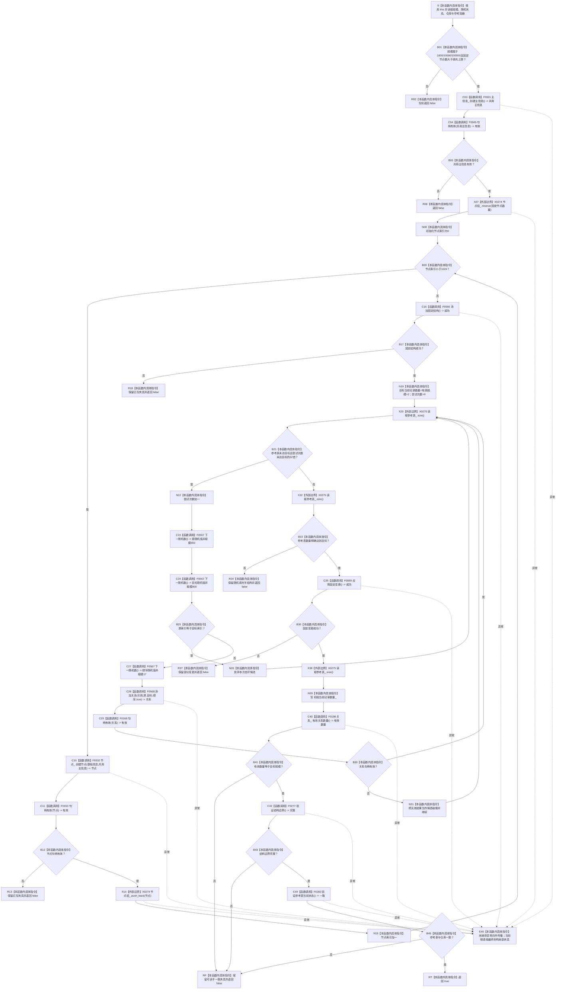

# CF-L5-0149 `隔离关系夹具::构建` 现状流程图

图类型：现状流程图
代码版本：`a48a70b2d678dea64dd8228adb4f26f0badd9506`
覆盖文件：`海中鱼巣/核心/自检.关系仓库性能基线.ixx:154-191`
唯一根函数：F0273
完整签名：`bool 海中鱼巣::关系仓库性能基线内部::隔离关系夹具::构建()`
参数：无显式参数；通过 `this` 读取构造时冻结的规模、随机状态、三个隔离仓库和参考容器
返回结果：`true` 仅表示当前隔离夹具形成目标规模关系并通过三项即时读回；`false` 混合写前拒绝与多种写后不一致，不证明恢复调用前状态
已登记调用方：F0096 无效规模负例；F0097 三档正式性能夹具
直接项目函数：F0331、F0565、F0332、F0163、F0566、F0567、F0568、F0168、F0569、F0198、F0277、F0283；被调图：[F0331 主信息仓库创建主信息](../L6/CF-L6-0011_主信息仓库创建主信息_现状流程图.md)、[F0332 节点仓库创建节点](../L6/CF-L6-0012_节点仓库创建节点_现状流程图.md)
调用图：`流程图/代码流程图/00_调用知识图谱.md`
逐行映射表：`流程图/代码流程图/L5/CF-L5-0149_隔离关系夹具构建_逐行代码映射表.md`
输入契约 / 调用语境表：本文“输入契约与非成功语境”
非成功返回二分审查表：本文“输入契约与非成功语境”
偏差清单：`流程图/代码流程图/00_规范偏差审计.md` 的 F0273 切片
依据提交 / 结构化消息：冻结源码提交 `a48a70b2d678dea64dd8228adb4f26f0badd9506`；三个同层函数由只读子智能体分析，主智能体复核并统一编号
入口前置：当前调用方每次使用新建空夹具；函数自身不检查空夹具或单次调用状态
结构读取与写入：即时写入夹具私有主信息、节点、关系仓库及参考容器；没有共同候选、统一发布、显式撤销或失败封存
逻辑内返回：F0096 的无效规模写前拒绝；随机自环和重复引用候选可以跳过
内部错误：合法三档规模下的创建、固定结构、填充上限、固定变更或读回失败，以及异常传播
生命周期与资源释放：夹具拥有全部写入结构；失败后由当前局部调用语境最终析构整体夹具，但析构不是 F0273 的事务撤销
异常：未声明 `noexcept` 且无 `catch`；异常穿过 F0096/F0097，最终由 F0037 外层 `catch (...)` 收口并析构局部夹具
验证入口：冻结源码、14 条新增项目调用边、2 组外部边界、逐行映射与两个调用语境机械核对；未构建夹具、未运行性能自检
验证输出：函数 / 队列 / JSON / Markdown 图谱身份集合一致；项目调用边正反闭合；有效源码行覆盖、节点类型、HTML 零差异、冻结源码零漂移、`git diff --check` 与 strict 100 项均 PASS
依据：`规范/0050_项目通用机器逻辑与禁止性规则总纲_20260721.md`、`规范/4040_子规范_不透明结构事务候选确认撤销与最后发布.md`、`规范/详细设计/数据仓库关系查询二级索引与性能治理详细设计.md`
不得作为施工许可：是
不得宣称：`false` 零变化、夹具具备跨仓原子性、当前性能门禁通过、旧主信息结构符合现行生产规范

## 流程图

## 节点合同

| 节点 | 类型 | 参数 / 输入绑定 | 结果 / 输出绑定 | 事实读写 | 后继条件 | 验证 |
| --- | --- | --- | --- | --- | --- | --- |
| S / B01 / R02 | 本函数内具体指令 | `this`、三档规模常量、固定节点常量 | 准入布尔或 `false` | 拒绝路径零写 | 合法规模继续 | 154—160 行 |
| C03—B05 / R06 | 函数调用 / 指令 | 私有主信息仓库 | 共用主信息句柄 | 调用仓库创建；失败原子性由 F0331 决定 | 有效继续 | 161—162 行 |
| X07—N15 | 外部边界 / 指令 / 函数调用 | 共用主信息、1024次索引 | 1024个基础节点句柄 | 循环即时写节点仓库和向量 | 任一失败返回 | 163—168 行 |
| C16—R18 | 函数调用 / 指令 | 全部节点 | 固定结构成功位 | 可能即时写任意固定关系前缀 | 成功继续 | 170 行 |
| N19—B25 | 指令 / 外部边界 / 函数调用 | 目标数量、LCG 状态 | 源 / 目标索引 | 修改随机状态，不因自环写仓库 | 非自环继续 | 172—179 行 |
| C27—N31 | 函数调用 / 指令 | 引用关系候选 | 关系句柄或空句柄 | F0568 可能写关系、键和参考表 | 无效统一继续 | 179—182 行 |
| X32—R34 | 外部边界 / 指令 | 参考表数量 | 是否达到目标 | 只读；失败保留已写结构 | 精确相等继续 | 184 行 |
| C35—R37 | 函数调用 / 指令 | 三个待变更关系 | 失效 / 删除 / 重挂结果 | 可能只发布部分固定变更 | 成功继续 | 186 行 |
| X38—N39 | 外部边界 / 指令 | 参考表数量 | 初始当前记录数量 | 写夹具摘要成员 | 无判断 | 187 行 |
| C40—B45 / RT / RF | 函数调用 / 指令 | 三项只读验证 | 最终 bool | 只读已写夹具；短路求值 | 全部真返回 true | 188—190 行 |
| E46 | 本函数内具体指令 | 任一未捕获异常 | 异常传播 | F0273 不撤销 | 外层收口 | 现有调用链 |

## 输入契约与非成功语境

| 语境 | 非成功条件 | 结构变化 | 分类与后继 |
| --- | --- | --- | --- |
| F0096 无效参数负例 | 规模为0 | 零写入 | 正式测试允许的逻辑内返回 |
| F0097 三档规模 | 入口守卫失败 | 零写入 | 正式固定输入漂移，追根因 |
| 主信息 / 节点 / 固定结构创建 | 返回无效或 false | 可能已有主信息、节点或关系前缀 | 前置通过后的内部错误 |
| 随机候选 | 源等于目标 | 本轮零仓库写 | 逻辑内继续 |
| F0568 | 重复引用键 | 本轮无新关系 | 逻辑内继续 |
| F0568 | 仓库创建或读回失败也返回空句柄 | 可能存在关系 / 键 / 参考表偏差 | 应追根因，但 F0273 当前统一继续 |
| 随机填充 | 32倍尝试上限耗尽 | 保留大量可读前缀 | 内部错误返回 false |
| 固定变更 | 任一阶段失败 | 可能已经完成前序变更 | 内部错误返回 false |
| 最终读回 | 数量、结构或参考表不一致 | 全部构建写入已经发生 | 内部错误返回 false |
| 任意步骤 | 分配、仓库或验证异常 | 取决于发生阶段 | 向 F0037 传播并由局部析构释放 |

## 外部与偏差边界

- X0274 分账节点句柄向量的容量预留、追加、元素生命周期与分配异常；X0275 分账参考表 `size()` 的三处只读。
- `添加关系` 的空句柄同时承载正常候选碰撞和内部创建 / 读回失败，F0273 一律继续，导致错误分类丢失。
- 从第一笔主信息写入开始，多个 `false` 路径保留夹具内可读半结构；当前局部夹具析构限制泄漏范围，但不等价于 4040 的精确逆序撤销。
- 三仓库和参考容器没有共同写入权、候选隔离或统一可见点；本函数只能作为旧隔离性能夹具事实，不能证明生产跨仓事务合规。
- `初始当前记录数量_` 在最终三项验证前写入；最终 false 时夹具仍暂时持有非零摘要。
- 函数没有单次使用状态；对同一夹具重复调用会在既有仓库和容器上继续写入。
