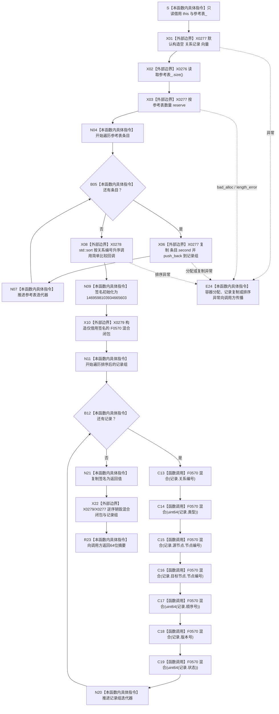

# CF-L5-0150 `隔离关系夹具::当前签名` 现状流程图

图类型：现状流程图
代码版本：`a48a70b2d678dea64dd8228adb4f26f0badd9506`
覆盖文件：`海中鱼巣/核心/自检.关系仓库性能基线.ixx:195-217`
唯一根函数：F0274
完整签名：`std::uint64_t 海中鱼巣::关系仓库性能基线内部::隔离关系夹具::当前签名() const`
参数：无显式参数；通过 `const this` 只读借用 `参考表_`，调用期间要求没有并发写入
返回结果：按关系编号排序后，对每条记录的七项字段执行自定义 FNV-like 64位整词混合所得摘要；空表返回非零初始常量；摘要允许碰撞
已登记调用方：F0097 `运行单规模基线`，仅在 F0273 成功后、任何并发与写测量前调用一次
直接项目函数：F0570 `当前签名::<lambda@203>::operator()(std::uint64_t) const` 七个调用点
排除函数身份：199行无捕获排序比较 lambda 只有一次内建 `<` 比较，按现行政策归入 X0278 `std::sort` 回调边界，不为其生成独立项目函数图
调用图：`流程图/代码流程图/00_调用知识图谱.md`
逐行映射表：`流程图/代码流程图/L5/CF-L5-0150_隔离关系夹具当前签名_逐行代码映射表.md`
输入契约 / 调用语境表：本文“输入契约与非成功语境”
非成功返回二分审查表：本文“输入契约与非成功语境”
偏差清单：`流程图/代码流程图/00_规范偏差审计.md` 的 F0274 切片
依据提交 / 结构化消息：冻结源码提交 `a48a70b2d678dea64dd8228adb4f26f0badd9506`；同层只读分析由子智能体形成候选，lambda 身份与编号由主智能体裁决
入口前置：当前唯一调用语境保证夹具构建成功且尚未开始并发 / 写测量；函数本身没有锁或稳定快照许可
结构读取与写入：只复制参考表值到局部向量并写局部签名；不写仓库或参考表
逻辑内返回：无拒绝分支；空表同样返回初始常量
内部错误：局部向量分配或 `std::sort` 异常向调用方传播；字段缺失和摘要碰撞不产生错误
生命周期与资源释放：局部向量拥有记录副本；F0570 闭包只在函数内借用局部 `签名` 并同步调用，不逃逸
异常：未声明 `noexcept` 且无 `catch`；`reserve`、`push_back` 或排序相关异常向 F0097 传播
验证入口：冻结源码、7条 F0570 调用边、4组外部 / 编译器边界、逐行映射与 F0097 调用语境机械核对；未计算三档真实签名
验证输出：函数 / 队列 / JSON / Markdown 图谱身份集合一致；项目调用边正反闭合；有效源码行覆盖、节点类型、HTML 零差异、冻结源码零漂移、`git diff --check` 与 strict 100 项均 PASS
依据：`规范/4010_子规范_统一仓库稳定句柄与通用关系索引边界.md`、`规范/0600_代码函数流程图应用与维护规范.md`、`规范/详细设计/数据仓库关系查询二级索引与性能治理详细设计.md`
不得作为施工许可：是
不得宣称：该摘要是完整结构身份、标准 FNV-1a、无碰撞校验、线程安全快照或三档冻结常量已经通过验证

## 流程图

## 节点合同

| 节点 | 类型 | 参数 / 输入绑定 | 结果 / 输出绑定 | 事实读写 | 后继条件 | 验证 |
| --- | --- | --- | --- | --- | --- | --- |
| S / X01—X03 | 指令 / 外部边界 | `const this`、参考表数量 | 有足够容量的空记录组 | 只读参考表，写局部容器 | 分配成功 | 195—197 行 |
| N04—N07 | 指令 / 外部边界 | 每个参考表条目 | `条目.second` 副本序列 | 不读取 map key；只写局部向量 | 遍历结束 | 198 行 |
| X08 | 外部边界 | 记录组、简单关系编号比较回调 | 按关系编号非降序的记录组 | 只改局部向量次序 | 排序完成 | 199—201 行 |
| N09 / X10 | 指令 / 外部边界 | 固定初值、局部签名引用 | F0570 同步闭包 | 只写局部签名 / 闭包 | 构造成功 | 202—206 行 |
| N11—C19 | 指令 / 函数调用 | 每条记录七项字段 | 每次更新后的签名 | F0570 对局部 `uint64_t` 执行异或和模乘 | 七项完成 | 207—214 行 |
| N20—R23 | 指令 / 外部边界 | 完成摘要 | 独立 `uint64_t` 返回值 | 不写项目结构 | 遍历完成 | 215—217 行 |
| E24 | 本函数内具体指令 | 标准容器 / 算法异常 | 异常传播 | 局部对象按规则析构 | 无普通返回 | 外部边界合同 |

## 输入契约与非成功语境

| 语境 | 非成功条件 | 结构变化 | 分类与后继 |
| --- | --- | --- | --- |
| 当前 F0097 | F0273 已成功，尚未并发写入 | 只复制参考表并形成摘要 | 正常调用 |
| 空参考表 | 无记录 | 返回非零初始常量 | 当前函数允许，不表示空或失败 |
| 容器 / 排序 | 分配、复制或算法异常 | 项目机器结构零写；局部材料销毁 | 内部错误向 F0097 传播 |
| 未来并发调用 | 参考表同时写入 | C++ 数据竞争 | 函数无锁，属于非法调用语境 |
| 摘要碰撞 | 不同记录集形成相同64位值 | 无结构变化 | 算法固有可能；不得作为身份或完整相等证明 |

## 外部与偏差边界

- X0276 分账 `unordered_map` 的 `size`、范围遍历、迭代与解引用；X0277 分账记录向量的构造、容量、复制追加、遍历和析构。
- X0278 分账 `std::sort`、向量迭代器和无捕获简单比较闭包；该闭包只有一次内建比较，不单独建立项目函数身份。
- X0279 分账 F0570 闭包的构造、七次同步调用和析构；闭包引用不逃逸。
- 初值 `1469598103934665603` 少于标准 64位 FNV-1a offset basis `14695981039346656037` 一位，且这里按七个64位整词而非逐字节混入，只能称自定义 FNV-like 摘要。
- `uint64_t` 乘法按模 `2^64` 回绕；负顺序号转换为 `uint64_t` 后按模值参与，跨构建确定。
- 排序消除 `unordered_map` 枚举顺序；但函数不验证 map key 等于记录内关系编号，若私有不变量破坏且出现重复内嵌编号，等价元素次序不再由比较器裁决。
- 摘要只混源 / 目标节点编号，遗漏两端仓库编号和版本；也未混关系仓库编号、参考表 key、记录数、规模和随机种子。因此只能作为旧性能报告摘要。
- 详细设计冻结三档结构签名常量，但当前调用链只检查摘要非零；对应验收缺口已在既有 A0118 归属，不由本函数图自动形成代码计划。
