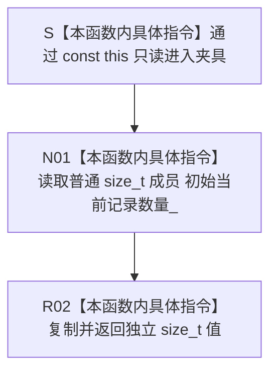

# CF-L5-0151 `隔离关系夹具::初始当前记录数量` 现状流程图

图类型：现状流程图
代码版本：`a48a70b2d678dea64dd8228adb4f26f0badd9506`
覆盖文件：`海中鱼巣/核心/自检.关系仓库性能基线.ixx:194`；值来源见同文件 `187,614`
唯一根函数：F0275
完整签名：`std::size_t 海中鱼巣::关系仓库性能基线内部::隔离关系夹具::初始当前记录数量() const`
参数：无显式参数；通过 `const this` 只读借用有效夹具对象，不保存引用
返回结果：把普通成员 `初始当前记录数量_` 按值复制为独立 `std::size_t`；该值是 F0273 缓存的构建期参考表条目数，不是实时或有效关系数量
已登记调用方：F0097 `运行单规模基线`，仅在 F0273 成功且 F0274 已读取结构签名后调用
直接项目函数：无
调用图：`流程图/代码流程图/00_调用知识图谱.md`
逐行映射表：`流程图/代码流程图/L5/CF-L5-0151_隔离关系夹具初始当前记录数量_逐行代码映射表.md`
输入契约 / 调用语境表：本文“输入契约与非成功语境”
非成功返回二分审查表：本文“输入契约与非成功语境”
偏差清单：`流程图/代码流程图/00_规范偏差审计.md` 的 F0275 切片
依据提交 / 结构化消息：冻结源码提交 `a48a70b2d678dea64dd8228adb4f26f0badd9506`；同层三个函数由只读子智能体分析，主智能体统一写入
入口前置：当前 F0097 已确认 F0273 返回 true，且调用发生在并发基线与写测量之前
结构读取与写入：只读取一个夹具私有普通标量；不访问仓库或参考表，不修改任何结构
逻辑内返回：无；返回0不是具名失败，只是默认或早期失败后可能保留的缓存值
内部错误：本函数无错误结果；无效 / 悬垂 `this` 或与 F0273 写入并发属于非法调用和未定义行为
生命周期与资源释放：返回副本独立拥有，调用后不依赖夹具生命周期
异常：未声明 `noexcept`，但当前函数体只有有效对象上的内建标量读取、复制和返回，没有可抛操作
验证入口：冻结源码、E0516 既有入边、逐行映射与当前调用顺序机械核对；未运行性能专项
验证输出：本批函数 / 队列 / JSON / Markdown 图谱身份、调用边闭合、单图单根与元数据、图映射配对、HTML 零差异、冻结源码零差异、`git diff --check` 和 `check_specs.py --strict` 均 PASS
依据：`规范/0050_项目通用机器逻辑与禁止性规则总纲_20260721.md`、`规范/0600_代码函数流程图应用与维护规范.md`、`规范/详细设计/数据仓库关系查询二级索引与性能治理详细设计.md`
不得作为施工许可：是
不得宣称：返回值是实时记录数量、有效关系数量、生产机器事实，或能够单独证明构建 / 参考模型 / 性能基线成功

## 流程图

## 节点合同

| 节点 | 类型 | 参数 / 输入绑定 | 结果 / 输出绑定 | 事实读写 | 后继条件 | 验证 |
| --- | --- | --- | --- | --- | --- | --- |
| S | 本函数内具体指令 | `const 隔离关系夹具* this` | 只读对象借用 | 无 | 有效对象 | 194 行函数头 |
| N01 | 本函数内具体指令 | `初始当前记录数量_` | `size_t` 临时值 | 只读夹具缓存 | 无判断 | 194 行返回表达式 |
| R02 | 本函数内具体指令 | 临时值 | 独立返回副本 | 无结构变化 | 返回 | 194 行 |

## 输入契约与非成功语境

| 语境 | 非成功条件 | 结构变化 | 分类与后继 |
| --- | --- | --- | --- |
| 当前 F0097 | F0273 成功并先完成 F0274 | 无 | 正常返回构建期缓存 |
| 未构建或187行前失败 | 成员仍为默认0 | 无 | 0不是本函数失败码；调用方无法据此区分状态 |
| 187行后最终验证失败 | 成员可能已是非零 | 无 | 非零不证明 F0273 成功 |
| 未来并发调用 | F0273 同时写普通成员 | 可能数据竞争 | 非法调用语境，不是逻辑内返回 |
| 非法对象生命周期 | 空或悬垂 `this` | 未定义行为 | 调用合同破坏 |

## 外部与偏差边界

- 本函数无项目源码出边、外部边界或未解析调用。
- 成员在声明处默认0，F0273 在固定变更成功后、最终三项验证前写入 `参考表_.size()`；函数本身不携带成功位。
- 当前成功构建路径中，参考表已在写入前被要求等于 `有效关系规模_+2`，因此三档报告预期分别得到 1002、10002、100002。
- 后续并发与写入测量不更新成员；名称中的“当前”是构建期快照语义，不是调用时实时语义。
- 摘要写入时点与状态歧义归 F0273 的构建结果合同，不应把纯 getter 改画成验证或仓库查询函数。
