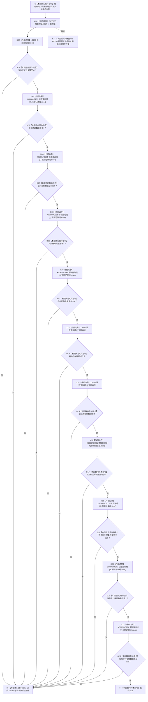

# CF-L5-0152 `隔离关系夹具::分布完整` 现状流程图

图类型：现状流程图
代码版本：`a48a70b2d678dea64dd8228adb4f26f0badd9506`
覆盖文件：`海中鱼巣/核心/自检.关系仓库性能基线.ixx:219-232`
唯一根函数：F0276
完整签名：`bool 海中鱼巣::关系仓库性能基线内部::隔离关系夹具::分布完整() const`
参数：无显式参数；通过 `const this` 只读借用已经成功构建且处于稳定单线程阶段的夹具
返回结果：十个固定位置查询定义的稀疏 / 密集数量轮廓全部满足时返回 true；不证明查询身份、记录内容、仓库读回或性能门禁完整
已登记调用方：F0097 `运行单规模基线`，在 F0273 成功并读取结构签名与初始数量后调用
直接项目函数：F0278 `隔离关系夹具::形成查询定义组() const`
调用图：`流程图/代码流程图/00_调用知识图谱.md`
逐行映射表：`流程图/代码流程图/L5/CF-L5-0152_隔离关系夹具分布完整_逐行代码映射表.md`
输入契约 / 调用语境表：本文“输入契约与非成功语境”
非成功返回二分审查表：本文“输入契约与非成功语境”
偏差清单：`流程图/代码流程图/00_规范偏差审计.md` 的 F0276 切片
依据提交 / 结构化消息：冻结源码提交 `a48a70b2d678dea64dd8228adb4f26f0badd9506`；同层三个函数由只读子智能体分析，主智能体统一写入
入口前置：F0273 已成功，节点组至少1024项且参考表可由 F0278 形成固定十项查询定义；函数自身不机械验证此前置
结构读取与写入：经 F0278 读取夹具节点组和参考表，局部拥有十项值式查询定义；不写夹具或仓库
逻辑内返回：无；固定夹具的任一 false 都表示构建、参考模型或查询定义合同不一致
内部错误：F0278 分配 / 复制异常向调用方传播；未构建夹具调用可能在 F0278 固定下标访问时越界
生命周期与资源释放：局部查询组及嵌套预期记录组由本函数拥有，正常或异常退出时析构
异常：未声明 `noexcept` 且无 `catch`；F0278 和返回值物化相关异常经 F0097 向 F0037 传播
验证入口：冻结源码、E1324 新增项目边、2组外部边界、逐行映射和左到右短路顺序机械核对；未形成真实查询组
验证输出：本批函数 / 队列 / JSON / Markdown 图谱身份、调用边闭合、单图单根与元数据、图映射配对、HTML 零差异、冻结源码零差异、`git diff --check` 和 `check_specs.py --strict` 均 PASS
依据：`规范/0600_代码函数流程图应用与维护规范.md`、`规范/详细设计/数据仓库关系查询二级索引与性能治理详细设计.md`
不得作为施工许可：是
不得宣称：返回 true 证明完整结构、完整句柄、参考表与仓库一致、查询实际正确或性能基线通过

## 流程图

## 节点合同

| 节点 | 类型 | 参数 / 输入绑定 | 结果 / 输出绑定 | 事实读写 | 后继条件 | 验证 |
| --- | --- | --- | --- | --- | --- | --- |
| S / C01 | 指令 / 函数调用 | 稳定夹具 `this` | 局部拥有查询组 | F0278 只读节点组 / 参考表 | 成功形成组 | 219—220 行 |
| X02 / B03 | 外部边界 / 指令 | 查询组 | 数量是否为10 | 只读局部值 | false立即返回 | 221 行 |
| X04—B11 | 外部边界 / 指令 | 0—3号查询 | 正反向稀疏 / 密集数量轮廓 | 只读局部值 | 左到右短路 | 222—225 行 |
| X12—B15 | 外部边界 / 指令 | 4—5号查询 | 两项存在预期 | 只读局部值 | 左到右短路 | 226—227 行 |
| X16—B23 | 外部边界 / 指令 | 6—9号查询 | 相关 / 审计稀疏密集轮廓 | 只读局部值 | 左到右短路 | 228—231 行 |
| RT / RF | 本函数内具体指令 | 完整短路表达式 | bool | 无结构变化 | 返回 | 221—232 行 |
| E24 | 本函数内具体指令 | F0278 / 容器异常 | 异常传播 | 局部值析构 | 无普通返回 | 调用合同 |

## 输入契约与非成功语境

| 语境 | 非成功条件 | 结构变化 | 分类与后继 |
| --- | --- | --- | --- |
| 查询组形成 | 分配或复制异常 | 项目机器结构零写 | 稳定阶段内部错误 |
| 固定十项合同 | 查询组数量不是10 | 无 | 追查 F0278 或调用前置 |
| 稀疏查询 | 任一预期数量不等于1 | 无 | 固定夹具分布不一致，追根因 |
| 密集查询 | 任一预期数量小于128 | 无 | 固定夹具分布不一致，追根因 |
| 存在查询 | 任一预期存在为false | 无 | 固定结构缺失，追根因 |
| 未构建夹具 | F0278 固定下标越界 | 未定义行为 | 调用合同破坏 |
| 未来并发调用 | 参考表 / 节点组同时写入 | 可能数据竞争 | 非法调用语境 |

## 外部与偏差边界

- E1324 登记 F0276 到既有 F0278 的唯一项目出边；F0278 下层参考查询函数只在展开 F0278 时登记，不伪造为本函数直接出边。
- X0280 分账查询组返回值物化、`size`、十次 `operator[]` 和局部析构；X0281 分账八个嵌套关系记录向量的 `size`。
- `&&` 从左到右短路；`查询组.size()==10` 是全部固定下标访问的前置，因此当前表达式内不会先越界再判断数量。
- 函数只验证十个固定位置的数量轮廓，不核对名称、查询种类、端点完整句柄、关系类型、记录身份、排序、版本或状态。
- 四个密集查询只要求 `>=128`，额外关系不会使本函数失败；完整内容一致性依赖后续查询执行与 F0283。
- F0276 返回 false 后，F0097 仍继续结构验证、查询、并发和写测量，最终仅由报告汇总判失败；“分布失败后停止测量”未在此判断点实现。
