# CF-L5-0153 `隔离关系夹具::验证结构边界` 现状流程图

图类型：现状流程图
代码版本：`a48a70b2d678dea64dd8228adb4f26f0badd9506`
覆盖文件：`海中鱼巣/核心/自检.关系仓库性能基线.ixx:234-247`
唯一根函数：F0277
完整签名：`bool 海中鱼巣::关系仓库性能基线内部::隔离关系夹具::验证结构边界() const`
参数：无显式参数；通过 `const this` 只读借用已成功构建、节点组至少 1024 项且处于稳定单线程阶段的夹具
返回结果：四组固定参考模型断言全部成立时返回 true；只证明选定目标数量、两个选定源各有出边和三条选定边存在，不证明实际关系仓库、无环性或完整结构正确
已登记调用方：F0273 `隔离关系夹具::构建`、F0097 `运行单规模基线`
直接项目函数：F0571 `参考按目标`、F0572 `参考按源`、F0573 `参考精确存在`
调用图：`流程图/代码流程图/00_调用知识图谱.md`
逐行映射表：`流程图/代码流程图/L5/CF-L5-0153_隔离关系夹具验证结构边界_逐行代码映射表.md`
输入契约 / 调用语境表：本文“输入契约与非成功语境”
非成功返回二分审查表：本文“输入契约与非成功语境”
偏差清单：`流程图/代码流程图/00_规范偏差审计.md` 的 F0277 切片
依据提交 / 结构化消息：冻结源码提交 `a48a70b2d678dea64dd8228adb4f26f0badd9506`；同层三个函数由只读子智能体分析，主智能体统一写入
入口前置：两个当前调用点都已完成 F0273 的 1024 节点和固定关系构建；函数自身不验证节点组长度
结构读取与写入：读取 `节点组_`、`参考表_` 派生值和 `普通父第二次挂载已拒绝_`；不写夹具、仓库或机器结构
逻辑内返回：无；两个当前调用语境中的 false 都表示固定夹具或参考模型不符合预期，须追根因
内部错误：提前调用可能因固定 `operator[]` 越界形成未定义行为；参考查询分配 / 复制异常向上传播；与夹具写入并发可能数据竞争
生命周期与资源释放：两个 F0572 临时关系记录组分别在所属完整表达式结束时析构；两个具名局部关系记录组在函数返回时析构；异常展开销毁已经构造的局部值
异常：未声明 `noexcept` 且无 `catch`；F0571 / F0572 的分配、复制或排序异常直接传播
验证入口：冻结源码、E1325—E1331 七条项目边、X0282—X0283 两组外部边界、逐行映射和短路顺序机械核对；未运行性能专项
验证输出：本批函数 / 队列 / JSON / Markdown 图谱身份、调用边闭合、单图单根与元数据、图映射配对、HTML 零差异、冻结源码零差异、`git diff --check` 和 `check_specs.py --strict` 均 PASS
依据：`规范/0050_项目通用机器逻辑与禁止性规则总纲_20260721.md`、`规范/0600_代码函数流程图应用与维护规范.md`、`规范/7140_子规范_概念身份生命周期退役删除与活动投影分账.md`、`规范/详细设计/数据仓库关系查询二级索引与性能治理详细设计.md`
不得作为施工许可：是
不得宣称：返回 true 证明关系仓库完整、存在两个正式类别根、概念上下位关系合法、无环、同类、顺序号正确或性能基线通过

## 流程图

```mermaid
flowchart TD
    S["S【本函数内具体指令】借用已完成构建且处于稳定只读期的夹具"]
    X01["X01【外部边界】X0282 读取节点组_[1002]"]
    C02["C02【函数调用】F0571 参考按目标(节点组_[1002],普通父子,false)"]
    N03["N03【本函数内具体指令】绑定局部普通父组"]
    X04["X04【外部边界】X0282 读取节点组_[992]"]
    C05["C05【函数调用】F0571 参考按目标(节点组_[992],概念上下位,false)"]
    N06["N06【本函数内具体指令】绑定局部多父组"]
    X07["X07【外部边界】X0282 读取节点组_[996]"]
    C08["C08【函数调用】F0572 参考按源(节点组_[996],概念上下位,false)"]
    X09["X09【外部边界】X0283 读取临时结果.empty()并销毁临时组"]
    B10{"B10【本函数内具体指令】第一选定源存在出边？"}
    X11["X11【外部边界】X0282 读取节点组_[998]"]
    C12["C12【函数调用】F0572 参考按源(节点组_[998],概念上下位,false)"]
    X13["X13【外部边界】X0283 读取临时结果.empty()并销毁临时组"]
    N14["N14【本函数内具体指令】形成 两棵根结构存在 布尔值"]
    P15["P15【本函数内具体指令】读取节点组_[993]与[994]；两个实参求值先后未规定"]
    C16["C16【函数调用】F0573 参考精确存在(概念上下位,993,994)"]
    B17{"B17【本函数内具体指令】第一条环边存在？"}
    P18["P18【本函数内具体指令】读取节点组_[994]与[995]；两个实参求值先后未规定"]
    C19["C19【函数调用】F0573 参考精确存在(概念上下位,994,995)"]
    B20{"B20【本函数内具体指令】第二条环边存在？"}
    P21["P21【本函数内具体指令】读取节点组_[995]与[993]；两个实参求值先后未规定"]
    C22["C22【函数调用】F0573 参考精确存在(概念上下位,995,993)"]
    N23["N23【本函数内具体指令】形成 图环存在 布尔值"]
    B24{"B24【本函数内具体指令】普通父第二次挂载已拒绝_？"}
    X25["X25【外部边界】X0283 读取普通父组.size()"]
    B26{"B26【本函数内具体指令】普通父组数量等于1？"}
    X27["X27【外部边界】X0283 读取多父组.size()"]
    B28{"B28【本函数内具体指令】多父组数量等于2？"}
    B29{"B29【本函数内具体指令】两棵根结构存在？"}
    B30{"B30【本函数内具体指令】图环存在？"}
    DF31["DF31【本函数内具体指令】失败路径销毁两个具名局部关系记录组"]
    DT32["DT32【本函数内具体指令】成功路径销毁两个具名局部关系记录组"]
    RT["RT【本函数内具体指令】返回 true"]
    RF["RF【本函数内具体指令】返回 false"]
    E33["E33【本函数内具体指令】参考查询或局部值异常向调用方传播"]

    S --> X01 --> C02 --> N03 --> X04 --> C05 --> N06 --> X07 --> C08 --> X09 --> B10
    B10 -- "否" --> N14
    B10 -- "是" --> X11 --> C12 --> X13 --> N14
    N14 --> P15 --> C16 --> B17
    B17 -- "否" --> N23
    B17 -- "是" --> P18 --> C19 --> B20
    B20 -- "否" --> N23
    B20 -- "是" --> P21 --> C22 --> N23
    N23 --> B24
    B24 -- "否" --> DF31 --> RF
    B24 -- "是" --> X25 --> B26
    B26 -- "否" --> DF31
    B26 -- "是" --> X27 --> B28
    B28 -- "否" --> DF31
    B28 -- "是" --> B29
    B29 -- "否" --> DF31
    B29 -- "是" --> B30
    B30 -- "否" --> DF31
    B30 -- "是" --> DT32 --> RT
    C02 -. "异常" .-> E33
    C05 -. "异常" .-> E33
    C08 -. "异常" .-> E33
    C12 -. "异常" .-> E33
```

## 节点合同

| 节点 | 类型 | 参数 / 输入绑定 | 结果 / 输出绑定 | 事实读写 | 后继条件 | 验证 |
| --- | --- | --- | --- | --- | --- | --- |
| S / X01—N06 | 指令 / 外部边界 / 函数调用 | 稳定夹具、1002 / 992号节点 | `普通父组`、`多父组` | 只读节点组和参考表投影 | 两次调用成功 | 234—236 行 |
| X07—N14 | 外部边界 / 函数调用 / 指令 | 996 / 998号节点 | `两棵根结构存在` | 只读参考表投影 | 第二次调用受首项短路保护 | 237—238 行 |
| P15—N23 | 指令 / 函数调用 | 三对固定节点 | `图环存在` | 三次只读参考精确存在 | 第二、三次调用逐项短路 | 239—241 行 |
| B24—B30 | 指令 / 外部边界 | 拒绝标志、两组数量、两个布尔值 | 最终 bool | 只读局部值和夹具标志 | 左到右短路 | 242—246 行 |
| DF31 / DT32 / RT / RF | 本函数内具体指令 | 局部关系记录组、最终 bool | 释放局部值并返回 | 无结构变化 | 正常退出 | 242—247 行 |
| E33 | 本函数内具体指令 | 参考查询 / 容器异常 | 异常传播 | 已构造局部值逆序析构 | 无普通返回 | 调用合同 |

## 输入契约与非成功语境

| 语境 | 非成功条件 | 结构变化 | 分类与后继 |
| --- | --- | --- | --- |
| F0273 构建尾部 | 有效数量已匹配后任一断言为 false | 此函数零写；夹具此前已存在完整或部分结构 | 固定构建后验不成立，追根因 |
| F0097 报告读取 | F0273 已返回 true 后再次得到 false | 此函数零写 | 构建后稳定性漂移或非法竞态，追根因 |
| 普通父断言 | 第二次挂载未拒绝或目标数量不是1 | 无 | 固定普通父结构不一致，追根因 |
| 多父断言 | 目标数量不是2 | 无 | 固定多父参考模型不一致，追根因 |
| “两棵根”断言 | 任一选定源没有出边 | 无 | 只证明选定源有出边；false 追根因 |
| “图环”断言 | 任一选定边不存在 | 无 | 旧夹具预期不成立；同时暴露与现行 7140 的规范偏差 |
| 提前调用 | 节点组少于1024项 | 未定义行为风险 | 调用合同破坏，不是逻辑内返回 |
| 未来并发调用 | 节点组 / 参考表同时写入 | 可能数据竞争 | 非法调用语境 |

## 外部与偏差边界

- E1325—E1331 分别登记两次 F0571、两次 F0572 和三次 F0573；F0571—F0573 进入 L6 待展开队列。
- X0282 分账十次 `std::vector<节点句柄>::operator[] const`；同一 F0573 调用中的两个下标实参求值先后未规定，流程图不伪造顺序。
- X0283 分账四个 `std::vector<关系记录>` 返回值生命周期、两次 `empty` 和两次 `size`；两个 F0572 临时组在各自完整表达式后析构，两个 F0571 具名组在函数退出时析构；F0571 / F0572 内部遍历与排序留给各自子图。
- 名称“两棵根结构存在”大于实际证明范围：代码只验证 996 和 998 两个源各有至少一条当前关系 10 出边，没有验证它们无入边、属于同一类别、是唯一根或可达全部概念。
- 名称“结构边界”也大于证明范围：函数只核对参考表投影中的四组固定模式；实际仓库与参考表一致性由后续 F0283 另行验证。
- 当前夹具用基础信息节点、顺序号0的关系 10，并要求 993→994→995→993 三边环存在；现行 7140 第4.2节要求关系 10 的两端为同类概念、顺序号固定1、整体无环且非根概念可达唯一类别根。多父本身允许，但当前端点、顺序号和环均不符合现行合同。
- 该偏差归“性能治理详细设计与隔离夹具语义修订”；必须先修设计再另行形成代码计划，本现状图不授权执行者直接替换关系类型。
