# CF-L5-0154 `隔离关系夹具::形成查询定义组` 现状流程图

图类型：现状流程图
代码版本：`a48a70b2d678dea64dd8228adb4f26f0badd9506`
覆盖文件：`海中鱼巣/核心/自检.关系仓库性能基线.ixx:272-294`
唯一根函数：F0278
完整签名：`std::vector<海中鱼巣::关系仓库性能基线内部::查询定义> 海中鱼巣::关系仓库性能基线内部::隔离关系夹具::形成查询定义组() const`
参数：无显式参数；通过 `const this` 只读借用已成功构建、节点组至少 1024 项且处于稳定只读期的夹具
返回结果：按值返回十项固定查询定义；每项包含名称、种类、源 / 目标句柄、关系类型、参考模型预期记录组或存在位
非法值 / 拒绝：无显式参数；当前两个可达调用均由构建成功保证1024个有效节点。函数自身不拒绝无效内部句柄；节点组不足1015项为未定义行为，非法并发写为数据竞争，均无普通失败返回
已登记调用方：F0276 `分布完整`、F0097 `运行单规模基线`
直接项目函数：F0571 `参考按目标`、F0572 `参考按源`、F0573 `参考精确存在`、F0574 `参考节点相关`
调用图：`流程图/代码流程图/00_调用知识图谱.md`
逐行映射表：`流程图/代码流程图/L5/CF-L5-0154_隔离关系夹具形成查询定义组_逐行代码映射表.md`
输入契约 / 调用语境表：本文“输入契约与非成功语境”
非成功返回二分审查表：本文“输入契约与非成功语境”
偏差清单：`流程图/代码流程图/00_规范偏差审计.md` 的 F0278 切片
依据提交 / 结构化消息：冻结源码提交 `a48a70b2d678dea64dd8228adb4f26f0badd9506`；同层三个函数由只读子智能体分析，主智能体统一写入
入口前置：F0273 已成功，固定节点下标0—1014均有效且参考表稳定；函数自身不验证节点组长度或构建状态
结构读取与写入：读取节点组和参考表派生值，构造非权威性能查询材料；不写夹具或仓库
逻辑内返回：无；合法调用总是尝试形成十项组
内部错误：固定下标提前调用可产生未定义行为；参考查询或字符串 / 容器构造异常向上传播；与夹具写入并发可数据竞争
生命周期与资源释放：八个参考记录组按值进入查询定义，第九个临时组只读取 `empty` 后销毁；十个 initializer-list 临时元素复制到结果向量后销毁；返回向量由调用方拥有
异常：未声明 `noexcept` 且无 `catch`；已经构造的临时元素和嵌套值在异常展开时逆序销毁
验证入口：冻结源码、E1332—E1341 十条项目边、X0284—X0286 三组外部边界、逐行映射与十项固定顺序机械核对；未运行性能专项
验证输出：PASS；冻结源码、逐行覆盖、E1332—E1341、X0284—X0286、聚合身份、独立只读复核、`git diff --check` 与 strict 均通过；未运行性能专项
依据：`规范/0050_项目通用机器逻辑与禁止性规则总纲_20260721.md`、`规范/0600_代码函数流程图应用与维护规范.md`、`规范/详细设计/数据仓库关系查询二级索引与性能治理详细设计.md`
不得作为施工许可：是
不得宣称：查询定义是生产机器事实、十项覆盖全部关系查询、参考模型与仓库一致、排序合同正确或性能验收完成

## 流程图

```mermaid
flowchart TD
    S["S【本函数内具体指令】借用成功构建且处于稳定只读期的夹具"]
    A01["A01【外部边界】X0286 从文字常量构造名称“正向稀疏”"]
    K01["K01【本函数内具体指令】初始化种类为正向记录"]
    X01["X01【外部边界】X0284 读取节点组_[1010]作为正向稀疏源"]
    H01["H01【本函数内具体指令】值初始化空目标句柄"]
    T01["T01【本函数内具体指令】初始化关系类型为引用"]
    X02["X02【外部边界】X0284 再读节点组_[1010]作为参考查询实参"]
    C03["C03【函数调用】F0572 参考按源(1010,引用,false)"]
    N04["N04【本函数内具体指令】初始化预期存在为false并完成正向稀疏定义"]
    A02["A02【外部边界】X0286 从文字常量构造名称“正向密集”"]
    K02["K02【本函数内具体指令】初始化种类为正向记录"]
    X05["X05【外部边界】X0284 读取节点组_[0]作为正向密集源"]
    H02["H02【本函数内具体指令】值初始化空目标句柄"]
    T02["T02【本函数内具体指令】初始化关系类型为引用"]
    X06["X06【外部边界】X0284 再读节点组_[0]作为参考查询实参"]
    C07["C07【函数调用】F0572 参考按源(0,引用,false)"]
    N08["N08【本函数内具体指令】初始化预期存在为false并完成正向密集定义"]

    A03["A03【外部边界】X0286 从文字常量构造名称“反向稀疏”"]
    K03["K03【本函数内具体指令】初始化种类为反向记录"]
    H03["H03【本函数内具体指令】值初始化空源句柄"]
    X09["X09【外部边界】X0284 读取节点组_[1013]作为反向稀疏目标"]
    T03["T03【本函数内具体指令】初始化关系类型为引用"]
    X10["X10【外部边界】X0284 再读节点组_[1013]作为参考查询实参"]
    C11["C11【函数调用】F0571 参考按目标(1013,引用,false)"]
    N12["N12【本函数内具体指令】初始化预期存在为false并完成反向稀疏定义"]
    A04["A04【外部边界】X0286 从文字常量构造名称“反向密集”"]
    K04["K04【本函数内具体指令】初始化种类为反向记录"]
    H04["H04【本函数内具体指令】值初始化空源句柄"]
    X13["X13【外部边界】X0284 读取节点组_[257]作为反向密集目标"]
    T04["T04【本函数内具体指令】初始化关系类型为引用"]
    X14["X14【外部边界】X0284 再读节点组_[257]作为参考查询实参"]
    C15["C15【函数调用】F0571 参考按目标(257,引用,false)"]
    N16["N16【本函数内具体指令】初始化预期存在为false并完成反向密集定义"]

    A05["A05【外部边界】X0286 从文字常量构造名称“存在稀疏”"]
    K05["K05【本函数内具体指令】初始化种类为精确存在"]
    X17["X17【外部边界】X0284 读取节点组_[1010]作为存在稀疏源"]
    X17A["X17A【外部边界】X0284 读取节点组_[1011]作为存在稀疏目标"]
    T05["T05【本函数内具体指令】初始化关系类型为引用"]
    G05["G05【外部边界】X0286 值初始化空预期记录组"]
    P18["P18【本函数内具体指令】再次读取1010与1011作为F0573实参；二者求值先后未规定"]
    C19["C19【函数调用】F0573 参考精确存在(引用,1010,1011)"]
    N20["N20【本函数内具体指令】以参考存在位完成存在稀疏定义"]
    A06["A06【外部边界】X0286 从文字常量构造名称“存在密集”"]
    K06["K06【本函数内具体指令】初始化种类为目标存在"]
    H06["H06【本函数内具体指令】值初始化空源句柄"]
    X21["X21【外部边界】X0284 读取节点组_[257]作为存在密集目标"]
    T06["T06【本函数内具体指令】初始化关系类型为引用"]
    G06["G06【外部边界】X0286 值初始化空预期记录组"]
    X22["X22【外部边界】X0284 再读节点组_[257]作为参考查询实参"]
    C23["C23【函数调用】F0571 参考按目标(257,引用,false)"]
    X24["X24【外部边界】X0285 读取临时记录组.empty()并销毁临时组"]
    N25["N25【本函数内具体指令】取反empty结果并完成目标存在查询定义"]

    A07["A07【外部边界】X0286 从文字常量构造名称“相关稀疏”"]
    K07["K07【本函数内具体指令】初始化种类为节点相关"]
    X26["X26【外部边界】X0284 读取节点组_[1014]作为相关稀疏节点"]
    H07["H07【本函数内具体指令】值初始化空目标句柄"]
    T07["T07【本函数内具体指令】初始化关系类型为引用"]
    X27["X27【外部边界】X0284 再读节点组_[1014]作为参考查询实参"]
    C28["C28【函数调用】F0574 参考节点相关(1014)"]
    N29["N29【本函数内具体指令】初始化预期存在为false并完成相关稀疏定义"]
    A08["A08【外部边界】X0286 从文字常量构造名称“相关密集”"]
    K08["K08【本函数内具体指令】初始化种类为节点相关"]
    X30["X30【外部边界】X0284 读取节点组_[258]作为相关密集节点"]
    H08["H08【本函数内具体指令】值初始化空目标句柄"]
    T08["T08【本函数内具体指令】初始化关系类型为引用"]
    X31["X31【外部边界】X0284 再读节点组_[258]作为参考查询实参"]
    C32["C32【函数调用】F0574 参考节点相关(258)"]
    N33["N33【本函数内具体指令】初始化预期存在为false并完成相关密集定义"]

    A09["A09【外部边界】X0286 从文字常量构造名称“审计稀疏”"]
    K09["K09【本函数内具体指令】初始化种类为当前审计"]
    X34["X34【外部边界】X0284 读取节点组_[950]作为审计稀疏源"]
    H09["H09【本函数内具体指令】值初始化空目标句柄"]
    T09["T09【本函数内具体指令】初始化关系类型为模板"]
    X35["X35【外部边界】X0284 再读节点组_[950]作为参考查询实参"]
    C36["C36【函数调用】F0572 参考按源(950,模板,true)"]
    N37["N37【本函数内具体指令】初始化预期存在为false并完成审计稀疏定义"]
    A10["A10【外部边界】X0286 从文字常量构造名称“审计密集”"]
    K10["K10【本函数内具体指令】初始化种类为当前审计"]
    X38["X38【外部边界】X0284 读取节点组_[0]作为审计密集源"]
    H10["H10【本函数内具体指令】值初始化空目标句柄"]
    T10["T10【本函数内具体指令】初始化关系类型为引用"]
    X39["X39【外部边界】X0284 再读节点组_[0]作为参考查询实参"]
    C40["C40【函数调用】F0572 参考按源(0,引用,true)"]
    N41["N41【本函数内具体指令】初始化预期存在为false并完成审计密集定义"]
    X42["X42【外部边界】X0286 从十个const临时元素复制构造结果向量并销毁临时组"]
    R43["R43【本函数内具体指令】按值返回十项查询定义组"]

    S --> A01 --> K01 --> X01 --> H01 --> T01 --> X02 --> C03 --> N04
    N04 --> A02 --> K02 --> X05 --> H02 --> T02 --> X06 --> C07 --> N08
    N08 --> A03 --> K03 --> H03 --> X09 --> T03 --> X10 --> C11 --> N12
    N12 --> A04 --> K04 --> H04 --> X13 --> T04 --> X14 --> C15 --> N16
    N16 --> A05 --> K05 --> X17 --> X17A --> T05 --> G05 --> P18 --> C19 --> N20
    N20 --> A06 --> K06 --> H06 --> X21 --> T06 --> G06 --> X22 --> C23 --> X24 --> N25
    N25 --> A07 --> K07 --> X26 --> H07 --> T07 --> X27 --> C28 --> N29
    N29 --> A08 --> K08 --> X30 --> H08 --> T08 --> X31 --> C32 --> N33
    N33 --> A09 --> K09 --> X34 --> H09 --> T09 --> X35 --> C36 --> N37
    N37 --> A10 --> K10 --> X38 --> H10 --> T10 --> X39 --> C40 --> N41 --> X42 --> R43
```

## 节点合同

| 节点 | 类型 | 参数 / 输入绑定 | 结果 / 输出绑定 | 事实读写 | 后继条件 | 验证 |
| --- | --- | --- | --- | --- | --- | --- |
| S / A01—N08 | 指令 / 外部边界 / 函数调用 | 两个名称、1010和0号节点 | 正向稀疏 / 密集定义 | 只读参考表投影 | 两项按序构造 | 272—277 行 |
| A03—N16 | 外部边界 / 函数调用 / 指令 | 两个名称、1013和257号节点 | 反向稀疏 / 密集定义 | 只读参考表投影 | 两项按序构造 | 278—281 行 |
| A05—N25 | 外部边界 / 指令 / 函数调用 | 两个名称、1010 / 1011和257号节点 | 精确 / 目标存在定义 | 只读参考表投影 | 两项按序构造 | 282—285 行 |
| A07—N33 | 外部边界 / 函数调用 / 指令 | 两个名称、1014和258号节点 | 相关稀疏 / 密集定义 | 只读参考表投影 | 两项按序构造 | 286—289 行 |
| A09—N41 | 外部边界 / 函数调用 / 指令 | 两个名称、950和0号节点 | 审计稀疏 / 密集定义 | 只读当前审计参考投影 | 两项按序构造 | 290—293 行 |
| X42 / R43 | 外部边界 / 指令 | 十个临时查询定义 | 独立结果向量 | 无结构写入 | 构造成功后返回 | 273—293 行 |

## 输入契约与非成功语境

| 语境 | 非成功条件 | 结构变化 | 分类与后继 |
| --- | --- | --- | --- |
| F0276 / F0097 当前调用 | F0273 未成功或节点组少于1024项 | 本函数零写 | 上游合同破坏；固定下标可能未定义 |
| 参考查询异常 | 分配、复制或排序失败 | 本函数零写 | 固定性能材料无法形成，追根因 |
| 结果向量构造异常 | 字符串、嵌套向量或外层向量复制失败 | 本函数零写 | 异常传播并逆序清理，追根因 |
| 参考结果为空 | 多数记录组可以合法为空并进入定义 | 无 | 本函数不裁决正确性；后续 F0276 / F0279 核对固定预期 |
| 目标存在参考为空 | `empty` 为true并形成 `预期存在=false` | 无 | 当前固定密集目标应非空；后续若不符追根因 |
| 未来并发调用 | 节点组 / 参考表同时写入 | 可能数据竞争 | 非法调用语境 |

## 外部与偏差边界

- E1332—E1341 依次登记 F0572 两次、F0571 两次、F0573 一次、F0571 一次、F0574 两次、F0572 两次；仅新增 F0574 `参考节点相关` 身份。
- X0284 分账22次固定节点下标读取；X0285 分账九个关系记录向量返回值生命周期和一次 `empty`；X0286 分账十个名称字符串、两个空预期记录组、十个查询定义临时元素、外层向量从 const 元素复制以及返回 / 异常展开。
- braced-init-list 的十个元素及其初始化子句按源码顺序求值；仅 F0573 调用内部的两个函数实参求值先后未规定，流程图不虚构先后。
- 十项组只覆盖旧性能基线选定的正向、反向、精确 / 目标存在、节点相关和当前审计样本，不代表公开查询全集。
- F0571、F0572、F0574 与当前仓库记录组入口都按关系编号排序，因此当前比较可自洽；现行性能详细设计第6节仍写“按顺序号、关系编号”确定性排序，二者存在合同证据差异，不能由自洽比较反向裁决设计。
- 函数重复读取相同固定下标，没有冻结查询定义与节点身份的独立版本；当前只由成功构建和单线程稳定期保证。
