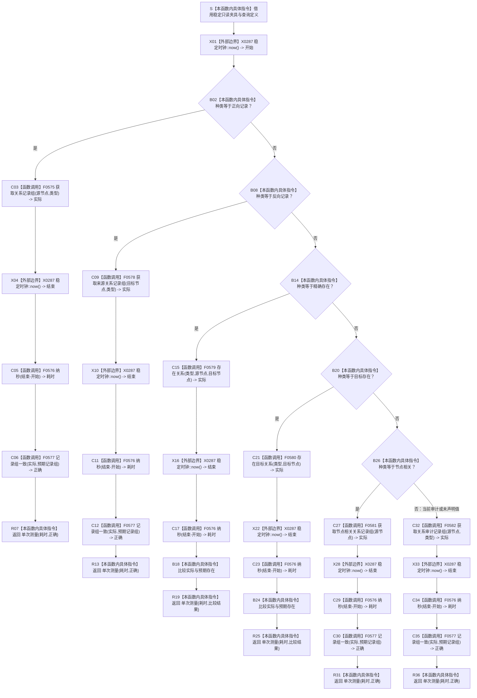

# CF-L5-0155 `隔离关系夹具::执行查询` 现状流程图

图类型：现状流程图
代码版本：`a48a70b2d678dea64dd8228adb4f26f0badd9506`
覆盖文件：`海中鱼巣/核心/自检.关系仓库性能基线.ixx:296-326`
唯一根函数：F0279
完整签名：`海中鱼巣::关系仓库性能基线内部::单次测量 海中鱼巣::关系仓库性能基线内部::隔离关系夹具::执行查询(const 海中鱼巣::关系仓库性能基线内部::查询定义& 定义) const`
参数：`定义` 是调用期间有效的只读非拥有借用，不保存引用；隐式 `const this` 只读借用夹具及其关系仓库
返回结果：按值返回 `单次测量{耗时纳秒, 正确}`；耗时只覆盖路由判断开始前到公开仓库查询返回后，不覆盖正确性比较、耗时换算、聚合返回构造或记录组析构
非法值 / 拒绝：函数不验证借用生命周期、句柄、关系类型或枚举值，也没有结构化拒绝结果；无效仓库输入可能折叠为空组 / `false`，未声明查询种类静默进入当前审计
已登记调用方：F0097 `运行单规模基线` 的预热与正式测量；源码另有 F0282 `运行并发基线` 调用，待 F0282 展开时登记入边
直接项目函数：F0575 `关系仓库::获取关系记录组`、F0576 `纳秒`、F0577 `记录组一致`、F0578 `关系仓库::获取来源关系记录组`、F0579 `关系仓库::存在关系`、F0580 `关系仓库::存在目标关系`、F0581 `关系仓库::获取节点相关关系记录组`、F0582 `关系仓库::获取关系审计记录组`
调用图：`流程图/代码流程图/00_调用知识图谱.md`
逐行映射表：`流程图/代码流程图/L5/CF-L5-0155_隔离关系夹具执行查询_逐行代码映射表.md`
输入契约 / 调用语境表：本文“输入契约与非成功语境”
非成功返回二分审查表：本文“输入契约与非成功语境”
偏差清单：`流程图/代码流程图/00_规范偏差审计.md` 的 F0279 切片
依据提交 / 结构化消息：冻结源码提交 `a48a70b2d678dea64dd8228adb4f26f0badd9506`；同层三个函数由只读子智能体分析，主智能体统一写入
入口前置：当前查询定义来自成功构建夹具的 F0278 十项组，句柄、类型和预期值均应有效；并发调用时定义生命周期覆盖全部线程
结构读取与写入：只调用关系仓库公开只读入口并比较值式结果；不写夹具、仓库、参考模型或机器结构
逻辑内返回：当前固定调用语境无允许的“正确=false”分支；正确性不一致表示仓库或参考模型漂移
内部错误：未声明查询种类被静默路由为当前审计；仓库、锁或分配异常不捕获；并发工作线程中异常越过线程入口会触发 `std::terminate`
生命周期与资源释放：四类记录组查询返回独立局部向量；两个存在查询返回 bool；局部结果在比较和返回后销毁
异常：未声明 `noexcept` 且无 `catch`；单线程异常可向 F0037 传播，并发工作线程异常没有结构化收口
验证入口：冻结源码、E1342—E1357 十六条项目边、X0287—X0289 三组外部边界、逐行映射与六种路由机械核对；未运行性能专项
验证输出：PASS；冻结源码、逐行覆盖、E1342—E1357、X0287—X0289、聚合身份、独立只读复核、`git diff --check` 与 strict 均通过；F0282 入边待下一批展开；未运行性能专项
依据：`规范/0050_项目通用机器逻辑与禁止性规则总纲_20260721.md`、`规范/0600_代码函数流程图应用与维护规范.md`、`规范/详细设计/数据仓库关系查询二级索引与性能治理详细设计.md`
不得作为施工许可：是
不得宣称：返回 true 证明生产关系事实、索引完整、并发安全、性能门槛或性能专项验收完成

## 流程图

## 节点合同

| 节点 | 类型 | 参数 / 输入绑定 | 结果 / 输出绑定 | 事实读写 | 后继条件 | 验证 |
| --- | --- | --- | --- | --- | --- | --- |
| S / X01 | 指令 / 外部边界 | `this`、定义借用 | 统一开始时间 | 只读 | 进入路由 | 296—297 行 |
| B02—R13 | 指令 / 函数调用 / 外部边界 | 正向或反向定义 | 记录组测量 | 仓库值式只读 | 命中即返回 | 298—307 行 |
| B14—R25 | 指令 / 函数调用 / 外部边界 | 精确或目标存在定义 | bool测量 | 仓库值式只读 | 命中即返回 | 308—317 行 |
| B26—R31 | 指令 / 函数调用 / 外部边界 | 节点相关定义 | 记录组测量 | 仓库值式只读 | 命中即返回 | 318—322 行 |
| C32—R36 | 函数调用 / 外部边界 / 指令 | 当前审计或任意未声明种类 | 审计记录组测量 | 仓库值式只读 | 默认返回 | 323—326 行 |

## 输入契约与非成功语境

| 语境 | 非成功条件 | 结构变化 | 分类与后继 |
| --- | --- | --- | --- |
| F0097 固定十项查询 | 实际记录组或存在位与预期不一致 | 无 | 已构建夹具内部不一致，追根因 |
| F0282 并发查询 | 读写竞争下结果不一致 | 写由外部工作线程执行；本函数零写 | 并发仓库或参考材料漂移，追根因 |
| 无效句柄 / 类型 | 仓库以空组或false返回 | 无 | 当前上游承诺有效，不能误判为预期为空，追根因 |
| 未声明查询种类 | 进入当前审计默认分支 | 无 | 枚举值域破坏被静默路由，追根因 |
| 仓库 / 锁 / 分配异常 | 异常向当前线程传播 | 本函数零写 | 单线程追根因；工作线程可能 `std::terminate` |
| `正确=false` | 返回裸bool字段并由调用方累计 | 无 | 当前语境不是允许的逻辑内返回 |

## 外部与偏差边界

- E1342—E1357 登记六个仓库入口、六次 F0576 和四次 F0577；F0575—F0582 进入 L6 待展开队列。
- X0287 分账七次稳定时钟读取和六次时长相减；X0288 分账四个记录组返回值物化与生命周期；X0289 分账五次查询种类比较、两次 bool 比较和六个测量聚合返回。
- 详细设计把查询耗时定义为“公开查询入口从调用到值式结果返回”。当前结束时间早于正确性比较、F0576 换算、`单次测量` 构造和记录组析构，实际计时区间更窄。
- 统一开始时间位于路由前，不同查询种类承担不同数量的枚举比较，后置分支额外计入路由开销。
- 默认分支不要求 `定义.种类 == 当前审计`，未声明枚举值会静默执行审计查询，可能掩盖内部值域破坏。
- 仓库入口用空组 / false 同时表达合法无候选和无效输入；当前固定查询均有有效前置，但函数结果不保留拒绝原因。
- F0097 首次正确性失败后继续后续测量；并发线程异常也没有结构化失败收口，均归性能自检控制流治理。
