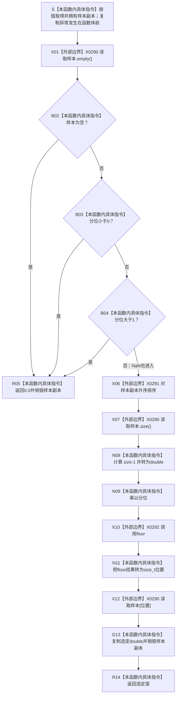

# CF-L5-0156 `读取分位数` 现状流程图

图类型：现状流程图
代码版本：`a48a70b2d678dea64dd8228adb4f26f0badd9506`
覆盖文件：`海中鱼巣/核心/自检.关系仓库性能基线.ixx:70-76`
唯一根函数：F0280
完整签名：`double 海中鱼巣::关系仓库性能基线内部::读取分位数(std::vector<double> 样本, double 分位)`
参数：`样本` 按值取得独立向量并由本函数拥有；`分位` 按值复制；当前五个调用点都传入 lvalue 样本和 `0.50 / 0.95 / 0.99`
返回结果：空样本或 `分位 < 0 / 分位 > 1`（包括负 / 正无穷）返回 `0.0`；无 NaN 且分位有限位于 `[0,1]` 时，把副本升序排序并返回 `floor((n-1)*分位)` 位置的元素，偶数样本 P50 为下中位数；分位或样本含 NaN 时没有可靠结果合同
非法值 / 拒绝：函数只把空样本和小于0 / 大于1的分位压成普通 `0.0`，不形成结构化拒绝；分位 NaN、样本 NaN 和样本无穷均不显式拒绝
已登记调用方：F0097 `运行单规模基线`、F0281 `形成分位指标` 三次、F0282 `运行并发基线` 一次
直接项目函数：无
调用图：`流程图/代码流程图/00_调用知识图谱.md`
逐行映射表：`流程图/代码流程图/L5/CF-L5-0156_读取分位数_逐行代码映射表.md`
输入契约 / 调用语境表：本文“输入契约与非成功语境”
非成功返回二分审查表：本文“输入契约与非成功语境”
偏差清单：`流程图/代码流程图/00_规范偏差审计.md` 的 F0280 切片
依据提交 / 结构化消息：冻结源码提交 `a48a70b2d678dea64dd8228adb4f26f0badd9506`；同层三个函数由只读子智能体分析，主智能体统一写入
入口前置：F0281 三处和 F0097 一处到达时提供非空耗时样本与有限合法分位；F0282 允许零次成功读取后用空合并样本调用并由调用方随后标为不一致；函数自身不验证样本有限性或分位 NaN
结构读取与写入：只排序按值副本并读取选定元素；不修改调用方样本或任何项目结构
逻辑内返回：代码把空样本和小于0 / 大于1的分位压成 `0.0`；F0282 的空样本是允许进入的性能材料并由调用方后验标为不一致，其它四处当前调用若命中该分支则表示上游前置破坏
内部错误：分位 NaN 绕过范围比较并在 NaN 转 `size_t` 时产生未定义行为；样本含 NaN 时默认比较不满足排序严格弱序要求
生命周期与资源释放：按值样本在进入函数前复制，正常或异常退出时析构；返回 double 独立拥有
异常：向量复制可在进入函数体前抛出；排序本身对 double 比较不抛，但内存 / 库前置破坏不在函数内收口
验证入口：冻结源码、X0290—X0292 三组外部边界、逐行映射和五个当前调用点机械核对；未运行性能专项
验证输出：PASS；冻结源码、逐行覆盖、X0290—X0292、聚合身份、独立只读复核、`git diff --check` 与 strict 均通过；F0281 / F0282 四条入边已由 E1358—E1360、E1364 闭合；未运行性能专项
依据：`规范/0050_项目通用机器逻辑与禁止性规则总纲_20260721.md`、`规范/0600_代码函数流程图应用与维护规范.md`、`规范/详细设计/数据仓库关系查询二级索引与性能治理详细设计.md`
不得作为施工许可：是
不得宣称：当前分位公式是唯一正式统计合同、结果是机器事实、样本有限性已验证或性能门槛通过

## 流程图

## 节点合同

| 节点 | 类型 | 参数 / 输入绑定 | 结果 / 输出绑定 | 事实读写 | 后继条件 | 验证 |
| --- | --- | --- | --- | --- | --- | --- |
| S | 本函数内具体指令 | 调用方样本 lvalue、分位 | 独立样本副本 | 无项目结构读写 | 复制成功 | 70 行函数头 |
| X01—R05 | 外部边界 / 指令 | 样本、分位 | `0.0`或继续 | 只读局部值 | `empty → <0 → >1` 左到右短路 | 71 行 |
| X06 | 外部边界 | 样本副本 | 升序副本 | 只改局部副本；样本含 NaN 时排序前置破坏且无可靠结果保证 | 比较满足严格弱序 | 72 行 |
| X07—N11 | 外部边界 / 指令 | 样本数、分位 | `size_t 位置` | 纯计算；分位 NaN 时浮点转整数行为未定义 | 有限合法输入 | 73—74 行 |
| X12—R14 | 外部边界 / 指令 | 排序副本、位置 | 独立 double | 只读并释放局部值 | 位置在范围内 | 75—76 行 |

## 输入契约与非成功语境

| 语境 | 非成功条件 | 结构变化 | 分类与后继 |
| --- | --- | --- | --- |
| F0281 三处与 F0097 一处 | 样本为空或分位越界 | 无 | 上游固定合法输入被破坏，追根因 |
| F0282 并发聚合 | 零次成功读取形成空合并样本 | 无 | 允许进入并返回0；F0282 随后以 `!合并样本.empty()` 标为不一致 |
| 泛化调用 | 空样本 / 小于0或大于1的分位（含正负无穷）返回0 | 无 | 当前代码普通返回，但无正式结构化拒绝合同 |
| 分位 NaN | 两个范围比较均为false | 无可靠结果 | `floor(NaN)` 转 `size_t` 未定义，追根因 |
| 样本含 NaN | 默认 double `<` 非严格弱序 | 无可靠结果 / 结构保证 | 排序前置破坏，追根因 |
| 样本含无穷 | 排序可完成并可能返回无穷 | 只改副本 | 未被当前合同拒绝，设计证据不足 |
| 向量复制失败 | 函数体前抛出异常 | 无 | 性能材料无法形成，追根因 |

## 外部与偏差边界

- F0280 无项目源码出边或新增函数身份；X0290 分账按值向量生命周期、`empty / size / operator[]`，X0291 分账排序、迭代器和 double 默认比较，X0292 分账 `floor`、浮点乘法与 double 到 `size_t` 转换。
- `&&` 的真实顺序是 `样本.empty()`、`分位 < 0.0`、`分位 > 1.0`；NaN 与任意值比较均为false，因此会进入排序和位置计算。
- 有限合法输入采用零基下侧经验分位 `floor((n-1)q)`；详细设计只要求报告中位数、P95、P99，没有冻结估计器公式、偶数中位数、有限值准入或失败结果合同。
- 空样本或越界分位返回0无法与真实分位恰为0区分；当前指标完整性后续要求中位数大于0，但这不是本函数的结构化错误结果。
- 函数只操作副本，可重入且不共享状态；结果只是性能自检材料，不承担运行期机器事实。
