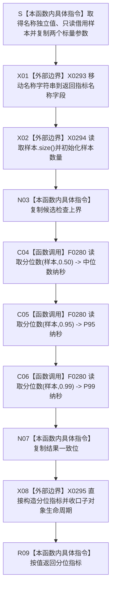

# CF-L5-0157 `形成分位指标` 现状流程图

图类型：现状流程图
代码版本：`a48a70b2d678dea64dd8228adb4f26f0badd9506`
覆盖文件：`海中鱼巣/核心/自检.关系仓库性能基线.ixx:98-111`
唯一根函数：F0281
完整签名：`海中鱼巣::关系仓库性能基线内部::分位指标 海中鱼巣::关系仓库性能基线内部::形成分位指标(std::string 名称, const std::vector<double>& 样本, std::uint64_t 候选检查上界, bool 结果一致)`
参数：`名称` 按值独立拥有并在返回时移动；`样本` 是调用期间有效的只读非拥有借用；`候选检查上界` 与 `结果一致` 按值复制
返回结果：按值返回 `分位指标{名称,样本数量,候选检查上界,中位数纳秒,P95纳秒,P99纳秒,结果一致}`；三个分位依次按 P50、P95、P99 形成
非法值 / 拒绝：函数没有普通拒绝或结构化错误；空名称、空或不足正式次数的样本、候选上界零及不一致结果仍形成普通指标，后续只能由 `分位指标::完整()` 汇总失败
已登记调用方：F0097 `运行单规模基线`；源码另有 F0284、F0285、F0286、F0287 四个写测量调用，等待各调用方展开时登记
直接项目函数：F0280 `读取分位数` 三次
调用图：`流程图/代码流程图/00_调用知识图谱.md`
逐行映射表：`流程图/代码流程图/L5/CF-L5-0157_形成分位指标_逐行代码映射表.md`
输入契约 / 调用语境表：本文“输入契约与非成功语境”
非成功返回二分审查表：本文“输入契约与非成功语境”
偏差清单：`流程图/代码流程图/00_规范偏差审计.md` 的 F0281 切片
依据提交 / 结构化消息：冻结源码提交 `a48a70b2d678dea64dd8228adb4f26f0badd9506`；只读子智能体分析，主智能体统一编号和写入
入口前置：当前查询和四类写测量调用均应提供非空正式样本、非空名称、非零候选上界及累计正确性；函数自身不验证这些前置
结构读取与写入：只读取非权威性能样本并形成报告材料；不写仓库、节点、关系、索引或其它机器事实
逻辑内返回：无具名逻辑内拒绝；函数总是尝试形成普通指标
内部错误：F0280 的样本复制、排序、数值转换或分配异常直接传播；任一分位调用未正常返回时不产生可读半指标
生命周期与资源释放：名称形参在入口独立拥有，104 行移动到结果；F0280 每次复制并销毁独立样本；已构造返回字段在异常时逆序清理
异常：未声明 `noexcept` 且无 `catch`；名称调用点构造、三次样本复制和返回对象构造均可能抛出
验证入口：冻结源码、三条 F0281→F0280 项目边、三组外部边界、逐行映射和调用语境机械核对；未运行性能专项
验证输出：PASS；冻结源码、逐行覆盖、E1358—E1360、X0293—X0295、聚合身份、独立只读复核、`git diff --check` 与 strict 均通过；未运行性能专项
依据：`规范/0050_项目通用机器逻辑与禁止性规则总纲_20260721.md`、`规范/0600_代码函数流程图应用与维护规范.md`、`规范/详细设计/数据仓库关系查询二级索引与性能治理详细设计.md`
不得作为施工许可：是
不得宣称：指标形成证明样本有效、候选检查数真实、统计估计器正确、性能门槛满足或性能专项通过

## 流程图

## 节点合同

| 节点 | 类型 | 参数 / 输入绑定 | 结果 / 输出绑定 | 事实读写 | 后继条件 | 验证 |
| --- | --- | --- | --- | --- | --- | --- |
| S | 本函数内具体指令 | 四个形参 | 名称所有权、样本借用和两个标量副本 | 无机器事实 | 函数入口成立 | 98—102 行 |
| X01 / X02 / N03 | 外部边界 / 指令 | 名称、样本、候选检查上界 | 返回前三字段 | 读取非权威材料 | 各字段构造成功 | 103—106 行 |
| C04—C06 | 函数调用 | 同一 `样本` 分别与 `0.50/0.95/0.99` | P50、P95、P99 | 只读样本副本 | 前一调用正常返回 | 107—109 行 |
| N07 / X08 / R09 | 指令 / 外部边界 | 结果一致和已构造字段 | 完整按值指标 | 无机器事实 | 聚合构造成功 | 110—111 行 |

## 输入契约与非成功语境

| 语境 | 非成功条件 | 结构变化 | 分类与后继 |
| --- | --- | --- | --- |
| F0097 查询测量 | 名称空、样本不足、上界零或累计不一致 | 无 | 已固定性能夹具内部材料破坏，追根因 |
| F0284—F0287 写测量 | 样本不足、推算上界不实或累计不一致 | 无 | 写测量材料或计量合同漂移，追根因 |
| F0280 返回 `0.0` | 空样本或非法分位被压成普通零值 | 无 | 当前固定常量合法；空样本表示上游材料破坏，追根因 |
| 样本含 NaN / 无穷 | F0280 排序或结果不具备可靠有限值合同 | 无 | 数值准入缺口，追根因 |
| 名称 / 样本复制 / 返回构造异常 | 异常向调用方传播，不返回半指标 | 无 | 内部错误 |
| 后续 `完整()==false` | 调用方汇总材料完整性失败 | 无 | 本函数不区分失败字段，须由汇总合同追根因 |

## 外部与偏差边界

- E1358—E1360 分别登记 P50、P95、P99 三次 F0280 调用；每次都把同一 lvalue 样本复制为 F0280 的独立按值样本。
- X0293 记录名称按值取得、移动和移动后形参析构；X0294 记录一次样本数量读取；X0295 记录聚合返回对象、异常逆序清理和返回值生命周期。
- 详细设计只要求中位数、P95、P99，未冻结 F0280 使用的下侧经验分位估计器、NaN / 无穷准入和可区分失败结果。
- 候选检查上界完全信任调用方；本函数不计算、不读回，也不证明该值来自实际检查数量。
- 同一样本被复制并排序三次；这是统计准备成本，不在 F0279 已记录的公开查询计时区间内，现行详细设计也未冻结统计聚合成本口径。
- F0281 分别承载材料和正确性字段，真正把它们压成单个布尔结果的是后继 `分位指标::完整()`；本函数自身不承担报告分层合并。
