# CF-L5-0158 `运行并发基线` 现状流程图

图类型：现状流程图
代码版本：`a48a70b2d678dea64dd8228adb4f26f0badd9506`
覆盖文件：`海中鱼巣/核心/自检.关系仓库性能基线.ixx:640-714`
唯一根函数：F0282
完整签名：`海中鱼巣::关系仓库性能基线内部::并发指标 海中鱼巣::关系仓库性能基线内部::运行并发基线(海中鱼巣::关系仓库性能基线内部::隔离关系夹具& 夹具, const 海中鱼巣::关系仓库性能基线内部::查询定义& 密集正向, double 单线程中位数纳秒)`
参数：`夹具` 是覆盖函数和全部工作线程的非拥有可写借用；`密集正向` 是覆盖全部线程汇合的只读非拥有借用；`单线程中位数纳秒` 按值复制
返回结果：按值返回 `并发指标{窗口秒,线程数量,完成操作数量,每秒吞吐,并发读取中位数纳秒,等待代理纳秒,等待代理不是内部精确锁等待,结果一致}`
非法值 / 拒绝：写材料数量不等于四时返回全默认指标；函数不验证密集查询身份，也不拒绝负数、NaN 或无穷单线程中位数
已登记调用方：F0097 `运行单规模基线`
根级项目出边：F0583 `读取并发写材料组`、F0584 独立线程 lambda、F0585 `更新并发写关系`、F0280 `读取分位数`；其中 E1362 是 `thread_callback`，其余三条是直接调用
间接项目函数：F0584 线程 lambda 调用 F0279、F0288 与 F0586；这些不是 F0282 的虚假直接边
调用图：`流程图/代码流程图/00_调用知识图谱.md`
逐行映射表：`流程图/代码流程图/L5/CF-L5-0158_运行并发基线_逐行代码映射表.md`
输入契约 / 调用语境表：本文“输入契约与非成功语境”
非成功返回二分审查表：本文“输入契约与非成功语境”
偏差清单：`流程图/代码流程图/00_规范偏差审计.md` 的 F0282 切片
依据提交 / 结构化消息：冻结源码提交 `a48a70b2d678dea64dd8228adb4f26f0badd9506`；只读子智能体分析，主智能体统一调用身份、编号和写入
入口前置：当前唯一调用使用成功构建夹具、F0278 位置 `[1]` 查询和相应单线程中位数；夹具与查询定义生命周期覆盖全部线程并在 join 前不得由外部销毁或并发修改
结构读取与写入：工作线程反复读取关系并重挂四条隔离夹具关系；join 后 F0585 更新夹具写材料与非权威参考表；不接生产运行期
逻辑内返回：无正式业务拒绝；默认指标只承载夹具内部材料数量不一致
内部错误：工作线程异常、部分线程创建失败或 joinable 线程异常析构可触发 `std::terminate`；join 后汇总分配异常直接传播
生命周期与资源释放：工作线程闭包按值捕获索引、按引用捕获其余共享材料；F0282 保存全部捕获对象到 join；正常退出后线程、样本和局部值逆序释放
异常：未声明 `noexcept` 且无 `catch`；线程 lambda 另有独立身份 F0584，其异常边界不属于 F0282 的源码指令
验证入口：冻结源码、F0282 四条根级项目出边、F0584 三条直接边、十组外部边界、逐行映射和并发可见性机械核对；未运行性能专项
验证输出：PASS；冻结源码、逐行覆盖、E1361—E1367、X0296—X0305、F0584 异步边归属、聚合身份、独立只读复核、`git diff --check` 与 strict 均通过；未运行性能专项
依据：`规范/0050_项目通用机器逻辑与禁止性规则总纲_20260721.md`、`规范/0600_代码函数流程图应用与维护规范.md`、`规范/详细设计/数据仓库关系查询二级索引与性能治理详细设计.md`
不得作为施工许可：是
不得宣称：四线程运行证明固定十秒窗口、90/10 比例、同一关系前后态一致、吞吐门槛、锁等待来源或性能专项通过

## 流程图

```mermaid
flowchart TD
    S["S【本函数内具体指令】借用夹具、密集正向定义并复制单线程中位数"]
    C01["C01【函数调用】F0583 读取并发写材料组() -> 写材料组借用"]
    B02{"B02【本函数内具体指令】写材料数量不等于4？"}
    R03["R03【本函数内具体指令】返回默认并发指标"]
    N04["N04【本函数内具体指令】构造开始位、正确位和完成计数原子"]
    N05["N05【本函数内具体指令】构造线程样本槽、最终关系槽和线程容器"]
    X06["X06【外部边界】X0296 线程容器 reserve(4)"]
    X07["X07【外部边界】X0298 稳定时钟 now() -> 窗口开始"]
    N08["N08【本函数内具体指令】窗口结束=窗口开始+10秒"]
    N09["N09【本函数内具体指令】线程索引从0开始"]
    B10{"B10【本函数内具体指令】线程索引小于4？"}
    X11["X11【外部边界】X0299 构造F0584闭包并启动新线程"]
    C12["C12【函数调用】F0584 线程 lambda::operator()() -> void"]
    N13["N13【本函数内具体指令】线程索引递增"]
    N14["N14【本函数内具体指令】release发布开始=true"]
    N15["N15【本函数内具体指令】初始化线程遍历"]
    B16{"B16【本函数内具体指令】仍有线程？"}
    X17["X17【外部边界】X0299 thread.join()"]
    N18["N18【本函数内具体指令】推进线程遍历"]
    X19["X19【外部边界】X0298 稳定时钟 now() -> 实际结束"]
    X20["X20【外部边界】X0297 relaxed读取正确位 -> 更新正确"]
    N21["N21【本函数内具体指令】最终关系索引从0开始"]
    B22{"B22【本函数内具体指令】索引小于最终关系数量？"}
    C23["C23【函数调用】F0585 更新并发写关系(索引,最终关系) -> 本项正确"]
    N24["N24【本函数内具体指令】合并本项正确并递增索引"]
    N25["N25【本函数内具体指令】构造空合并样本"]
    N26["N26【本函数内具体指令】初始化线程样本遍历"]
    B27{"B27【本函数内具体指令】仍有线程样本？"}
    X28["X28【外部边界】X0296 把当前样本区间插入合并样本"]
    N29["N29【本函数内具体指令】推进样本遍历"]
    X30["X30【外部边界】X0298 换算实际窗口秒"]
    C31["C31【函数调用】F0280 读取分位数(合并样本,0.50) -> 并发中位数"]
    X32["X32【外部边界】X0297 读取完成操作数量"]
    B33{"B33【本函数内具体指令】实际窗口秒大于0？"}
    X34["X34【外部边界】X0300 再读计数并计算每秒吞吐"]
    N35["N35【本函数内具体指令】每秒吞吐置0"]
    X36["X36【外部边界】X0300 max(0,并发中位数-单线程中位数) -> 等待代理"]
    N37["N37【本函数内具体指令】结果一致=更新正确且合并样本非空"]
    R38["R38【本函数内具体指令】按值返回并发指标"]

    S --> C01 --> B02
    B02 -- "是" --> R03
    B02 -- "否" --> N04 --> N05 --> X06 --> X07 --> N08 --> N09 --> B10
    B10 -- "是" --> X11 --> N13 --> B10
    X11 -. "新线程异步调度" .-> C12
    B10 -- "否" --> N14 --> N15 --> B16
    B16 -- "是" --> X17 --> N18 --> B16
    C12 -. "线程完成后可汇合" .-> X17
    B16 -- "否" --> X19 --> X20 --> N21 --> B22
    B22 -- "是" --> C23 --> N24 --> B22
    B22 -- "否" --> N25 --> N26 --> B27
    B27 -- "是" --> X28 --> N29 --> B27
    B27 -- "否" --> X30 --> C31 --> X32 --> B33
    B33 -- "是" --> X34 --> X36
    B33 -- "否" --> N35 --> X36
    X36 --> N37 --> R38
```

## 节点合同

| 节点 | 类型 | 参数 / 输入绑定 | 结果 / 输出绑定 | 事实读写 | 后继条件 | 验证 |
| --- | --- | --- | --- | --- | --- | --- |
| S—R03 | 指令 / 函数调用 | 三个参数、夹具写材料组 | 默认指标或进入并发编排 | 只读夹具材料 | 数量精确为4 | 640—645 行 |
| N04—N08 | 指令 / 外部边界 | 四线程常量、十秒窗口 | 同步原子、容器和时间点 | 临时材料 | 全部构造成功 | 647—656 行 |
| N09—N13 | 指令 / 外部边界 / 函数调用 | 索引、引用捕获材料 | 四个线程及异步 F0584 调用 | F0584 写隔离关系 | 每次线程构造成功 | 657—688 行 |
| N14—X20 | 指令 / 外部边界 | 开始位和线程组 | 全部线程已 join、实际结束和正确位 | 原子同步 | 线程遍历穷尽 | 689—693 行 |
| N21—N29 | 指令 / 函数调用 / 外部边界 | 最终关系与分线程样本 | 更新正确和合并样本 | F0585 写参考材料 | 两个循环穷尽 | 694—700 行 |
| X30—R38 | 外部边界 / 函数调用 / 指令 | 时间、计数、样本、单线程中位数 | 八字段并发指标 | 非权威性能材料 | 返回构造成功 | 701—714 行 |

## 输入契约与非成功语境

| 语境 | 非成功条件 | 结构变化 | 分类与后继 |
| --- | --- | --- | --- |
| 写材料数量非4 | 返回默认并发指标 | 无 | 当前成功夹具内部不一致，追根因 |
| 查询测量不一致 | F0584 把正确位置 false 并停止 | 已成功重挂可能保留 | 仓库或参考材料漂移，追根因 |
| 重挂返回空 | F0584 把正确位置 false 并停止 | 先前线程操作可能已提交 | 隔离关系写失败，追根因 |
| F0585 更新失败 | 继续尝试后续项并返回结果不一致 | 参考表可能部分更新 | 失败收口不完整，追根因 |
| 零次读取样本 | F0280 返回0，最终结果一致为 false | 关系写可能已发生 | 追根因 |
| 工作线程异常 | 越过线程入口，可能 `std::terminate` | 先前操作可能已提交 | 内部错误 |
| 部分线程创建失败 | 已有线程等待开始位，joinable 析构可能终止进程 | 无统一收口 | 内部错误 |
| join 后汇总异常 | 异常向 F0097 传播 | 已有隔离关系提交 | 内部错误 |

## 独立线程函数与并发边界

F0584 的完整身份为：

`void 海中鱼巣::关系仓库性能基线内部::运行并发基线(海中鱼巣::关系仓库性能基线内部::隔离关系夹具&, const 海中鱼巣::关系仓库性能基线内部::查询定义&, double)::<lambda@自检.关系仓库性能基线.ixx:658>::operator()() const`

它无显式参数，按值捕获 `线程索引`，按引用捕获 `写材料组`、`线程读取样本`、`开始`、`窗口结束`、`正确`、`夹具`、`密集正向`、`完成操作数量` 和 `最终关系组`，返回 `void`。F0584 身份跨度为 658—687，内部有效正文为 659—686，不在 F0282 图中内联；658 和 687 同时承担闭包定义边界与根函数 `emplace_back` 表达式边界。

正常路径下每个线程独占 `线程读取样本[线程索引]` 与 `最终关系组[线程索引]`；开始位、正确位和完成计数使用 atomic；`join` 提供根线程读取线程槽的完成同步。与函数外并发修改夹具、查询定义或写材料组仍无保护。

## 外部与偏差边界

- E1361—E1364 是 F0282 的四条根级出边，其中 E1362 为 `thread_callback`；E1365—E1367 是 F0584 的三条直接边。666 行不得伪写为 F0282→F0279。
- X0296—X0300 覆盖根函数容器、原子、时间、线程和浮点聚合；X0301—X0305 预登记 F0584 的容器、原子、让出、时钟与 optional 边界，等待该函数独立展开。
- 窗口开始早于线程创建，工作线程又等到全部创建后才启动；有效负载期少于十秒，而吞吐分母包含线程创建与 join 时间。
- 截止判断只发生在每组“九读一写”之前，尾批可以越过截止时间后继续完成并计数。
- 每线程只保存前512个读取样本，之后读取仍计吞吐但不进入中位数。
- 密集查询读取的是源0的引用关系，工作线程重挂的是970—981范围的归属关系；现状场景没有观察同一关系的提交前后态，不能单独证明 A12。
- `密集正向` 依赖 F0278 位置 `[1]` 且函数不验证查询身份，延续隐式位置协议。
- `单线程中位数纳秒` 不拒绝负数、NaN 或无穷；等待代理缺少确定的有限数值合同。
- “等待代理不是内部精确锁等待”硬编码为 true，只声明人读指标口径，不证明等待来源。
