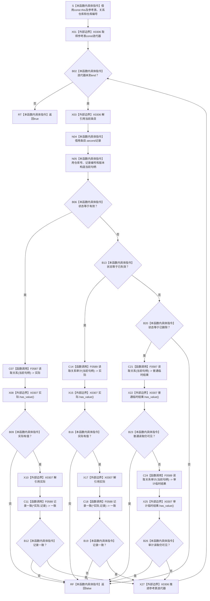

# CF-L5-0159 `隔离关系夹具::验证参考表当前状态` 现状流程图

图类型：现状流程图
代码版本：`a48a70b2d678dea64dd8228adb4f26f0badd9506`
覆盖文件：`海中鱼巣/核心/自检.关系仓库性能基线.ixx:249-270`
唯一根函数：F0283
完整签名：`bool 海中鱼巣::关系仓库性能基线内部::隔离关系夹具::验证参考表当前状态() const`
参数：无显式参数；隐式 `const this` 是调用期间有效的非拥有借用，只读夹具参考表、关系仓库和仓库编号
返回结果：参考表每项按状态通过对应公开读取与字段比较后返回 true；首个不符、未知状态或意外可见的删除记录返回 false
非法值 / 拒绝：空参考表真空返回 true；函数不验证 map 键等于记录编号、参考表规模、仓库额外记录、删除权威记录字段或同代快照
已登记调用方：F0273 `隔离关系夹具::构建`、F0097 `运行单规模基线`
直接项目函数：F0587 `关系仓库::读取关系` 两次、F0588 `记录一致` 两次、F0589 `关系仓库::读取关系审计` 两次
调用图：`流程图/代码流程图/00_调用知识图谱.md`
逐行映射表：`流程图/代码流程图/L5/CF-L5-0159_隔离关系夹具验证参考表当前状态_逐行代码映射表.md`
输入契约 / 调用语境表：本文“输入契约与非成功语境”
非成功返回二分审查表：本文“输入契约与非成功语境”
偏差清单：`流程图/代码流程图/00_规范偏差审计.md` 的 F0283 切片
依据提交 / 结构化消息：冻结源码提交 `a48a70b2d678dea64dd8228adb4f26f0badd9506`；只读子智能体分析，主智能体统一编号和写入
入口前置：当前两个调用点都在参考表和仓库无并发写的稳定阶段；F0273 仅在有效关系数量等于目标规模且结构边界返回 true 后调用，F0097 位于并发线程 join 与参考更新尝试结束后
结构读取与写入：关系仓库是隔离夹具内权威关系结构；参考表是非权威期望模型；函数只读，不写任何结构
逻辑内返回：无普通业务拒绝；当前固定夹具中的 false 都表示一致性证据失败
内部错误：仓库读锁、回调或复制异常向调用方传播；与参考表并发写属于数据竞争而非结构化异常
生命周期与资源释放：循环借用参考记录；有效和失效分支拥有 optional 记录副本；删除分支 optional 临时值在完整表达式结束时析构
异常：未声明 `noexcept` 且无 `catch`；仓库单次读取各自加共享锁，但函数没有跨整表锁或快照
验证入口：冻结源码、六条项目边、两组外部边界、逐行短路顺序和两个调用语境机械核对；未运行性能专项
验证输出：PASS；冻结源码、逐行覆盖、E1368—E1373、X0306—X0307、完整短路前置、聚合身份、独立只读复核、`git diff --check` 与 strict 均通过；未运行性能专项
依据：`规范/0050_项目通用机器逻辑与禁止性规则总纲_20260721.md`、`规范/0600_代码函数流程图应用与维护规范.md`、`规范/4010_子规范_统一仓库稳定句柄与通用关系索引边界.md`、`规范/详细设计/数据仓库关系查询二级索引与性能治理详细设计.md`
不得作为施工许可：是
不得宣称：返回 true 证明全仓无额外记录、删除记录完成权威审计、跨整表同代快照、生产关系一致或性能验收完成

## 流程图

## 节点合同

| 节点 | 类型 | 参数 / 输入绑定 | 结果 / 输出绑定 | 事实读写 | 后继条件 | 验证 |
| --- | --- | --- | --- | --- | --- | --- |
| S—N05 | 指令 / 外部边界 | `const this`、当前 map 条目 | 参考记录借用和当前句柄 | 只读参考材料 | 仍有条目 | 249—252 行 |
| B06—B12 | 指令 / 函数调用 / 外部边界 | 有效参考记录 | 普通读取记录及七字段一致位 | 只读权威关系 | 有值且一致 | 253—256 行 |
| B13—B19 | 指令 / 函数调用 / 外部边界 | 已失效参考记录 | 审计读取记录及七字段一致位 | 只读权威关系 | 有值且一致 | 257—260 行 |
| B20—B26 | 指令 / 函数调用 / 外部边界 | 已删除参考记录 | 普通和审计均不可见 | 只读权威关系 | 两次读取都空 | 261—264 行 |
| RF / X27 / RT | 指令 / 外部边界 | 分支结果或循环状态 | false、下一项或 true | 无 | 首败或迭代穷尽 | 250、255、259、263、265—270 行 |

## 输入契约与非成功语境

| 语境 | 非成功条件 | 结构变化 | 分类与后继 |
| --- | --- | --- | --- |
| F0273 构建末尾 | 任一参考记录与公开读取不一致 | 无 | 固定构建内部不一致，追根因 |
| F0097 并发后 | 任一最终关系更新或公开读取不一致 | 无 | 并发更新、参考表或仓库漂移，追根因 |
| 空参考表 | 直接返回 true | 无 | 当前成功夹具不允许；真空成功是证据缺口 |
| 未知状态 | 返回 false | 无 | 内部状态值域破坏，追根因 |
| 删除记录句柄无效或记录缺失 | 普通、审计都空而错误通过 | 无 | 删除审计证据不足，追根因 |
| 仓库读取异常 | 异常向调用方传播 | 无 | 内部错误 |
| 与参考表并发写 | unordered_map 数据竞争 | 未定义 | 内部并发前置破坏 |

## 外部与偏差边界

- E1368—E1373 登记普通读取两次、记录比较两次和审计读取两次；F0587—F0589 进入 L6 待展开队列。
- X0306 覆盖 unordered_map const 范围迭代、条目借用和生命周期；X0307 覆盖四个 optional 返回值、四次 `has_value`、两次解引用和临时值析构。
- 函数没有排序；稳定状态下全称 bool 与 unordered_map 枚举顺序无关，但首个失败条目不确定且不会被返回。
- 每次仓库读取只保护单个值式读取，没有跨整表同代快照；当前两个调用点稳定，不代表该函数可与参考表或仓库写并发。
- 删除分支要求普通和显式审计都不可见，与 4010 对已删除记录保留并可由显式审计 / 恢复读取的口径冲突；同时性能详细设计另有“删除从审计候选移除”的旧口径，须先由关系审计生命周期治理统一。
- 当前核对只有“参考表值 → 仓库公开可见结果”单向证明，不检查 map 键、空表、规模、仓库额外记录，也不比较被保留的已删除权威记录，不能证明详细设计所称全表参考模型一致。
- F0273 的 E1316 和 F0097 的 E0525 已作为两个入边保留；本图回列并冻结各自稳定调用前置。
