# CF-L5-0160 `隔离关系夹具::测量创建` 现状流程图

图类型：现状流程图
代码版本：`a48a70b2d678dea64dd8228adb4f26f0badd9506`
覆盖文件：`海中鱼巣/核心/自检.关系仓库性能基线.ixx:341-355`
唯一根函数：F0284
完整签名：`海中鱼巣::关系仓库性能基线内部::分位指标 海中鱼巣::关系仓库性能基线内部::隔离关系夹具::测量创建()`
参数：无显式参数；隐式可写 `this` 是调用期间有效的非拥有借用，读取节点组和初始数量并写隔离关系仓库
返回结果：按值返回名称为“创建”的 `分位指标`；样本只计正式轮固定节点取参、参数求值与创建入口耗时，候选上界写为 `初始当前记录数量_ + 样本.size()`，结果一致位来自粘性 `正确`
非法值 / 拒绝：无普通拒绝；固定成功夹具中的创建、读回、删除或删除后可见均属于追根因；异常直接传播
已登记调用方：F0097 `运行单规模基线`
直接项目函数：F0167 `创建关系`、F0168 `句柄有效`、F0587 `读取关系` 两次、F0590 `删除关系`、F0576 `纳秒`、F0281 `形成分位指标`
调用图：`流程图/代码流程图/00_调用知识图谱.md`
逐行映射表：`流程图/代码流程图/L5/CF-L5-0160_隔离关系夹具测量创建_逐行代码映射表.md`
输入契约 / 调用语境表：本文“输入契约与非成功语境”
非成功返回二分审查表：本文“输入契约与非成功语境”
偏差清单：`流程图/代码流程图/00_规范偏差审计.md` 的 F0284 切片
依据提交 / 结构化消息：冻结源码提交 `a48a70b2d678dea64dd8228adb4f26f0badd9506`；只读子智能体分析，主智能体统一编号和写入
入口前置：F0097 已取得成功构建的 1024 节点隔离夹具，节点 940/941 当前有效且无并发写；F0097 已计算参考模型一致位但不要求其为 true；函数自身不验证这些前置
结构读取与写入：每轮创建一条隔离 `运行期临时` 关系并尝试逻辑删除；删除记录仍保留在隔离权威关系表，不接生产运行期
逻辑内返回：无；最终普通指标可以携带 `结果一致=false`，但该值表示内部失败材料，不是允许的业务拒绝
内部错误：任一项目调用异常或分配异常直接传播；成功创建后没有 RAII 清理，异常或粘性失败可能遗留有效关系
生命周期与资源释放：样本由函数拥有；关系句柄和 optional 为逐轮局部值；正常成功轮删除当前关系，函数退出时局部材料逆序释放
异常：未声明 `noexcept` 且无 `catch`
验证入口：冻结源码、E1374—E1380、X0308—X0313、两组三段短路、逐行映射和候选上界机械核对；未运行性能专项
验证输出：PASS；冻结源码 blob `34c34bffcd80f78e28345292deb69aca2eabf38d`、逐行覆盖、E1374—E1380、X0308—X0313、聚合统计、Mermaid 结构、独立只读复核、`git diff --check` 与 strict 100/100 均通过；未运行性能专项
依据：`规范/0050_项目通用机器逻辑与禁止性规则总纲_20260721.md`、`规范/0600_代码函数流程图应用与维护规范.md`、`规范/4010_子规范_统一仓库稳定句柄与通用关系索引边界.md`、`规范/详细设计/数据仓库关系查询二级索引与性能治理详细设计.md`
不得作为施工许可：是
不得宣称：全部创建均完成读回和清理、候选上界是真实检查数、指标含完整验收成本、性能门槛通过或生产创建闭环完成

## 流程图

```mermaid
flowchart TD
    S["S【本函数内具体指令】借用可写this及隔离夹具成员"]
    X01["X01【外部边界】X0308 构造样本vector并reserve正式次数"]
    N02["N02【本函数内具体指令】正确=true且次数=0"]
    B03{"B03【本函数内具体指令】X0312 次数小于预热次数加正式次数？"}
    X04["X04【外部边界】X0309 steady_clock::now() -> 开始"]
    X05["X05【外部边界】X0310 读取节点组940和941"]
    C06["C06【函数调用】F0167 创建关系(运行期临时,节点940,节点941,1) -> 新关系"]
    X07["X07【外部边界】X0309 steady_clock::now() -> 结束"]
    B08{"B08【本函数内具体指令】X0312 累计正确仍为true？"}
    C09["C09【函数调用】F0168 句柄有效(新关系) -> 句柄有效位"]
    B10{"B10【本函数内具体指令】X0312 新关系句柄有效？"}
    C11["C11【函数调用】F0587 读取关系(新关系) -> 创建后记录"]
    X12["X12【外部边界】X0311 创建后记录.has_value()"]
    N13["N13【本函数内具体指令】写入第一组短路后的正确位"]
    B14{"B14【本函数内具体指令】X0312 累计正确仍为true？"}
    C15["C15【函数调用】F0590 删除关系(新关系) -> 已删除"]
    B16{"B16【本函数内具体指令】X0312 删除成功？"}
    C17["C17【函数调用】F0587 读取关系(新关系) -> 删除后记录"]
    X18["X18【外部边界】X0311 删除后记录.has_value()"]
    N19["N19【本函数内具体指令】X0312 写入第二组三段短路后的正确位"]
    B20{"B20【本函数内具体指令】X0312 次数达到预热次数？"}
    C21["C21【函数调用】F0576 纳秒(结束-开始) -> 创建耗时"]
    X22["X22【外部边界】X0308 样本.push_back(创建耗时)"]
    N23["N23【本函数内具体指令】X0312 次数递增"]
    X24["X24【外部边界】X0308 读取样本.size()"]
    N25["N25【本函数内具体指令】X0312 候选上界=初始当前记录数量加样本数"]
    X26["X26【外部边界】X0313 构造名称创建的std::string"]
    C27["C27【函数调用】F0281 形成分位指标(名称,样本,候选上界,正确) -> 指标"]
    R28["R28【本函数内具体指令】按值返回指标"]

    S --> X01 --> N02 --> B03
    B03 -- "是" --> X04 --> X05 --> C06 --> X07 --> B08
    B08 -- "否" --> N13
    B08 -- "是" --> C09 --> B10
    B10 -- "否" --> N13
    B10 -- "是" --> C11 --> X12 --> N13
    N13 --> B14
    B14 -- "否" --> N19
    B14 -- "是" --> C15 --> B16
    B16 -- "否" --> N19
    B16 -- "是" --> C17 --> X18 --> N19
    N19 --> B20
    B20 -- "否" --> N23
    B20 -- "是" --> C21 --> X22 --> N23
    N23 --> B03
    B03 -- "否" --> X24 --> N25 --> X26 --> C27 --> R28
```

## 节点合同

| 节点 | 类型 | 参数 / 输入绑定 | 结果 / 输出绑定 | 事实读写 | 后继条件 | 验证 |
| --- | --- | --- | --- | --- | --- | --- |
| S—N02 | 指令 / 外部边界 | `this`、正式次数 | 空样本、正确位和循环计数 | 无机器事实 | 局部构造成功 | 341—344 行 |
| B03—X07 | 指令 / 外部边界 / 函数调用 | 次数、节点940/941 | 新关系与计时点 | 写隔离关系 | 创建调用返回 | 345—349 行 |
| B08—N13 | 指令 / 函数调用 / 外部边界 | 累计正确、新关系 | 创建后读回位 | 只读隔离关系 | 左到右短路 | 350 行 |
| B14—N19 | 指令 / 函数调用 / 外部边界 | 累计正确、新关系 | 删除成功且普通读不可见 | 逻辑删除隔离关系 | 左到右短路 | 351 行 |
| B20—N23 | 指令 / 函数调用 / 外部边界 | 次数、两个时间点 | 正式样本或跳过 | 无新增机器事实 | 回到循环 | 352—353 行 |
| X24—R28 | 外部边界 / 指令 / 函数调用 | 样本、初始数量、正确位 | 创建分位指标 | 非权威性能材料 | 返回构造成功 | 354—355 行 |

## 输入契约与非成功语境

| 入口 / 节点 | 输入来源 | 上游是否保证有效 | 非成功结果 | 二分口径 | 结构变化与后续归属 |
| --- | --- | --- | --- | --- | --- |
| C06 | 成功构建的固定夹具 | 是 | 无效关系句柄 | 追根因解决 | 创建入口或端点不一致 |
| C11 / X12 | 新关系 | 是 | 创建后普通读取为空 | 追根因解决 | 读回失败；后续删除被短路 |
| C15—X18 | 已创建关系 | 是 | 删除失败或删除后仍可见 | 追根因解决 | 删除生命周期或普通读取不一致 |
| 任一异常 | 局部材料或隔离仓库 | 是 | 异常传播 | 内部错误 | 失败清理与夹具封存 |
| C27 | 已收集报告材料 | 部分 | `结果一致=false` 指标 | 人读材料返回 | 不转成业务成功 |

## 调用与边界汇总

E1374—E1380 是七条直接项目边。X0308—X0313 分别覆盖样本容器、稳定时钟、固定节点下标、optional、循环与布尔短路边界、字符串及返回生命周期。任一早期失败后后续循环仍创建关系，但验证和删除会被粘性 `正确` 短路。
