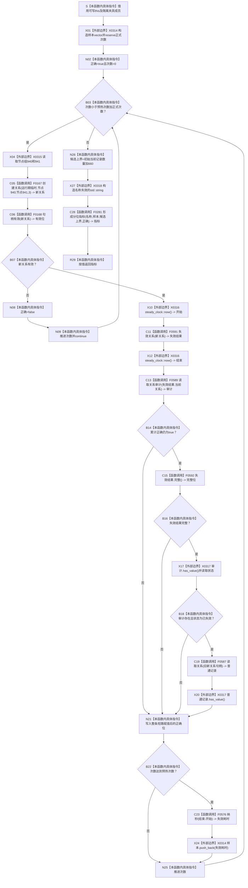

# CF-L5-0161 `隔离关系夹具::测量失效` 现状流程图

图类型：现状流程图
代码版本：`a48a70b2d678dea64dd8228adb4f26f0badd9506`
覆盖文件：`海中鱼巣/核心/自检.关系仓库性能基线.ixx:377-398`
唯一根函数：F0285
完整签名：`海中鱼巣::关系仓库性能基线内部::分位指标 海中鱼巣::关系仓库性能基线内部::隔离关系夹具::测量失效()`
参数：无显式参数；隐式可写 `this` 是非拥有借用
返回结果：按值返回名称为“失效”的 `分位指标`；样本只计成功创建后的失效入口耗时，候选上界硬编码为 `初始当前记录数量_ + 660`
非法值 / 拒绝：无普通拒绝；固定夹具中的创建、失效、审计或旧句柄可见异常均属追根因
已登记调用方：F0097 `运行单规模基线`
直接项目函数：F0167、F0168、F0591 `失效关系`、F0589、F0592 `关系状态变更材料::完整`、F0587、F0576、F0281
调用图：`流程图/代码流程图/00_调用知识图谱.md`
逐行映射表：`流程图/代码流程图/L5/CF-L5-0161_隔离关系夹具测量失效_逐行代码映射表.md`
输入契约 / 调用语境表：本文“输入契约与非成功语境”
非成功返回二分审查表：本文“输入契约与非成功语境”
偏差清单：`流程图/代码流程图/00_规范偏差审计.md` 的 F0285 切片
依据提交 / 结构化消息：冻结源码提交 `a48a70b2d678dea64dd8228adb4f26f0badd9506`；只读子智能体分析，主智能体统一编号和写入
入口前置：成功构建的1024节点隔离夹具，无并发测量；函数自身不验证
结构读取与写入：每个成功创建的临时关系由普通失效入口推进为当前已失效审计记录；不更新参考表，不接生产仓库
逻辑内返回：无；创建失败使用 `continue`，但在当前固定前置中仍是追根因
内部错误：异常直接传播；关系已经创建或失效后没有局部撤销
生命周期与资源释放：样本和结果材料局部拥有；正常全部成功后保留220条已失效隔离审计记录
异常：未声明 `noexcept` 且无 `catch`
验证入口：冻结源码、E1381—E1388、X0314—X0318、粘性正确短路、逐行映射和审计读回机械核对；未运行性能专项
验证输出：PASS；冻结源码 blob `34c34bffcd80f78e28345292deb69aca2eabf38d`、逐行覆盖、E1381—E1388、X0314—X0318、聚合统计、Mermaid 结构、独立只读复核、`git diff --check` 与 strict 100/100 均通过；未运行性能专项
依据：`规范/0050_项目通用机器逻辑与禁止性规则总纲_20260721.md`、`规范/0600_代码函数流程图应用与维护规范.md`、`规范/4010_子规范_统一仓库稳定句柄与通用关系索引边界.md`、`规范/详细设计/数据仓库关系查询二级索引与性能治理详细设计.md`
不得作为施工许可：是
不得宣称：每轮均形成已变更结果、完整字段已读回、候选上界为实际计数、写后参考模型一致或性能验收通过

## 流程图

## 节点合同

| 节点 | 类型 | 参数 / 输入绑定 | 结果 / 输出绑定 | 事实读写 | 后继条件 | 验证 |
| --- | --- | --- | --- | --- | --- | --- |
| S—N02 | 指令 / 外部边界 | `this`、正式次数 | 样本、正确位、次数 | 无机器事实 | 局部构造成功 | 377—380 行 |
| B03—N09 | 指令 / 外部边界 / 函数调用 | 次数、固定节点 | 新关系或创建失败继续 | 写隔离关系 | 句柄有效 | 381—386 行 |
| X10—C13 | 外部边界 / 函数调用 | 新关系 | 失效结果、计时点和审计 | 失效隔离关系 | 三项调用返回 | 388—391 行 |
| B14—N21 | 指令 / 函数调用 / 外部边界 | 累计正确、失效结果、审计 | 写后完整且旧句柄不可见 | 只读隔离关系 | 左到右短路 | 392—394 行 |
| B22—N25 | 指令 / 函数调用 / 外部边界 | 次数、时间点 | 正式样本或跳过 | 无新增机器事实 | 回到循环 | 395—396 行 |
| N26—R29 | 指令 / 外部边界 / 函数调用 | 样本、正确位、硬编码上界 | 失效分位指标 | 非权威性能材料 | 返回构造成功 | 397—398 行 |

## 输入契约与非成功语境

| 入口 / 节点 | 输入来源 | 上游是否保证有效 | 非成功结果 | 二分口径 | 结构变化与后续归属 |
| --- | --- | --- | --- | --- | --- |
| C05—B07 | 固定有效节点 | 是 | 创建失败并 continue | 追根因解决 | 创建入口或固定夹具 |
| C11—C15 | 新建有效关系 | 是 | 失效结果非完整 | 追根因解决 | 关系失效写入或值式结果 |
| X17—C19 | 当前失效句柄与旧句柄 | 是 | 审计不符或旧句柄可见 | 追根因解决 | 写后审计与普通读取 |
| 任一异常 | 隔离仓库和局部材料 | 是 | 异常传播 | 内部错误 | 失败清理与夹具封存 |
| C28 | 已收集报告材料 | 部分 | `结果一致=false` 或样本不足 | 人读材料返回 | 不转成业务成功 |

## 调用与边界汇总

E1381—E1388 是八条直接项目边。X0314—X0318 覆盖样本容器、固定节点下标、稳定时钟、optional 及字符串/返回生命周期。391 行审计读取不受累计正确位短路；392—394 行的完整、状态和旧句柄读回受粘性 `正确` 左到右短路。
