# CF-L5-0162 `隔离关系夹具::测量重挂` 现状流程图

图类型：现状流程图
代码版本：`a48a70b2d678dea64dd8228adb4f26f0badd9506`
覆盖文件：`海中鱼巣/核心/自检.关系仓库性能基线.ixx:400-425`
唯一根函数：F0286
完整签名：`海中鱼巣::关系仓库性能基线内部::分位指标 海中鱼巣::关系仓库性能基线内部::隔离关系夹具::测量重挂()`
参数：无显式参数；隐式可写 `this` 是非拥有借用
返回结果：按值返回名称为“重挂”的 `分位指标`；样本只计成功重挂入口耗时，候选上界硬编码为 `初始当前记录数量_ + 661`
非法值 / 拒绝：无普通拒绝；固定夹具中的创建、重挂、读回、目标比较和清理失败均属追根因
已登记调用方：F0097 `运行单规模基线`
直接项目函数：F0167、F0586、F0587 两次、F0051 `节点句柄operator==`、F0576、F0590、F0281
调用图：`流程图/代码流程图/00_调用知识图谱.md`
逐行映射表：`流程图/代码流程图/L5/CF-L5-0162_隔离关系夹具测量重挂_逐行代码映射表.md`
输入契约 / 调用语境表：本文“输入契约与非成功语境”
非成功返回二分审查表：本文“输入契约与非成功语境”
偏差清单：`流程图/代码流程图/00_规范偏差审计.md` 的 F0286 切片
依据提交 / 结构化消息：冻结源码提交 `a48a70b2d678dea64dd8228adb4f26f0badd9506`；只读子智能体分析，主智能体统一编号和写入
入口前置：成功构建的1024节点隔离夹具，无并发测量；函数自身不验证节点942—944或初始创建结果
结构读取与写入：先创建一条隔离 `因果来源` 关系，成功轮在目标943/944间重挂并推进版本；仅累计正确仍为 true 时尝试最终逻辑删除
逻辑内返回：无；重挂空结果使用 `continue`，在固定成功语境中仍是追根因
内部错误：异常直接传播；创建后无 scope guard，粘性失败会跳过最终删除
生命周期与资源释放：样本、当前关系、optional 和时间点局部拥有；正常全程正确时最后删除当前关系
异常：未声明 `noexcept` 且无 `catch`
验证入口：冻结源码、E1389—E1396、X0319—X0323、成功/失败短路、逐行映射和关系类型准入机械核对；未运行性能专项
验证输出：PASS；冻结源码 blob `34c34bffcd80f78e28345292deb69aca2eabf38d`、逐行覆盖、E1389—E1396、X0319—X0323、聚合统计、Mermaid 结构、独立只读复核、`git diff --check` 与 strict 100/100 均通过；未运行性能专项
依据：`规范/0050_项目通用机器逻辑与禁止性规则总纲_20260721.md`、`规范/0600_代码函数流程图应用与维护规范.md`、`规范/4010_子规范_统一仓库稳定句柄与通用关系索引边界.md`、`规范/详细设计/数据仓库关系查询二级索引与性能治理详细设计.md`
不得作为施工许可：是
不得宣称：因果来源已获通用重挂授权、完整身份版本和索引已读回、失败必清理、候选上界为真实计数、写后参考模型一致或性能验收通过

## 流程图

```mermaid
flowchart TD
    S["S【本函数内具体指令】借用可写this及隔离夹具成员"]
    X01["X01【外部边界】X0319 构造样本vector并reserve正式次数"]
    N02["N02【本函数内具体指令】正确=true"]
    X03["X03【外部边界】X0320 读取节点组942和943"]
    C04["C04【函数调用】F0167 创建关系(因果来源,节点942,节点943,4) -> 当前关系"]
    N05["N05【本函数内具体指令】使用乙=false且次数=0"]
    B06{"B06【本函数内具体指令】次数小于预热次数加正式次数？"}
    X07["X07【外部边界】X0320 按使用乙读取节点943或944 -> 新目标"]
    X08["X08【外部边界】X0321 steady_clock::now() -> 开始"]
    X09["X09【外部边界】X0320 读取节点942作为新源"]
    C10["C10【函数调用】F0586 重挂关系并返回新句柄(当前关系,新源,新目标) -> 新关系"]
    X11["X11【外部边界】X0321 steady_clock::now() -> 结束"]
    X12["X12【外部边界】X0322 新关系.has_value()"]
    B13{"B13【本函数内具体指令】重挂成功？"}
    N14["N14【本函数内具体指令】正确=false"]
    N15["N15【本函数内具体指令】推进次数并continue"]
    X16["X16【外部边界】X0322 解引用新关系"]
    C17["C17【函数调用】F0587 读取关系(新关系) -> 新记录"]
    B18{"B18【本函数内具体指令】累计正确仍为true？"}
    C19["C19【函数调用】F0587 读取关系(旧当前关系) -> 旧记录"]
    X20["X20【外部边界】X0322 旧记录.has_value()"]
    B21{"B21【本函数内具体指令】旧记录为空？"}
    X22["X22【外部边界】X0322 新记录.has_value()"]
    B23{"B23【本函数内具体指令】新记录存在？"}
    X24["X24【外部边界】X0322 解引用新记录并读取目标节点"]
    C25["C25【函数调用】F0051 节点句柄operator==(新记录.目标节点,新目标) -> 目标相等"]
    N26["N26【本函数内具体指令】正确=目标相等"]
    N27["N27【本函数内具体指令】正确=false"]
    N28["N28【本函数内具体指令】无论核对结果都采用新关系并切换使用乙"]
    B29{"B29【本函数内具体指令】次数达到预热次数？"}
    C30["C30【函数调用】F0576 纳秒(结束-开始) -> 重挂耗时"]
    X31["X31【外部边界】X0319 样本.push_back(重挂耗时)"]
    N32["N32【本函数内具体指令】推进次数"]
    B33{"B33【本函数内具体指令】累计正确仍为true？"}
    C34["C34【函数调用】F0590 删除关系(当前关系) -> 删除成功"]
    N35["N35【本函数内具体指令】正确=删除成功或保持false"]
    N36["N36【本函数内具体指令】候选上界=初始当前记录数量加661"]
    X37["X37【外部边界】X0323 构造名称重挂的std::string"]
    C38["C38【函数调用】F0281 形成分位指标(名称,样本,候选上界,正确) -> 指标"]
    R39["R39【本函数内具体指令】按值返回指标"]

    S --> X01 --> N02 --> X03 --> C04 --> N05 --> B06
    B06 -- "是" --> X07 --> X08 --> X09 --> C10 --> X11 --> X12 --> B13
    B13 -- "否" --> N14 --> N15 --> B06
    B13 -- "是" --> X16 --> C17 --> B18
    B18 -- "否" --> N27
    B18 -- "是" --> C19 --> X20 --> B21
    B21 -- "否" --> N27
    B21 -- "是" --> X22 --> B23
    B23 -- "否" --> N27
    B23 -- "是" --> X24 --> C25 --> N26
    N26 --> N28
    N27 --> N28
    N28 --> B29
    B29 -- "否" --> N32
    B29 -- "是" --> C30 --> X31 --> N32
    N32 --> B06
    B06 -- "否" --> B33
    B33 -- "否" --> N35
    B33 -- "是" --> C34 --> N35
    N35 --> N36 --> X37 --> C38 --> R39
```

## 节点合同

| 节点 | 类型 | 参数 / 输入绑定 | 结果 / 输出绑定 | 事实读写 | 后继条件 | 验证 |
| --- | --- | --- | --- | --- | --- | --- |
| S—C04 | 指令 / 外部边界 / 函数调用 | `this`、节点942/943 | 样本、正确位、初始关系 | 创建隔离关系 | 创建调用返回 | 400—405 行 |
| N05—B06 | 本函数内具体指令 | 使用乙、次数 | 循环状态 | 无 | 仍有轮次 | 406—407 行 |
| X07—B13 | 外部边界 / 函数调用 / 指令 | 当前关系、新源、新目标 | 新关系和计时点 | 重挂隔离关系 | optional有值 | 408—415 行 |
| X16—N28 | 外部边界 / 函数调用 / 指令 | 新旧关系、新目标、累计正确 | 先核旧记录为空，再核新记录存在和目标相等，随后采用新句柄 | 只读隔离关系 | 成功重挂；逐项左到右短路 | 416—420 行 |
| B29—N32 | 指令 / 函数调用 / 外部边界 | 次数、时间点 | 正式样本或跳过 | 无新增机器事实 | 回到循环 | 421—422 行 |
| B33—N35 | 指令 / 函数调用 | 累计正确、当前关系 | 删除结果或保持false | 逻辑删除隔离关系 | 短路完成 | 423 行 |
| N36—R39 | 指令 / 外部边界 / 函数调用 | 样本、正确位、硬编码上界 | 重挂分位指标 | 非权威性能材料 | 返回构造成功 | 424—425 行 |

## 输入契约与非成功语境

| 入口 / 节点 | 输入来源 | 上游是否保证有效 | 非成功结果 | 二分口径 | 结构变化与后续归属 |
| --- | --- | --- | --- | --- | --- |
| C04 | 固定有效节点 | 是 | 初始关系无效但未即时拒绝 | 追根因解决 | 创建入口和前置读回 |
| C10—B13 | 当前关系与固定端点 | 是 | 重挂返回空并 continue | 追根因解决 | 关系类型准入、重挂入口或版本 |
| C17—C25 | 成功重挂的新旧句柄 | 是 | 旧仍可见、新记录空或目标错；检查按源码顺序短路 | 追根因解决 | 完整写后读回 |
| C34 | 当前有效关系 | 是 | 删除失败或被既有失败短路 | 追根因解决 | 失败清理与生命周期 |
| 任一异常 | 隔离仓库和局部材料 | 是 | 异常传播 | 内部错误 | scope guard 与夹具封存 |
| C38 | 已收集报告材料 | 部分 | `结果一致=false` 或样本不足 | 人读材料返回 | 不转成业务成功 |

## 调用与边界汇总

E1389—E1396 是八条直接项目边。X0319—X0323 覆盖样本容器、固定节点下标、稳定时钟、optional 及字符串/返回生命周期。F0586 因本函数的 L5 直调由 L7 收敛到 L6。416—418 行先核旧记录为空，成立后才核新记录存在，再比较目标；任一步失败都把粘性正确位写为 false。写后核对失败仍采用新句柄并可能采样；粘性失败会跳过最终删除。
